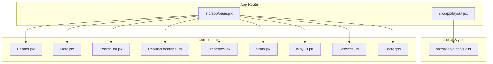
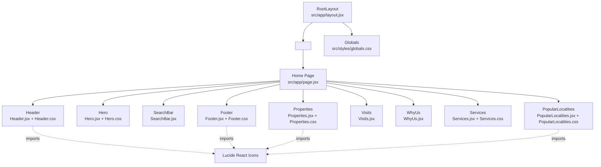
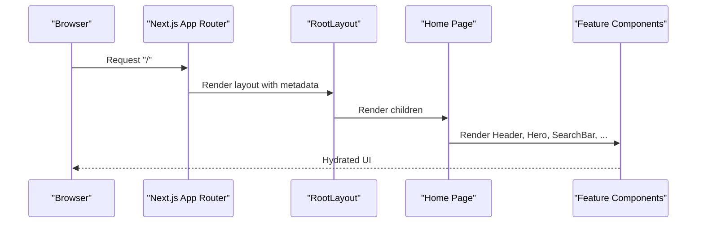
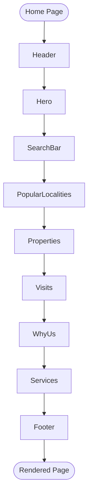
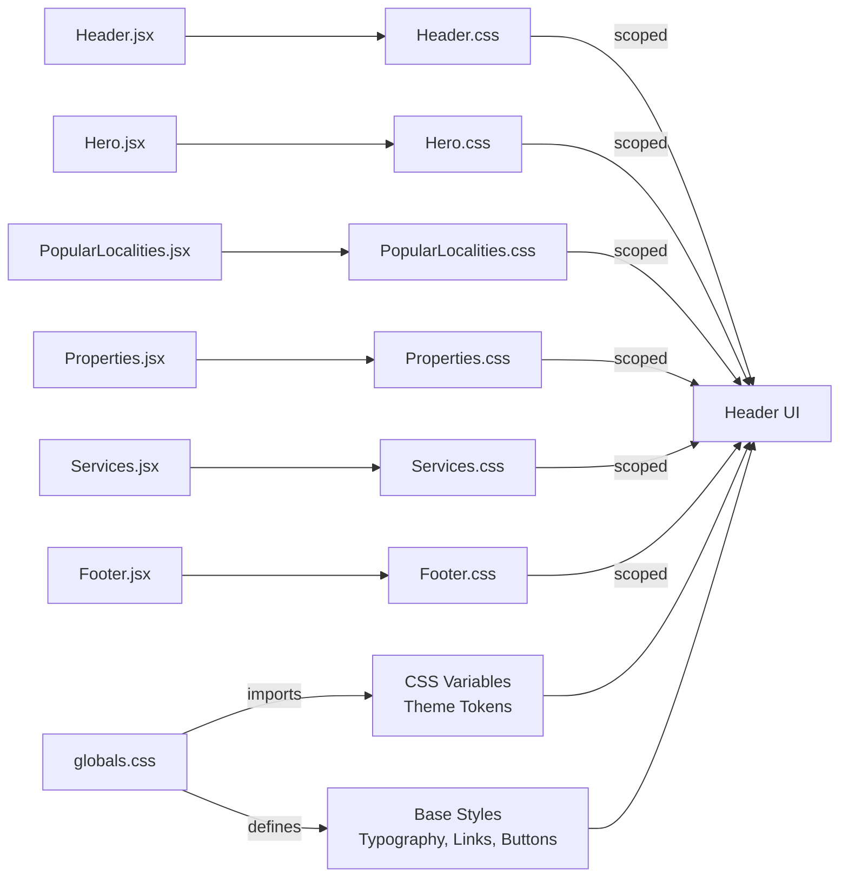
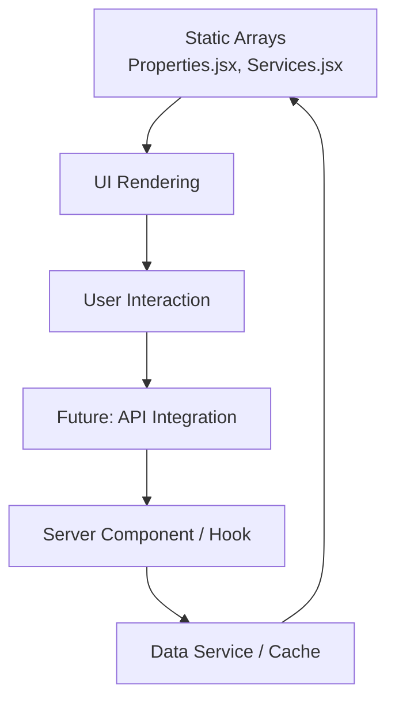
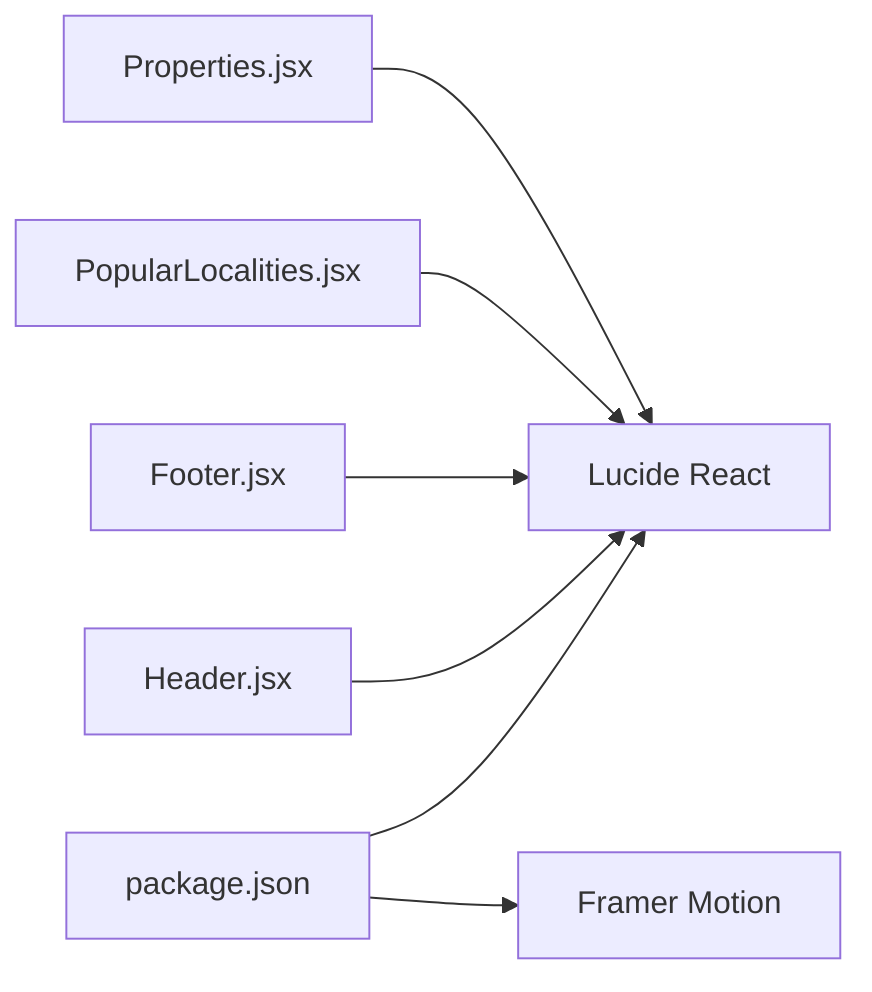
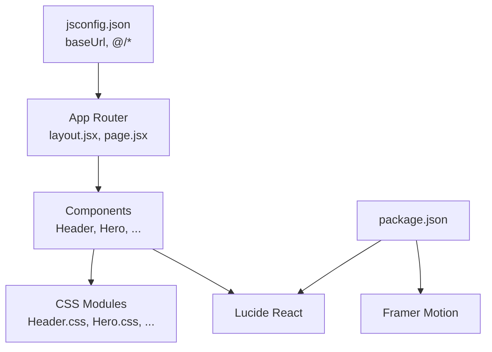

# Architecture Overview

<cite>
**Referenced Files in This Document**
- [src/app/layout.jsx](file://src/app/layout.jsx)
- [src/app/page.jsx](file://src/app/page.jsx)
- [src/styles/globals.css](file://src/styles/globals.css)
- [jsconfig.json](file://jsconfig.json)
- [package.json](file://package.json)
- [src/components/Header/Header.jsx](file://src/components/Header/Header.jsx)
- [src/components/Header/Header.css](file://src/components/Header/Header.css)
- [src/components/Hero/Hero.jsx](file://src/components/Hero/Hero.jsx)
- [src/components/Hero/Hero.css](file://src/components/Hero/Hero.css)
- [src/components/PopularLocalities/PopularLocalities.jsx](file://src/components/PopularLocalities/PopularLocalities.jsx)
- [src/components/PopularLocalities/PopularLocalities.css](file://src/components/PopularLocalities/PopularLocalities.css)
- [src/components/Properties/Properties.jsx](file://src/components/Properties/Properties.jsx)
- [src/components/Properties/Properties.css](file://src/components/Properties/Properties.css)
- [src/components/Services/Services.jsx](file://src/components/Services/Services.jsx)
- [src/components/Visits/Visits.jsx](file://src/components/Visits/Visits.jsx)
- [src/components/WhyUs/WhyUs.jsx](file://src/components/WhyUs/WhyUs.jsx)
- [src/components/Footer/Footer.jsx](file://src/components/Footer/Footer.jsx)
- [src/components/Footer/Footer.css](file://src/components/Footer/Footer.css)
</cite>

## Table of Contents
1. [Introduction](#introduction)
2. [Project Structure](#project-structure)
3. [Core Components](#core-components)
4. [Architecture Overview](#architecture-overview)
5. [Detailed Component Analysis](#detailed-component-analysis)
6. [Dependency Analysis](#dependency-analysis)
7. [Performance Considerations](#performance-considerations)
8. [Troubleshooting Guide](#troubleshooting-guide)
9. [Conclusion](#conclusion)

## Introduction
This document describes the architecture of the Propellow frontend built with Next.js App Router. It focuses on the component-based design, file-based routing, layout composition, and component hierarchy. It also documents the styling strategy using CSS Modules and global styles, the separation of concerns between pages and reusable components, and the integration points for external libraries such as Lucide React and Framer Motion. Finally, it outlines the current static data pattern and considerations for future API integration.

## Project Structure
The project follows Next.js conventions with the App Router under src/app. The UI is composed of reusable components under src/components organized by feature. Global styles live under src/styles. Path aliases are configured via jsconfig.json to simplify imports.

**Diagram sources**
- [src/app/layout.jsx](file://src/app/layout.jsx#L1-L15)
- [src/app/page.jsx](file://src/app/page.jsx#L1-L26)
- [src/styles/globals.css](file://src/styles/globals.css#L1-L60)
- [src/components/Header/Header.jsx](file://src/components/Header/Header.jsx#L1-L26)
- [src/components/Hero/Hero.jsx](file://src/components/Hero/Hero.jsx#L1-L45)
- [src/components/PopularLocalities/PopularLocalities.jsx](file://src/components/PopularLocalities/PopularLocalities.jsx#L1-L31)
- [src/components/Properties/Properties.jsx](file://src/components/Properties/Properties.jsx#L1-L67)
- [src/components/Services/Services.jsx](file://src/components/Services/Services.jsx#L1-L62)
- [src/components/Visits/Visits.jsx](file://src/components/Visits/Visits.jsx)
- [src/components/WhyUs/WhyUs.jsx](file://src/components/WhyUs/WhyUs.jsx)
- [src/components/Footer/Footer.jsx](file://src/components/Footer/Footer.jsx#L1-L51)

**Section sources**
- [src/app/layout.jsx](file://src/app/layout.jsx#L1-L15)
- [src/app/page.jsx](file://src/app/page.jsx#L1-L26)
- [src/styles/globals.css](file://src/styles/globals.css#L1-L60)
- [jsconfig.json](file://jsconfig.json#L1-L9)

## Core Components
The home page orchestrates all feature components in a top-to-bottom layout. Each component encapsulates its own styling via CSS Modules and imports icons from Lucide React. The global stylesheet defines shared tokens and base styles.

Key characteristics:
- Page orchestration: The home page imports and renders all feature components in sequence.
- Component isolation: Each component imports its own CSS Module to keep styles scoped.
- Iconography: Lucide React icons are imported directly inside components.
- Global baseline: Shared CSS variables and base styles are centralized in globals.css.

**Section sources**
- [src/app/page.jsx](file://src/app/page.jsx#L1-L26)
- [src/components/Header/Header.jsx](file://src/components/Header/Header.jsx#L1-L26)
- [src/components/Hero/Hero.jsx](file://src/components/Hero/Hero.jsx#L1-L45)
- [src/components/PopularLocalities/PopularLocalities.jsx](file://src/components/PopularLocalities/PopularLocalities.jsx#L1-L31)
- [src/components/Properties/Properties.jsx](file://src/components/Properties/Properties.jsx#L1-L67)
- [src/components/Services/Services.jsx](file://src/components/Services/Services.jsx#L1-L62)
- [src/components/Visits/Visits.jsx](file://src/components/Visits/Visits.jsx)
- [src/components/WhyUs/WhyUs.jsx](file://src/components/WhyUs/WhyUs.jsx)
- [src/components/Footer/Footer.jsx](file://src/components/Footer/Footer.jsx#L1-L51)
- [src/styles/globals.css](file://src/styles/globals.css#L1-L60)

## Architecture Overview
The system follows a file-based routing model where src/app/page.jsx is the root route. The RootLayout provides the HTML shell and global styles. The home page composes feature components, which render their own DOM and styles. Icons are integrated via Lucide React, and animations can be introduced using Framer Motion.

**Diagram sources**
- [src/app/layout.jsx](file://src/app/layout.jsx#L1-L15)
- [src/app/page.jsx](file://src/app/page.jsx#L1-L26)
- [src/styles/globals.css](file://src/styles/globals.css#L1-L60)
- [src/components/Header/Header.jsx](file://src/components/Header/Header.jsx#L1-L26)
- [src/components/Hero/Hero.jsx](file://src/components/Hero/Hero.jsx#L1-L45)
- [src/components/PopularLocalities/PopularLocalities.jsx](file://src/components/PopularLocalities/PopularLocalities.jsx#L1-L31)
- [src/components/Properties/Properties.jsx](file://src/components/Properties/Properties.jsx#L1-L67)
- [src/components/Services/Services.jsx](file://src/components/Services/Services.jsx#L1-L62)
- [src/components/Footer/Footer.jsx](file://src/components/Footer/Footer.jsx#L1-L51)

## Detailed Component Analysis

### Layout and Routing
- Root layout sets metadata and wraps children in html/body. Global styles are imported here to ensure baseline styles are applied across the app.
- The home page is the single route and composes all feature components.

**Diagram sources**
- [src/app/layout.jsx](file://src/app/layout.jsx#L1-L15)
- [src/app/page.jsx](file://src/app/page.jsx#L1-L26)

**Section sources**
- [src/app/layout.jsx](file://src/app/layout.jsx#L1-L15)
- [src/app/page.jsx](file://src/app/page.jsx#L1-L26)

### Component Composition Pattern
- The home page imports and renders all feature components in a linear sequence, forming the main page composition.
- Each feature component is responsible for its own rendering and styling, promoting modularity and reusability.

**Diagram sources**
- [src/app/page.jsx](file://src/app/page.jsx#L1-L26)
- [src/components/Header/Header.jsx](file://src/components/Header/Header.jsx#L1-L26)
- [src/components/Hero/Hero.jsx](file://src/components/Hero/Hero.jsx#L1-L45)
- [src/components/PopularLocalities/PopularLocalities.jsx](file://src/components/PopularLocalities/PopularLocalities.jsx#L1-L31)
- [src/components/Properties/Properties.jsx](file://src/components/Properties/Properties.jsx#L1-L67)
- [src/components/Services/Services.jsx](file://src/components/Services/Services.jsx#L1-L62)
- [src/components/Footer/Footer.jsx](file://src/components/Footer/Footer.jsx#L1-L51)

**Section sources**
- [src/app/page.jsx](file://src/app/page.jsx#L1-L26)

### Styling Architecture
- Global styles: Centralized in globals.css with CSS custom properties for theme tokens, base typography, and common utilities.
- Component styling: Each component imports its own CSS Module (e.g., Header.css, Hero.css, PopularLocalities.css, Properties.css, Services.jsx + Services.css, Footer.css) to scope styles locally.
- Responsive design: Media queries within component CSS handle responsive layouts.

**Diagram sources**
- [src/styles/globals.css](file://src/styles/globals.css#L1-L60)
- [src/components/Header/Header.css](file://src/components/Header/Header.css#L1-L73)
- [src/components/Hero/Hero.css](file://src/components/Hero/Hero.css#L1-L126)
- [src/components/PopularLocalities/PopularLocalities.css](file://src/components/PopularLocalities/PopularLocalities.css#L1-L58)
- [src/components/Properties/Properties.css](file://src/components/Properties/Properties.css#L1-L107)
- [src/components/Services/Services.jsx](file://src/components/Services/Services.jsx#L1-L62)
- [src/components/Footer/Footer.css](file://src/components/Footer/Footer.css)

**Section sources**
- [src/styles/globals.css](file://src/styles/globals.css#L1-L60)
- [src/components/Header/Header.css](file://src/components/Header/Header.css#L1-L73)
- [src/components/Hero/Hero.css](file://src/components/Hero/Hero.css#L1-L126)
- [src/components/PopularLocalities/PopularLocalities.css](file://src/components/PopularLocalities/PopularLocalities.css#L1-L58)
- [src/components/Properties/Properties.css](file://src/components/Properties/Properties.css#L1-L107)
- [src/components/Services/Services.jsx](file://src/components/Services/Services.jsx#L1-L62)
- [src/components/Footer/Footer.css](file://src/components/Footer/Footer.css)

### Static Data Patterns and Future API Integration
- Current approach: Feature components define small, static datasets locally (e.g., properties and services arrays). This simplifies development and avoids backend dependencies during early stages.
- Recommended future steps:
  - Extract data fetching to server components or hooks.
  - Introduce a data service layer to centralize API calls and caching.
  - Replace static arrays with dynamic props or context/state managed by a data layer.
  - Keep component APIs unchanged to maintain composability while swapping implementations.

**Diagram sources**
- [src/components/Properties/Properties.jsx](file://src/components/Properties/Properties.jsx#L4-L26)
- [src/components/Services/Services.jsx](file://src/components/Services/Services.jsx#L3-L34)

**Section sources**
- [src/components/Properties/Properties.jsx](file://src/components/Properties/Properties.jsx#L4-L26)
- [src/components/Services/Services.jsx](file://src/components/Services/Services.jsx#L3-L34)

### External Library Integrations
- Lucide React: Used directly inside components for icons (e.g., Header.jsx, Footer.jsx, PopularLocalities.jsx, Properties.jsx).
- Framer Motion: Declared as a dependency but not yet used in the current codebase; can be integrated for page transitions, hover animations, and micro-interactions.

**Diagram sources**
- [package.json](file://package.json#L10-L16)
- [src/components/Header/Header.jsx](file://src/components/Header/Header.jsx#L1-L26)
- [src/components/Footer/Footer.jsx](file://src/components/Footer/Footer.jsx#L1-L51)
- [src/components/PopularLocalities/PopularLocalities.jsx](file://src/components/PopularLocalities/PopularLocalities.jsx#L1-L31)
- [src/components/Properties/Properties.jsx](file://src/components/Properties/Properties.jsx#L1-L67)

**Section sources**
- [package.json](file://package.json#L10-L16)
- [src/components/Header/Header.jsx](file://src/components/Header/Header.jsx#L1-L26)
- [src/components/Footer/Footer.jsx](file://src/components/Footer/Footer.jsx#L1-L51)
- [src/components/PopularLocalities/PopularLocalities.jsx](file://src/components/PopularLocalities/PopularLocalities.jsx#L1-L31)
- [src/components/Properties/Properties.jsx](file://src/components/Properties/Properties.jsx#L1-L67)

## Dependency Analysis
- Path aliasing: baseUrl and @/* path mapping enable concise imports across the app.
- Component coupling: Components are loosely coupled; each imports its own CSS Module and icons independently.
- External dependencies: Lucide React is consumed directly by components; Framer Motion is available for animation enhancements.

**Diagram sources**
- [jsconfig.json](file://jsconfig.json#L1-L9)
- [src/app/layout.jsx](file://src/app/layout.jsx#L1-L15)
- [src/app/page.jsx](file://src/app/page.jsx#L1-L26)
- [src/components/Header/Header.jsx](file://src/components/Header/Header.jsx#L1-L26)
- [src/components/Hero/Hero.jsx](file://src/components/Hero/Hero.jsx#L1-L45)
- [src/components/PopularLocalities/PopularLocalities.jsx](file://src/components/PopularLocalities/PopularLocalities.jsx#L1-L31)
- [src/components/Properties/Properties.jsx](file://src/components/Properties/Properties.jsx#L1-L67)
- [src/components/Services/Services.jsx](file://src/components/Services/Services.jsx#L1-L62)
- [src/components/Footer/Footer.jsx](file://src/components/Footer/Footer.jsx#L1-L51)
- [package.json](file://package.json#L10-L16)

**Section sources**
- [jsconfig.json](file://jsconfig.json#L1-L9)
- [package.json](file://package.json#L10-L16)

## Performance Considerations
- CSS Modules: Encapsulated styles reduce cascade and improve cacheability; avoid unnecessary reflows by minimizing heavy transforms.
- Static assets: Images are referenced via public paths; ensure appropriate sizing and formats for optimal loading.
- Component granularity: Smaller components help with React’s rendering model; keep components pure and memoizable where possible.
- Animations: If adopting Framer Motion, prefer declarative animations and lazy-load heavy effects.

## Troubleshooting Guide
- Missing icons: Verify Lucide React imports and sizes within components.
- Styling conflicts: Ensure each component imports its CSS Module and uses unique class names; check globals.css for unintended overrides.
- Build-time errors: Confirm jsconfig.json path aliases match actual file locations.
- Route issues: Validate that src/app/page.jsx remains the root export and that metadata in layout.jsx is correct.

**Section sources**
- [jsconfig.json](file://jsconfig.json#L1-L9)
- [src/app/layout.jsx](file://src/app/layout.jsx#L1-L15)
- [src/app/page.jsx](file://src/app/page.jsx#L1-L26)
- [src/components/Header/Header.jsx](file://src/components/Header/Header.jsx#L1-L26)
- [src/components/Footer/Footer.jsx](file://src/components/Footer/Footer.jsx#L1-L51)
- [src/styles/globals.css](file://src/styles/globals.css#L1-L60)

## Conclusion
Propellow employs a clean, component-driven architecture within Next.js App Router. The home page orchestrates reusable feature components, each with scoped CSS Modules and Lucide React icons. Global styles provide a consistent foundation. The current design uses static data for simplicity, with clear pathways to integrate API-driven data later. External libraries like Lucide React and Framer Motion are ready for use to enhance UI and interactions.