# Component Library

<cite>
**Referenced Files in This Document**
- [Header.jsx](file://src/components/Header/Header.jsx)
- [Header.css](file://src/components/Header/Header.css)
- [Hero.jsx](file://src/components/Hero/Hero.jsx)
- [Hero.css](file://src/components/Hero/Hero.css)
- [SearchBar.jsx](file://src/components/SearchBar/SearchBar.jsx)
- [SearchBar.css](file://src/components/SearchBar/SearchBar.css)
- [PopularLocalities.jsx](file://src/components/PopularLocalities/PopularLocalities.jsx)
- [PopularLocalities.css](file://src/components/PopularLocalities/PopularLocalities.css)
- [Properties.jsx](file://src/components/Properties/Properties.jsx)
- [Properties.css](file://src/components/Properties/Properties.css)
- [Visits.jsx](file://src/components/Visits/Visits.jsx)
- [Visits.css](file://src/components/Visits/Visits.css)
- [WhyUs.jsx](file://src/components/WhyUs/WhyUs.jsx)
- [WhyUs.css](file://src/components/WhyUs/WhyUs.css)
- [Services.jsx](file://src/components/Services/Services.jsx)
- [Services.css](file://src/components/Services/Services.css)
- [Footer.jsx](file://src/components/Footer/Footer.jsx)
- [Footer.css](file://src/components/Footer/Footer.css)
</cite>

## Table of Contents
1. [Introduction](#introduction)
2. [Project Structure](#project-structure)
3. [Core Components](#core-components)
4. [Architecture Overview](#architecture-overview)
5. [Detailed Component Analysis](#detailed-component-analysis)
6. [Dependency Analysis](#dependency-analysis)
7. [Performance Considerations](#performance-considerations)
8. [Troubleshooting Guide](#troubleshooting-guide)
9. [Conclusion](#conclusion)
10. [Appendices](#appendices)

## Introduction
This document describes the Propellow UI component library. It covers nine main components: Header, Hero, SearchBar, PopularLocalities, Properties, Visits, WhyUs, Services, and Footer. For each component, we explain purpose, composition pattern, props interface, styling approach via CSS Modules, and integration patterns. We also document shared design tokens, iconography using Lucide React, and responsive behavior.

## Project Structure
Each component follows a consistent folder structure with a JSX file and a CSS Module file. Components are self-contained and import their own styles. They rely on Lucide React for icons and use CSS custom properties for theme tokens.

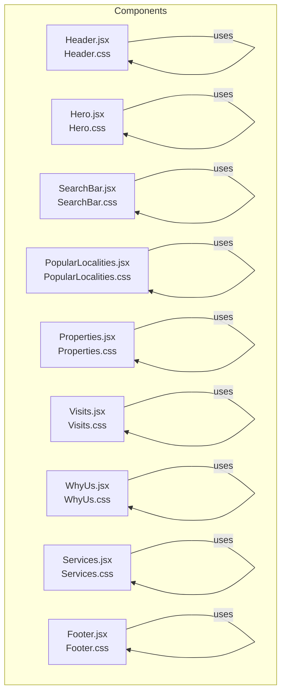

**Diagram sources**
- [Header.jsx](file://src/components/Header/Header.jsx#L1-L26)
- [Hero.jsx](file://src/components/Hero/Hero.jsx#L1-L45)
- [SearchBar.jsx](file://src/components/SearchBar/SearchBar.jsx#L1-L34)
- [PopularLocalities.jsx](file://src/components/PopularLocalities/PopularLocalities.jsx#L1-L31)
- [Properties.jsx](file://src/components/Properties/Properties.jsx#L1-L67)
- [Visits.jsx](file://src/components/Visits/Visits.jsx#L1-L49)
- [WhyUs.jsx](file://src/components/WhyUs/WhyUs.jsx#L1-L61)
- [Services.jsx](file://src/components/Services/Services.jsx#L1-L62)
- [Footer.jsx](file://src/components/Footer/Footer.jsx#L1-L51)

**Section sources**
- [Header.jsx](file://src/components/Header/Header.jsx#L1-L26)
- [Hero.jsx](file://src/components/Hero/Hero.jsx#L1-L45)
- [SearchBar.jsx](file://src/components/SearchBar/SearchBar.jsx#L1-L34)
- [PopularLocalities.jsx](file://src/components/PopularLocalities/PopularLocalities.jsx#L1-L31)
- [Properties.jsx](file://src/components/Properties/Properties.jsx#L1-L67)
- [Visits.jsx](file://src/components/Visits/Visits.jsx#L1-L49)
- [WhyUs.jsx](file://src/components/WhyUs/WhyUs.jsx#L1-L61)
- [Services.jsx](file://src/components/Services/Services.jsx#L1-L62)
- [Footer.jsx](file://src/components/Footer/Footer.jsx#L1-L51)

## Core Components
This section summarizes each component’s purpose, props interface, styling approach, and integration patterns.

- Header
  - Purpose: Brand identity, navigation links, and primary actions.
  - Props: None.
  - Composition: Logo area, navigation links, action buttons.
  - Styling: Flex layout, sticky positioning, hover effects, media queries.
  - Integration: Place at the top of pages; integrates with global container sizing.

- Hero
  - Purpose: Value proposition, features, and a primary CTA.
  - Props: None.
  - Composition: Background shape, content split into left and right halves, feature list, CTA.
  - Styling: Relative positioning, rounded background, responsive two-column layout.
  - Integration: Use as the main visual focal point after navigation.

- SearchBar
  - Purpose: Multi-faceted search with location input, intent selector, budget selector, and submit button.
  - Props: None.
  - Composition: Wrapper with shadowed box, input with icon, dividers, two dropdown-like selectors, and a prominent button.
  - Styling: Centered horizontally, responsive stacked layout on small screens.
  - Integration: Place prominently in Hero or landing page content area.

- PopularLocalities
  - Purpose: Quick-access location suggestions with icons and chevrons.
  - Props: None.
  - Composition: Label with pin icon, pill-shaped links with trailing arrow.
  - Styling: Flexible horizontal layout with wrapping pills; hover interactions.
  - Integration: Use below Hero or SearchBar to drive discovery.

- Properties
  - Purpose: Display property cards with title, location, price, and tag.
  - Props: None.
  - Composition: Section header with “View All” link, grid of cards.
  - Styling: Responsive grid, card hover elevation, tag-specific colors.
  - Integration: Feature curated or searched properties.

- Visits
  - Purpose: Promote free visit options (cab, bike, site visit).
  - Props: None.
  - Composition: Section title, grid of cards with images, descriptions, and “Book Now” buttons.
  - Styling: Card hover animations, centered imagery, consistent spacing.
  - Integration: Encourage engagement after property discovery.

- WhyUs
  - Purpose: Showcase key differentiators with icons and navigation arrows.
  - Props: None.
  - Composition: Section header with arrows, feature cards with icons.
  - Styling: Grid layout, active state for arrows, hover elevation.
  - Integration: Use as a feature highlight between value sections.

- Services
  - Purpose: Present real estate-related services with images and descriptions.
  - Props: None.
  - Composition: Section title, grid of service cards with image and info.
  - Styling: Card hover elevation, image cropping, responsive grid.
  - Integration: Offer complementary services alongside property listings.

- Footer
  - Purpose: Company branding, description, social links, and navigational columns.
  - Props: None.
  - Composition: Main branding area, social links, multi-column link grid.
  - Styling: Dark theme, grid-based layout, hover transitions.
  - Integration: Place at page bottom; ensure accessibility and readability.

**Section sources**
- [Header.jsx](file://src/components/Header/Header.jsx#L1-L26)
- [Header.css](file://src/components/Header/Header.css#L1-L73)
- [Hero.jsx](file://src/components/Hero/Hero.jsx#L1-L45)
- [Hero.css](file://src/components/Hero/Hero.css#L1-L126)
- [SearchBar.jsx](file://src/components/SearchBar/SearchBar.jsx#L1-L34)
- [SearchBar.css](file://src/components/SearchBar/SearchBar.css#L1-L95)
- [PopularLocalities.jsx](file://src/components/PopularLocalities/PopularLocalities.jsx#L1-L31)
- [PopularLocalities.css](file://src/components/PopularLocalities/PopularLocalities.css#L1-L58)
- [Properties.jsx](file://src/components/Properties/Properties.jsx#L1-L67)
- [Properties.css](file://src/components/Properties/Properties.css#L1-L107)
- [Visits.jsx](file://src/components/Visits/Visits.jsx#L1-L49)
- [Visits.css](file://src/components/Visits/Visits.css#L1-L79)
- [WhyUs.jsx](file://src/components/WhyUs/WhyUs.jsx#L1-L61)
- [WhyUs.css](file://src/components/WhyUs/WhyUs.css#L1-L85)
- [Services.jsx](file://src/components/Services/Services.jsx#L1-L62)
- [Services.css](file://src/components/Services/Services.css#L1-L61)
- [Footer.jsx](file://src/components/Footer/Footer.jsx#L1-L51)
- [Footer.css](file://src/components/Footer/Footer.css#L1-L98)

## Architecture Overview
The components are organized as feature-based folders with dedicated CSS Modules. Styling leverages CSS custom properties for theme tokens and media queries for responsiveness. Icons are imported from Lucide React and sized consistently. There is no shared TypeScript/JSX props interface; components are static and data-driven via inline arrays.

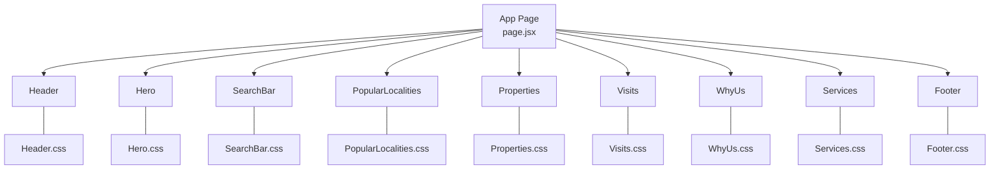

**Diagram sources**
- [Header.jsx](file://src/components/Header/Header.jsx#L1-L26)
- [Hero.jsx](file://src/components/Hero/Hero.jsx#L1-L45)
- [SearchBar.jsx](file://src/components/SearchBar/SearchBar.jsx#L1-L34)
- [PopularLocalities.jsx](file://src/components/PopularLocalities/PopularLocalities.jsx#L1-L31)
- [Properties.jsx](file://src/components/Properties/Properties.jsx#L1-L67)
- [Visits.jsx](file://src/components/Visits/Visits.jsx#L1-L49)
- [WhyUs.jsx](file://src/components/WhyUs/WhyUs.jsx#L1-L61)
- [Services.jsx](file://src/components/Services/Services.jsx#L1-L62)
- [Footer.jsx](file://src/components/Footer/Footer.jsx#L1-L51)

## Detailed Component Analysis

### Header
- Composition pattern: Three regions: logo, nav, actions. Uses Lucide React for brand icon.
- Props interface: None.
- Styling approach: Flexbox layout, sticky top, hover states, media-hidden navigation on small screens.
- Integration: Import into the application layout; ensure consistent padding and z-index stacking.

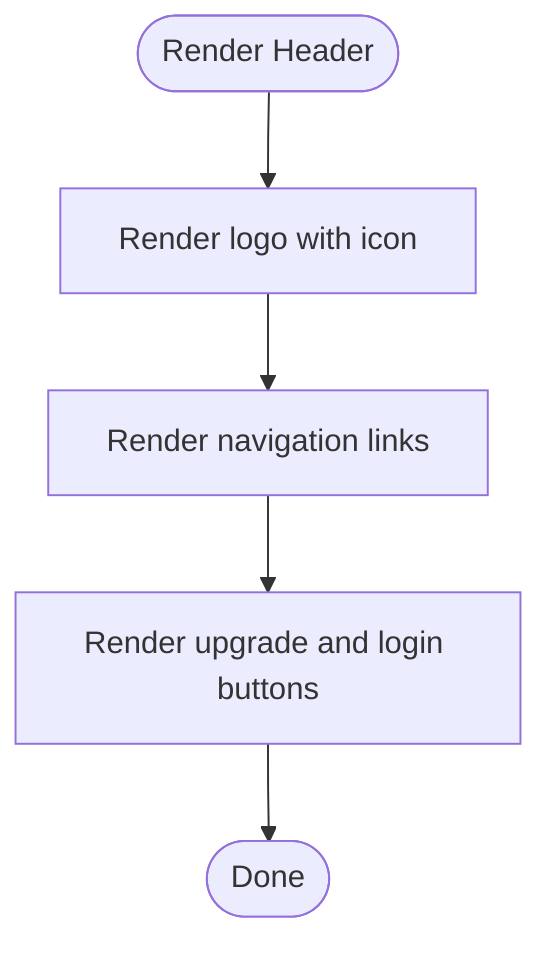

**Diagram sources**
- [Header.jsx](file://src/components/Header/Header.jsx#L4-L24)

**Section sources**
- [Header.jsx](file://src/components/Header/Header.jsx#L1-L26)
- [Header.css](file://src/components/Header/Header.css#L1-L73)

### Hero
- Composition pattern: Background shape, split content, feature list, and CTA.
- Props interface: None.
- Styling approach: Relative positioning, rounded corners, responsive flex layout, hover effects.
- Integration: Place immediately after Header; pair with SearchBar below for strong onboarding.

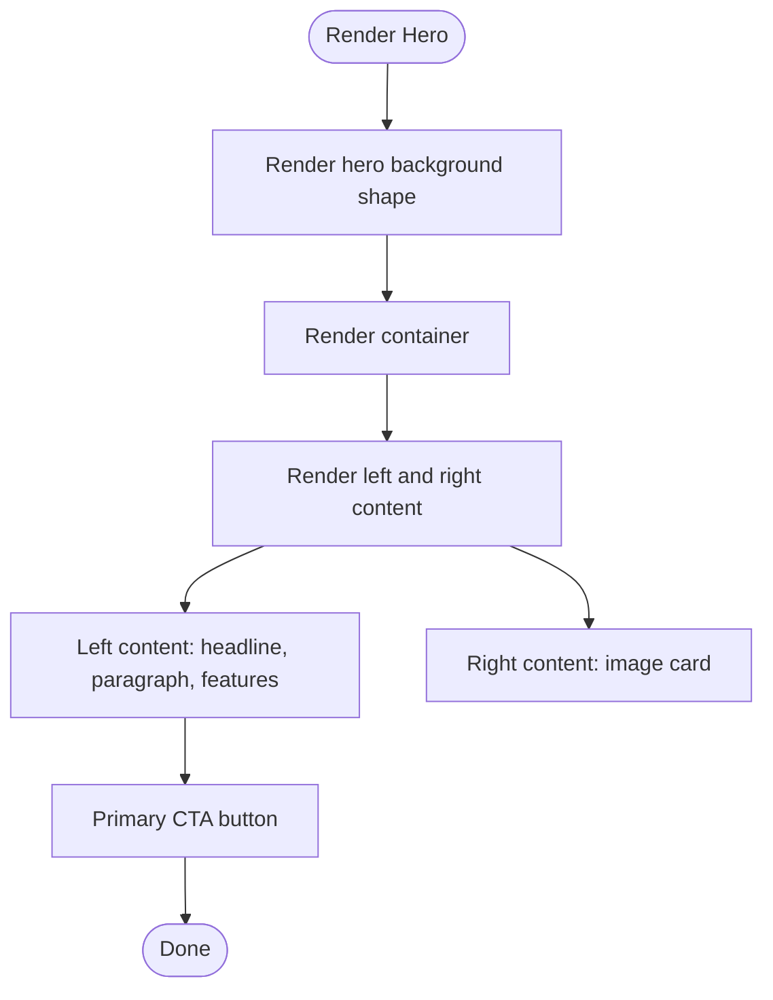

**Diagram sources**
- [Hero.jsx](file://src/components/Hero/Hero.jsx#L3-L43)

**Section sources**
- [Hero.jsx](file://src/components/Hero/Hero.jsx#L1-L45)
- [Hero.css](file://src/components/Hero/Hero.css#L1-L126)

### SearchBar
- Composition pattern: Input with icon, two dropdown-like selectors, divider spacers, and a submit button.
- Props interface: None.
- Styling approach: Centered container, shadowed box, responsive stacked layout on small screens.
- Integration: Centered within Hero or page content; ensure consistent icon sizing.

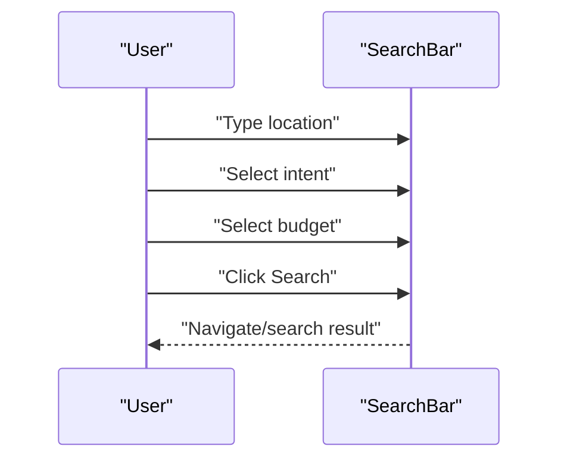

**Diagram sources**
- [SearchBar.jsx](file://src/components/SearchBar/SearchBar.jsx#L4-L32)

**Section sources**
- [SearchBar.jsx](file://src/components/SearchBar/SearchBar.jsx#L1-L34)
- [SearchBar.css](file://src/components/SearchBar/SearchBar.css#L1-L95)

### PopularLocalities
- Composition pattern: Label with pin icon and a list of pill-shaped links with trailing arrows.
- Props interface: None.
- Styling approach: Horizontal layout with wrapping; hover interactions and active colors.
- Integration: Place beneath Hero or SearchBar to guide quick selections.

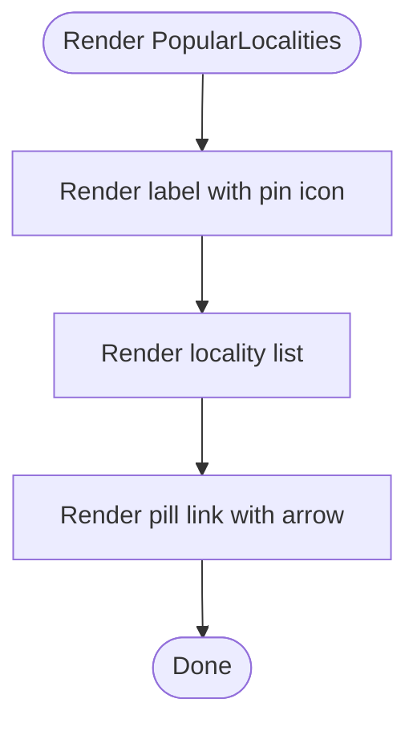

**Diagram sources**
- [PopularLocalities.jsx](file://src/components/PopularLocalities/PopularLocalities.jsx#L12-L28)

**Section sources**
- [PopularLocalities.jsx](file://src/components/PopularLocalities/PopularLocalities.jsx#L1-L31)
- [PopularLocalities.css](file://src/components/PopularLocalities/PopularLocalities.css#L1-L58)

### Properties
- Composition pattern: Section header and a responsive grid of property cards.
- Props interface: None.
- Styling approach: Grid layout with responsive columns; card hover elevation; tag-specific colors.
- Integration: Use to present curated or filtered property results.

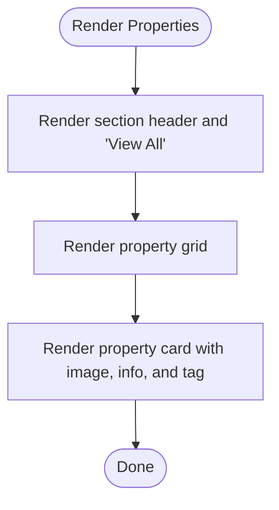

**Diagram sources**
- [Properties.jsx](file://src/components/Properties/Properties.jsx#L28-L66)

**Section sources**
- [Properties.jsx](file://src/components/Properties/Properties.jsx#L1-L67)
- [Properties.css](file://src/components/Properties/Properties.css#L1-L107)

### Visits
- Composition pattern: Section title and a grid of visit cards with images, descriptions, and buttons.
- Props interface: None.
- Styling approach: Card hover elevation; centered imagery; responsive single-column layout on small screens.
- Integration: Encourage immediate engagement after property browsing.

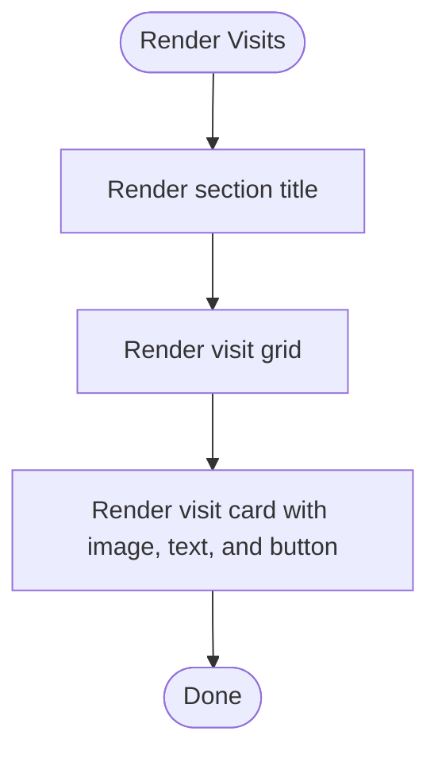

**Diagram sources**
- [Visits.jsx](file://src/components/Visits/Visits.jsx#L24-L47)

**Section sources**
- [Visits.jsx](file://src/components/Visits/Visits.jsx#L1-L49)
- [Visits.css](file://src/components/Visits/Visits.css#L1-L79)

### WhyUs
- Composition pattern: Section header with navigation arrows and a grid of feature cards with icons.
- Props interface: None.
- Styling approach: Grid layout, active arrow state, hover elevation.
- Integration: Use as a feature showcase between value and service sections.

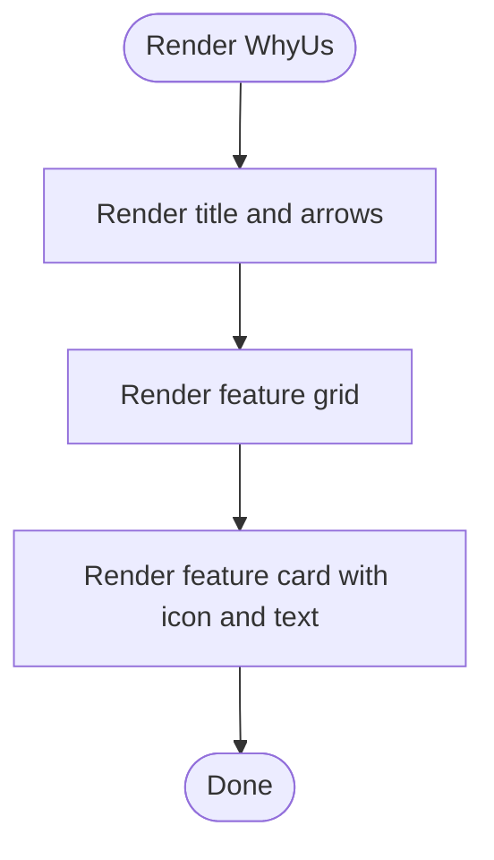

**Diagram sources**
- [WhyUs.jsx](file://src/components/WhyUs/WhyUs.jsx#L30-L58)

**Section sources**
- [WhyUs.jsx](file://src/components/WhyUs/WhyUs.jsx#L1-L61)
- [WhyUs.css](file://src/components/WhyUs/WhyUs.css#L1-L85)

### Services
- Composition pattern: Section title and a grid of service cards with images and descriptions.
- Props interface: None.
- Styling approach: Card hover elevation; image cropping; responsive grid.
- Integration: Offer related services alongside property discovery.

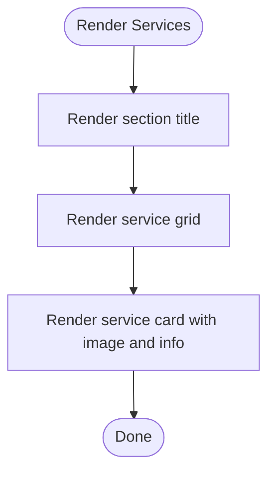

**Diagram sources**
- [Services.jsx](file://src/components/Services/Services.jsx#L36-L59)

**Section sources**
- [Services.jsx](file://src/components/Services/Services.jsx#L1-L62)
- [Services.css](file://src/components/Services/Services.css#L1-L61)

### Footer
- Composition pattern: Branding and description, social links, and a multi-column link grid.
- Props interface: None.
- Styling approach: Dark theme, grid layout, hover transitions on links and social icons.
- Integration: Place at page bottom; ensure readable typography and accessible links.

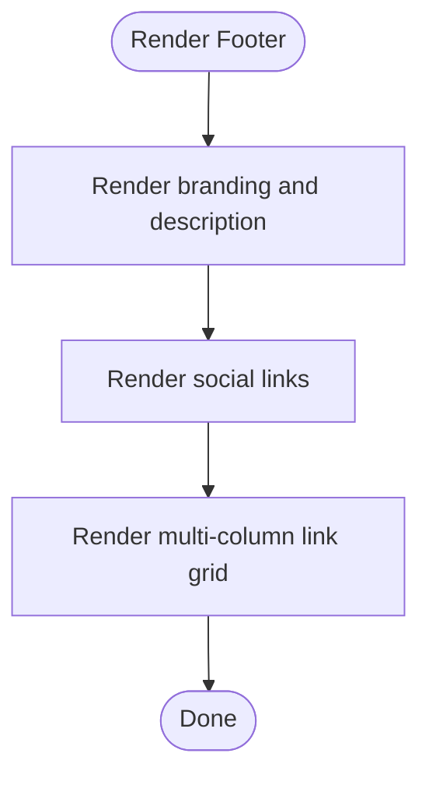

**Diagram sources**
- [Footer.jsx](file://src/components/Footer/Footer.jsx#L11-L48)

**Section sources**
- [Footer.jsx](file://src/components/Footer/Footer.jsx#L1-L51)
- [Footer.css](file://src/components/Footer/Footer.css#L1-L98)

## Dependency Analysis
- Internal dependencies: None among components; each is self-contained.
- External dependencies:
  - Lucide React: Used across components for icons (Home, Search, ChevronDown, MapPin, ChevronRight, ChevronLeft, Facebook, Instagram, Twitter, Youtube, Linkedin, List, ShieldCheck, Sliders).
  - CSS Modules: Each component imports its own stylesheet.
  - Media queries: Responsive breakpoints applied per component’s CSS.
- Coupling and cohesion:
  - Low inter-component coupling; high cohesion within each component.
  - No shared props or state management; components are presentation-focused.

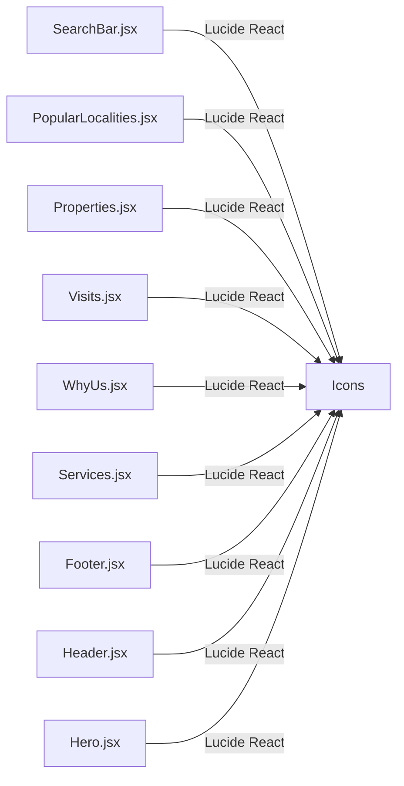

**Diagram sources**
- [SearchBar.jsx](file://src/components/SearchBar/SearchBar.jsx#L1-L34)
- [PopularLocalities.jsx](file://src/components/PopularLocalities/PopularLocalities.jsx#L1-L31)
- [Properties.jsx](file://src/components/Properties/Properties.jsx#L1-L67)
- [Visits.jsx](file://src/components/Visits/Visits.jsx#L1-L49)
- [WhyUs.jsx](file://src/components/WhyUs/WhyUs.jsx#L1-L61)
- [Services.jsx](file://src/components/Services/Services.jsx#L1-L62)
- [Footer.jsx](file://src/components/Footer/Footer.jsx#L1-L51)
- [Header.jsx](file://src/components/Header/Header.jsx#L1-L26)
- [Hero.jsx](file://src/components/Hero/Hero.jsx#L1-L45)

**Section sources**
- [SearchBar.jsx](file://src/components/SearchBar/SearchBar.jsx#L1-L34)
- [PopularLocalities.jsx](file://src/components/PopularLocalities/PopularLocalities.jsx#L1-L31)
- [Properties.jsx](file://src/components/Properties/Properties.jsx#L1-L67)
- [Visits.jsx](file://src/components/Visits/Visits.jsx#L1-L49)
- [WhyUs.jsx](file://src/components/WhyUs/WhyUs.jsx#L1-L61)
- [Services.jsx](file://src/components/Services/Services.jsx#L1-L62)
- [Footer.jsx](file://src/components/Footer/Footer.jsx#L1-L51)
- [Header.jsx](file://src/components/Header/Header.jsx#L1-L26)
- [Hero.jsx](file://src/components/Hero/Hero.jsx#L1-L45)

## Performance Considerations
- Rendering cost: Components are lightweight; minimal DOM nesting and no heavy computations.
- Image handling: Ensure property and service images are optimized; lazy loading can be considered for large grids.
- CSS Modules: Scoped styles reduce specificity conflicts and improve maintainability.
- Responsiveness: Media queries are used per component; keep breakpoint logic localized to avoid cascade effects.
- Icon usage: Lucide React renders SVGs; keep sizes consistent to prevent layout shifts.

## Troubleshooting Guide
- Missing icons: Verify Lucide React imports and sizes match the design system.
- Layout shifts: Ensure images have explicit dimensions or aspect ratios set in CSS.
- Hover states not working: Confirm pseudo-class selectors (e.g., hover) are defined in the component’s CSS.
- Responsive issues: Check media query breakpoints and ensure containers use appropriate widths.
- Styling conflicts: Since each component uses CSS Modules, confirm class names are unique and not overridden by global styles unintentionally.

## Conclusion
The Propellow UI component library is a set of cohesive, self-contained components styled with CSS Modules and powered by Lucide React icons. Each component follows a consistent composition pattern, emphasizes responsiveness, and integrates seamlessly into a larger page layout. Extending or customizing components should preserve their modular structure and adhere to the shared design tokens and iconography.

## Appendices
- Shared design tokens: The components use CSS custom properties for colors and typography. Reference the CSS files for variable usage.
- Iconography: Lucide React is used across components. Maintain consistent sizing and color usage for visual coherence.
- Animation: Hover elevations and subtle transitions are implemented via CSS; no external animation libraries are used.