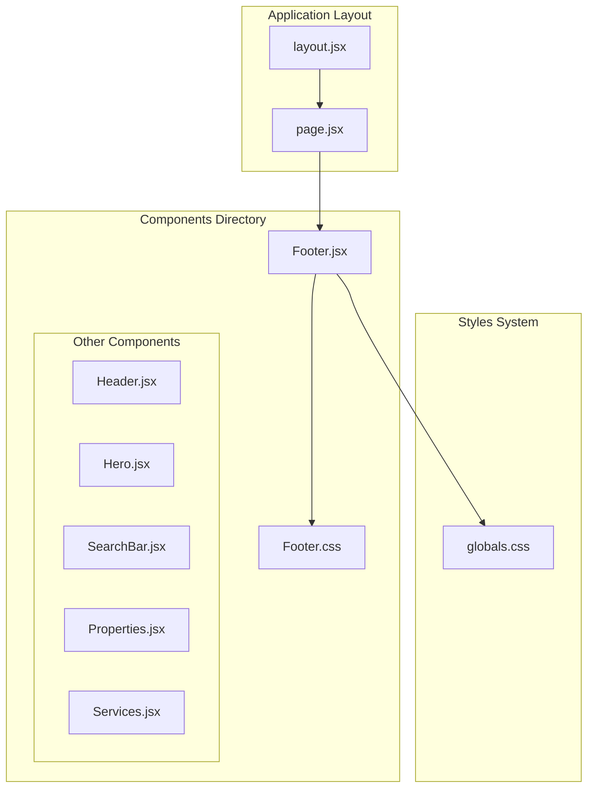
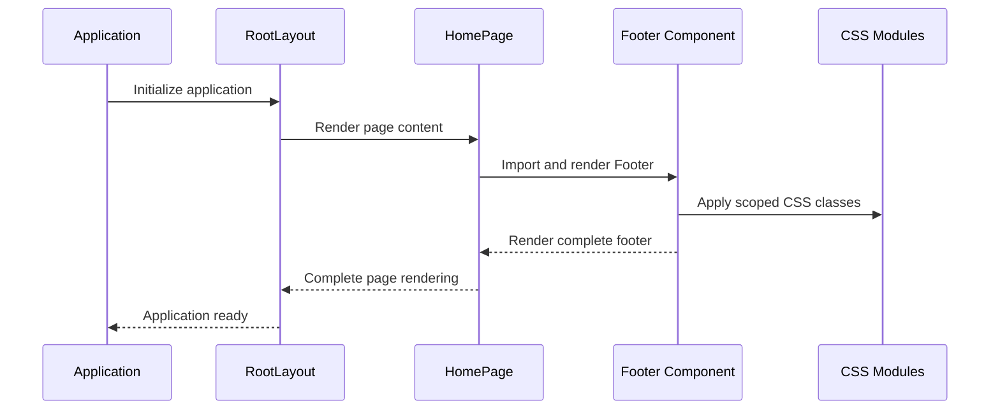
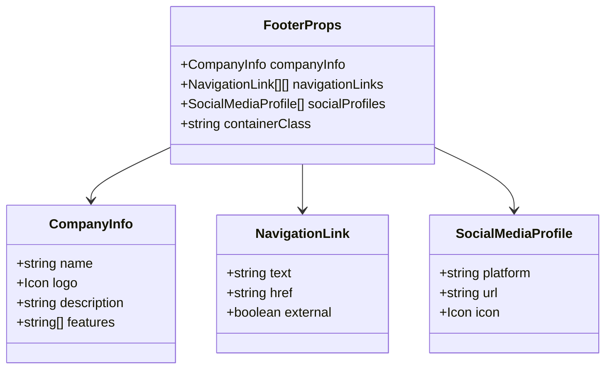
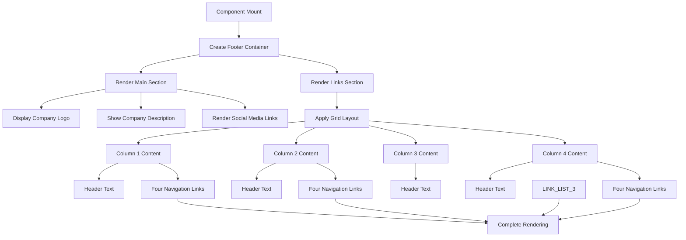
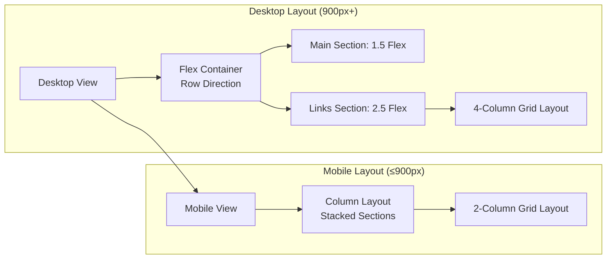
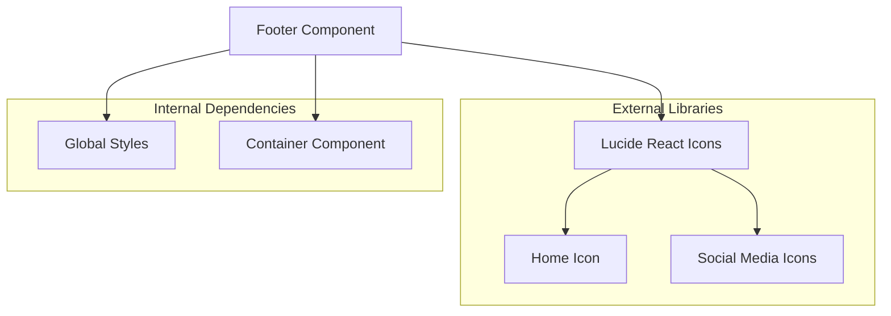
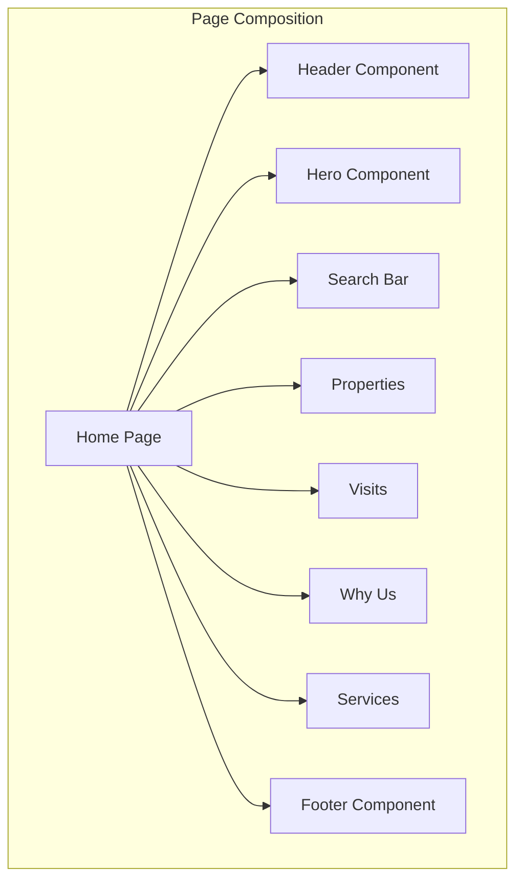

# Footer Component

<cite>
**Referenced Files in This Document**
- [Footer.jsx](file://src/components/Footer/Footer.jsx)
- [Footer.css](file://src/components/Footer/Footer.css)
- [layout.jsx](file://src/app/layout.jsx)
- [page.jsx](file://src/app/page.jsx)
- [globals.css](file://src/styles/globals.css)
</cite>

## Table of Contents
1. [Introduction](#introduction)
2. [Project Structure](#project-structure)
3. [Core Components](#core-components)
4. [Architecture Overview](#architecture-overview)
5. [Detailed Component Analysis](#detailed-component-analysis)
6. [Dependency Analysis](#dependency-analysis)
7. [Performance Considerations](#performance-considerations)
8. [Troubleshooting Guide](#troubleshooting-guide)
9. [Conclusion](#conclusion)

## Introduction
The Footer component serves as the essential navigation and contact hub for the Propellow real estate platform. It presents company information, organizes navigation links across four distinct categories, and integrates social media profiles to enhance brand visibility and user engagement. Built with modern React practices and CSS Modules, the component ensures consistent styling, responsive design, and seamless integration with the overall platform aesthetic.

## Project Structure
The Footer component follows a modular architecture within the Next.js application structure, positioned alongside other UI components in the components directory. It maintains separation of concerns through dedicated CSS styling and integrates seamlessly with the application layout.



**Diagram sources**
- [layout.jsx](file://src/app/layout.jsx#L8-L14)
- [page.jsx](file://src/app/page.jsx#L1-L26)
- [Footer.jsx](file://src/components/Footer/Footer.jsx#L1-L51)

**Section sources**
- [Footer.jsx](file://src/components/Footer/Footer.jsx#L1-L51)
- [Footer.css](file://src/components/Footer/Footer.css#L1-L98)
- [layout.jsx](file://src/app/layout.jsx#L1-L15)
- [page.jsx](file://src/app/page.jsx#L1-L26)

## Core Components
The Footer component consists of three primary sections that work together to deliver comprehensive information and navigation:

### Company Information Section
The left-hand section establishes brand identity through logo presentation and company description. It features a branded icon integrated with the company name, accompanied by a compelling brand message that communicates the platform's value proposition.

### Navigation Links Grid
The component organizes essential navigation links into a responsive four-column grid layout. Each column contains header text and four navigational items, providing structured access to key platform features and services.

### Social Media Integration
A prominent social media section showcases five major platforms with circular profile containers. The implementation includes hover effects that enhance interactivity while maintaining brand consistency.

**Section sources**
- [Footer.jsx](file://src/components/Footer/Footer.jsx#L11-L50)
- [Footer.css](file://src/components/Footer/Footer.css#L13-L88)

## Architecture Overview
The Footer component operates within the Next.js framework's component hierarchy, integrating with the global layout system and styled through CSS Modules for scoped styling benefits.



**Diagram sources**
- [layout.jsx](file://src/app/layout.jsx#L8-L14)
- [page.jsx](file://src/app/page.jsx#L11-L25)
- [Footer.jsx](file://src/components/Footer/Footer.jsx#L1-L51)

## Detailed Component Analysis

### Component Structure and Props Interface
Currently, the Footer component operates as a static component without external props. However, the architecture supports future enhancement through a well-defined props interface:



**Diagram sources**
- [Footer.jsx](file://src/components/Footer/Footer.jsx#L11-L50)

### Layout Structure Implementation
The component employs a flexible two-column layout that transforms into a single-column mobile layout:



**Diagram sources**
- [Footer.jsx](file://src/components/Footer/Footer.jsx#L14-L46)

### Responsive Design Implementation
The component implements a sophisticated responsive design system that adapts to various screen sizes:



**Diagram sources**
- [Footer.css](file://src/components/Footer/Footer.css#L90-L97)

**Section sources**
- [Footer.jsx](file://src/components/Footer/Footer.jsx#L11-L50)
- [Footer.css](file://src/components/Footer/Footer.css#L1-L98)

### Styling Approach with CSS Modules
The component utilizes CSS Modules for scoped styling, ensuring isolation from other components while maintaining design consistency:

#### Color Scheme and Typography
The Footer implements a dark theme with orange accent colors, following the established design system:

| Property | Value | Usage |
|----------|-------|--------|
| Background | #0a0a0a | Dark background for contrast |
| Primary Color | #ff6a00 | Brand accent color |
| Text Colors | #ffffff, #bbb, #999 | Multi-level text hierarchy |
| Container Width | 1200px | Maximum content width |

#### Interactive Elements
Hover effects provide visual feedback for user interactions:

```mermaid
stateDiagram-v2
[*] --> Default
Default --> Hover : Mouse Over
Hover --> Active : Click
Active --> Hover : Mouse Leave
Hover --> Default : Mouse Leave
state Default {
Background : Transparent
Border : 1px solid #333
Color : White
}
state Hover {
Background : #ff6a00
Border : 1px solid #ff6a00
Color : White
}
```

**Diagram sources**
- [Footer.css](file://src/components/Footer/Footer.css#L55-L58)

**Section sources**
- [Footer.css](file://src/components/Footer/Footer.css#L1-L98)
- [globals.css](file://src/styles/globals.css#L3-L10)

### Integration with Company Branding
The Footer component serves as a crucial touchpoint for brand consistency across the platform:

#### Brand Identity Elements
- **Logo Integration**: The Home icon combined with company name creates a recognizable brand mark
- **Color Consistency**: Orange (#ff6a00) accent color aligns with the primary brand color
- **Typography**: Poppins font family maintains visual continuity with other platform elements

#### Navigation Organization
The four-column layout provides structured access to key platform areas, though the current implementation uses placeholder content that should be replaced with actual navigation data.

**Section sources**
- [Footer.jsx](file://src/components/Footer/Footer.jsx#L16-L46)
- [globals.css](file://src/styles/globals.css#L1-L60)

## Dependency Analysis

### External Dependencies
The Footer component relies on several key dependencies:



**Diagram sources**
- [Footer.jsx](file://src/components/Footer/Footer.jsx#L2-L9)

### Internal Component Integration
The Footer integrates with the broader application ecosystem through the page composition pattern:



**Diagram sources**
- [page.jsx](file://src/app/page.jsx#L1-L26)

**Section sources**
- [Footer.jsx](file://src/components/Footer/Footer.jsx#L1-L51)
- [page.jsx](file://src/app/page.jsx#L1-L26)

## Performance Considerations
The Footer component is designed for optimal performance through several architectural choices:

### Lightweight Implementation
- **Minimal Dependencies**: Only requires lucide-react for icons
- **Static Content**: Current implementation uses hardcoded content for simplicity
- **Efficient Rendering**: Uses simple JSX structure without complex state management

### CSS Optimization
- **Scoped Styling**: CSS Modules prevent style conflicts and reduce bundle size
- **Efficient Selectors**: Minimal selector specificity reduces rendering overhead
- **Responsive Efficiency**: Media queries trigger only at 900px breakpoint

### Bundle Size Impact
The component contributes minimal overhead to the overall application bundle while providing essential functionality.

## Troubleshooting Guide

### Common Issues and Solutions

#### Styling Conflicts
**Problem**: Footer styles affecting other components
**Solution**: CSS Modules automatically scope styles, preventing conflicts

#### Responsive Design Issues
**Problem**: Layout breaks on smaller screens
**Solution**: Verify media query breakpoints and container width settings

#### Icon Display Problems
**Problem**: Social media icons not rendering
**Solution**: Ensure lucide-react is properly installed and icons are correctly imported

#### Content Organization
**Problem**: Navigation links appear as placeholders
**Solution**: Replace static content with dynamic data structures

### Debugging Steps
1. **Inspect Element**: Use browser dev tools to verify CSS class application
2. **Console Check**: Verify icon library imports are functioning
3. **Network Tab**: Confirm media query activation at 900px breakpoint
4. **Component Tree**: Trace component hierarchy in React DevTools

**Section sources**
- [Footer.jsx](file://src/components/Footer/Footer.jsx#L1-L51)
- [Footer.css](file://src/components/Footer/Footer.css#L90-L98)

## Conclusion
The Footer component successfully delivers a comprehensive navigation and contact hub for the Propellow platform. Its modular architecture, responsive design, and integration with the global styling system establish a foundation for consistent brand presentation across all platform touchpoints. While currently implemented as a static component, the architecture supports future enhancements through props-based configuration, enabling dynamic content management and personalized user experiences.

The component's contribution to brand consistency extends beyond visual elements to encompass user experience patterns, navigation organization, and social engagement strategies. As the platform evolves, the Footer component provides a scalable foundation for incorporating additional features while maintaining design coherence and performance standards.