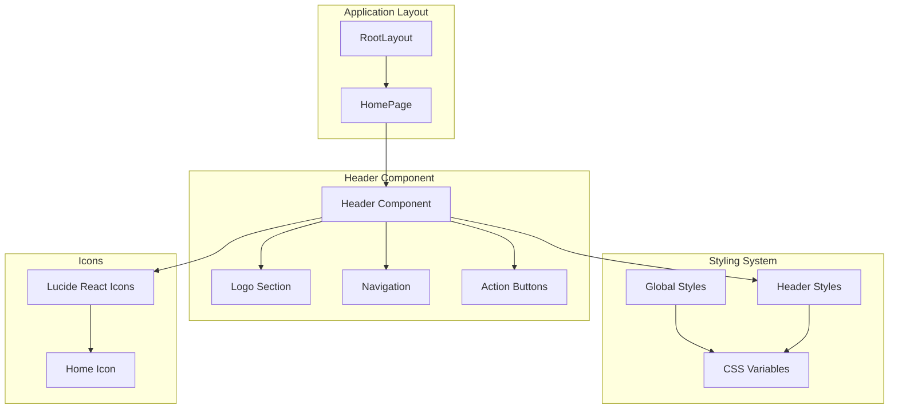
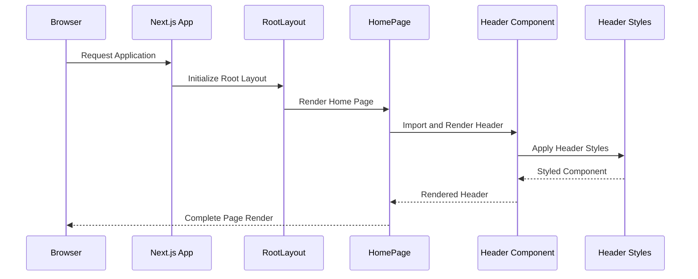
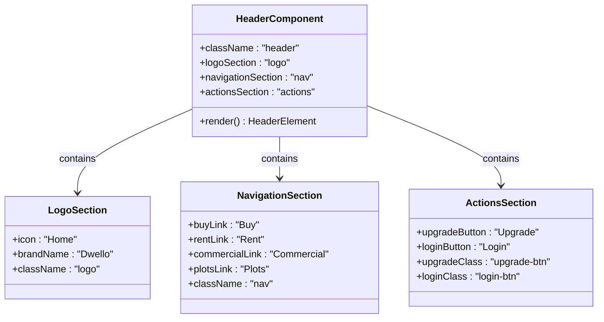
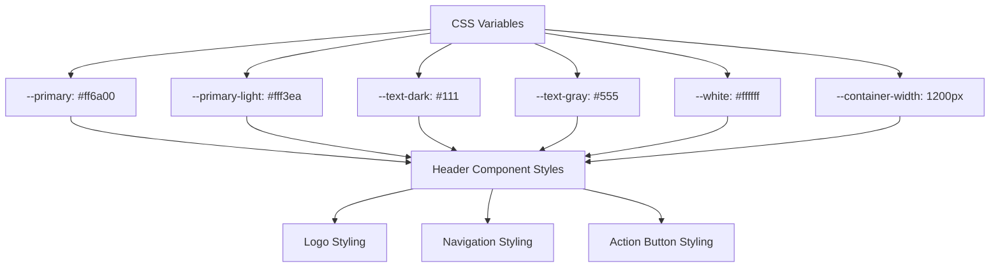
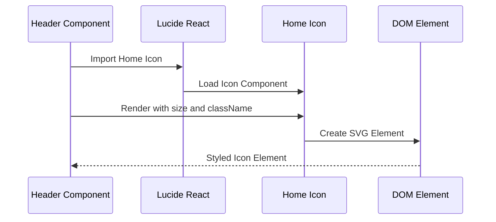
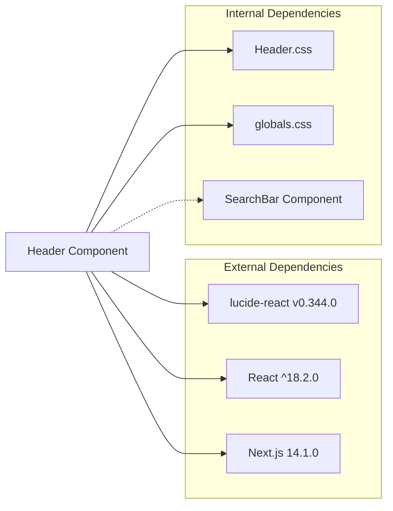
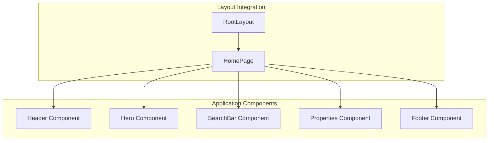

# Header Component

<cite>
**Referenced Files in This Document**
- [Header.jsx](file://src/components/Header/Header.jsx)
- [Header.css](file://src/components/Header/Header.css)
- [layout.jsx](file://src/app/layout.jsx)
- [page.jsx](file://src/app/page.jsx)
- [globals.css](file://src/styles/globals.css)
- [package.json](file://package.json)
- [SearchBar.jsx](file://src/components/SearchBar/SearchBar.jsx)
</cite>

## Table of Contents
1. [Introduction](#introduction)
2. [Project Structure](#project-structure)
3. [Core Components](#core-components)
4. [Architecture Overview](#architecture-overview)
5. [Detailed Component Analysis](#detailed-component-analysis)
6. [Dependency Analysis](#dependency-analysis)
7. [Performance Considerations](#performance-considerations)
8. [Troubleshooting Guide](#troubleshooting-guide)
9. [Conclusion](#conclusion)

## Introduction
The Header component serves as the primary navigation element for the Propellow real estate platform. It provides essential branding identity, property category navigation, and user action buttons positioned at the top of every page. Built with modern React patterns and styled with CSS modules, the component follows a clean, accessible design that adapts seamlessly across device sizes.

## Project Structure
The Header component is organized within the components directory alongside other UI elements. It integrates with the Next.js application layout and shares styling variables with the global stylesheet.



**Diagram sources**
- [layout.jsx](file://src/app/layout.jsx#L1-L15)
- [page.jsx](file://src/app/page.jsx#L1-L26)
- [Header.jsx](file://src/components/Header/Header.jsx#L1-L26)
- [Header.css](file://src/components/Header/Header.css#L1-L73)
- [globals.css](file://src/styles/globals.css#L1-L60)

**Section sources**
- [layout.jsx](file://src/app/layout.jsx#L1-L15)
- [page.jsx](file://src/app/page.jsx#L1-L26)

## Core Components
The Header component consists of three primary sections that work together to provide a cohesive navigation experience:

### Navigation Structure
- **Logo and Branding**: Features the Dwello brand identity with a Home icon and company name
- **Property Category Navigation**: Links for Buy, Rent, Commercial, and Plots categories
- **User Action Buttons**: Upgrade and Login buttons for user engagement

### Styling Approach
The component utilizes CSS modules with CSS variables for consistent theming across the application. The styling system provides:
- Flexbox-based layout for responsive alignment
- Sticky positioning for persistent navigation
- Hover effects for interactive elements
- Mobile-first responsive design with breakpoint at 900px

**Section sources**
- [Header.jsx](file://src/components/Header/Header.jsx#L4-L25)
- [Header.css](file://src/components/Header/Header.css#L1-L73)

## Architecture Overview
The Header component follows a modular architecture pattern within the Next.js framework, integrating seamlessly with the application's layout system and sharing design tokens through CSS variables.



**Diagram sources**
- [layout.jsx](file://src/app/layout.jsx#L8-L14)
- [page.jsx](file://src/app/page.jsx#L11-L25)
- [Header.jsx](file://src/components/Header/Header.jsx#L1-L26)

## Detailed Component Analysis

### Component Structure and Implementation
The Header component is implemented as a functional React component that returns JSX markup structured into three main sections: logo, navigation, and actions.



**Diagram sources**
- [Header.jsx](file://src/components/Header/Header.jsx#L4-L25)

### Styling System and Design Tokens
The component leverages a comprehensive CSS variable system inherited from the global stylesheet:



**Diagram sources**
- [globals.css](file://src/styles/globals.css#L3-L10)
- [Header.css](file://src/components/Header/Header.css#L1-L73)

### Responsive Design Implementation
The component implements a mobile-first responsive design strategy with a breakpoint at 900px:

```mermaid
flowchart TD
Desktop[Desktop View] --> HeaderPadding[Padding: 20px 80px]
Desktop --> NavVisible[Navigation Visible]
Mobile[Mobile View] --> MobilePadding[Padding: 20px 40px]
Mobile --> NavHidden[Navigation Hidden]
Desktop --> Breakpoint[900px Breakpoint]
Breakpoint --> Mobile
HeaderPadding --> MediaQuery[@media (max-width: 900px)]
NavVisible --> MediaQuery
MobilePadding --> MediaQuery
NavHidden --> MediaQuery
```

**Diagram sources**
- [Header.css](file://src/components/Header/Header.css#L65-L72)

### Icon Integration with Lucide React
The component integrates Lucide React icons for visual enhancement, specifically using the Home icon for branding:



**Diagram sources**
- [Header.jsx](file://src/components/Header/Header.jsx#L2-L9)
- [package.json](file://package.json#L14-L14)

**Section sources**
- [Header.jsx](file://src/components/Header/Header.jsx#L1-L26)
- [Header.css](file://src/components/Header/Header.css#L1-L73)
- [globals.css](file://src/styles/globals.css#L1-L60)
- [package.json](file://package.json#L10-L16)

## Dependency Analysis

### External Dependencies
The Header component relies on several key dependencies for its functionality:



**Diagram sources**
- [Header.jsx](file://src/components/Header/Header.jsx#L1-L2)
- [package.json](file://package.json#L10-L16)

### Internal Component Integration
The Header component integrates with other application components through the main page layout:



**Diagram sources**
- [page.jsx](file://src/app/page.jsx#L1-L9)
- [layout.jsx](file://src/app/layout.jsx#L8-L14)

**Section sources**
- [package.json](file://package.json#L10-L16)
- [page.jsx](file://src/app/page.jsx#L1-L26)

## Performance Considerations
The Header component is designed for optimal performance through several implementation strategies:

### Lightweight Implementation
- Single functional component with minimal state requirements
- No external state management dependencies
- Efficient CSS module usage with scoped selectors
- Minimal DOM manipulation through static markup

### Optimized Rendering
- Pure component with no unnecessary re-renders
- Efficient CSS variable usage reduces style recalculation
- Mobile-first approach minimizes layout thrashing
- Icon rendering optimized through Lucide React library

### Bundle Size Impact
- Individual component import pattern reduces initial bundle size
- CSS modules provide scoped styling without global conflicts
- Icon library integration allows for tree-shaking optimization

## Troubleshooting Guide

### Common Issues and Solutions

#### Styling Conflicts
**Issue**: Header styles conflicting with other components
**Solution**: Verify CSS module scoping and check for global style overrides

#### Icon Display Problems
**Issue**: Lucide icons not rendering correctly
**Solution**: Ensure lucide-react dependency is properly installed and imported

#### Responsive Behavior
**Issue**: Navigation not hiding on mobile devices
**Solution**: Verify media query breakpoints and CSS specificity

#### Accessibility Concerns
**Issue**: Screen reader compatibility issues
**Solution**: Add appropriate ARIA attributes and keyboard navigation support

### Debugging Steps
1. Check browser developer tools for CSS variable resolution
2. Verify component import paths in the main layout
3. Test responsive breakpoints across different viewport sizes
4. Inspect console for any JavaScript errors during component rendering

**Section sources**
- [Header.css](file://src/components/Header/Header.css#L65-L72)
- [Header.jsx](file://src/components/Header/Header.jsx#L1-L26)

## Conclusion
The Header component represents a well-architected navigation solution that effectively balances functionality, aesthetics, and performance. Its modular design, comprehensive styling system, and responsive implementation make it a cornerstone of the Propellow application's user interface. The component's integration with Lucide React icons and CSS variables demonstrates modern React development practices while maintaining accessibility and cross-device compatibility.

The component serves as both a functional navigation element and a design foundation that can be easily customized and extended as the application evolves. Its clean implementation provides a solid base for future enhancements while maintaining optimal performance characteristics.