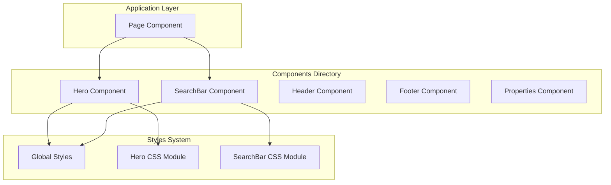
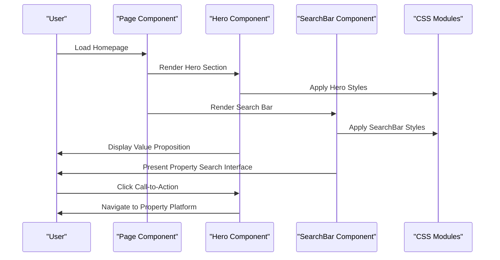
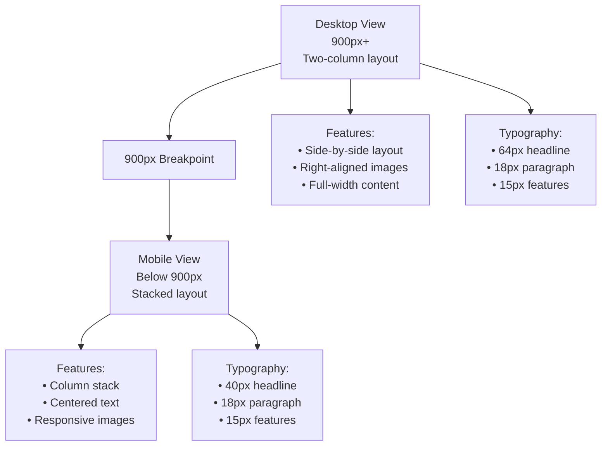
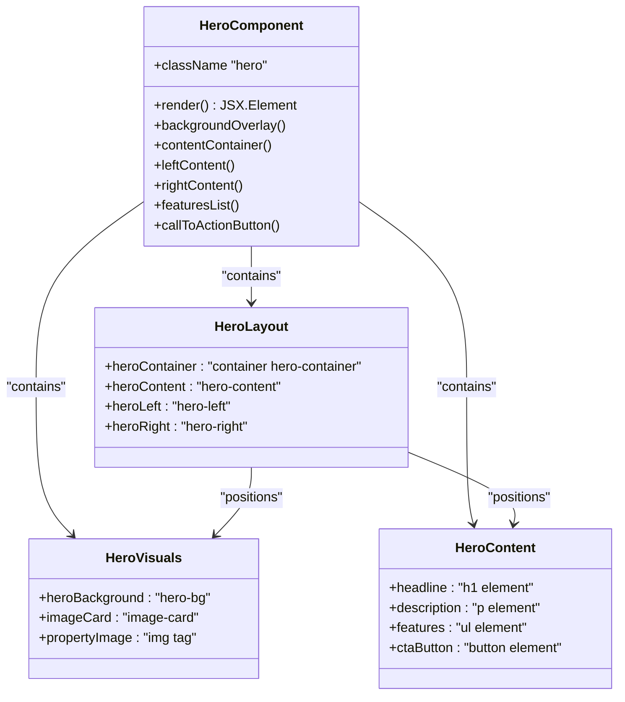
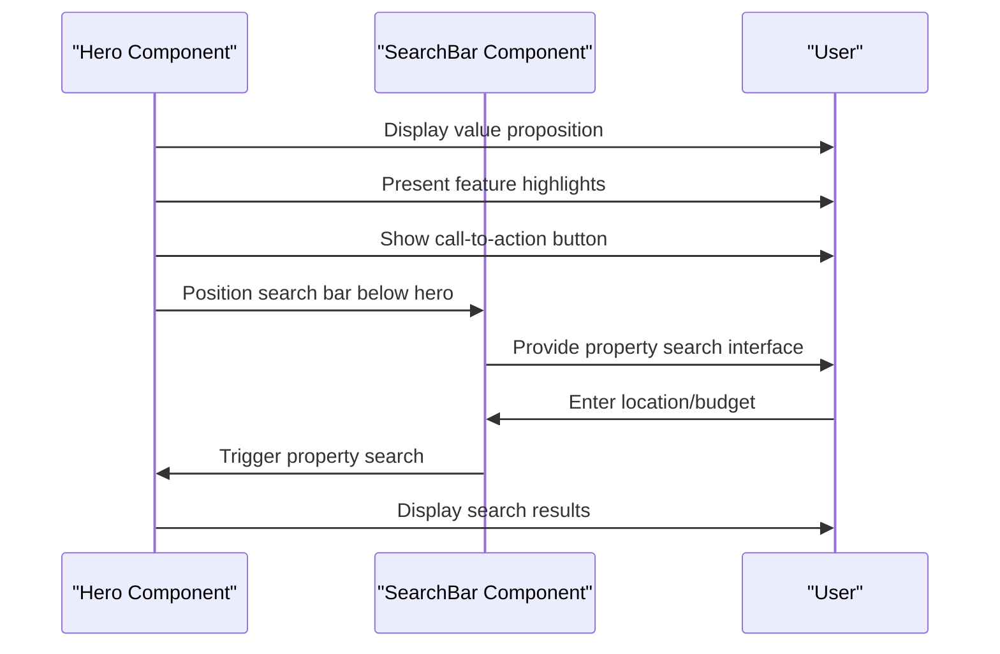
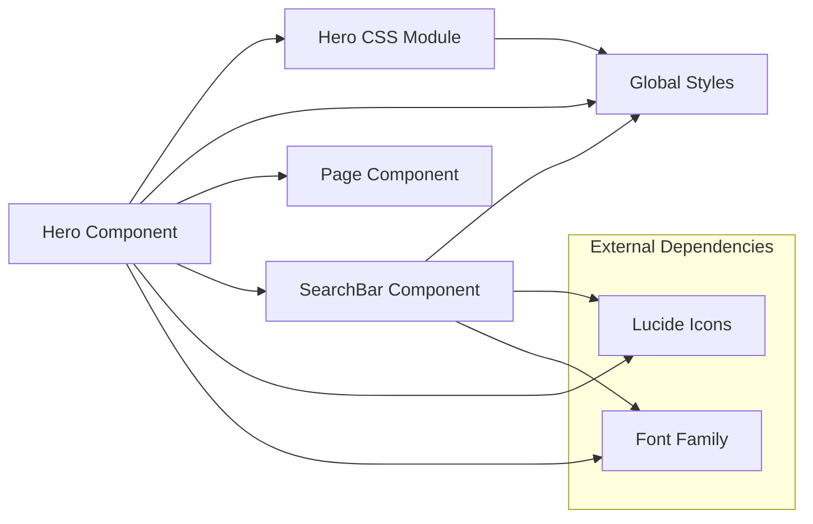

# Hero Component

<cite>
**Referenced Files in This Document**
- [Hero.jsx](file://src/components/Hero/Hero.jsx)
- [Hero.css](file://src/components/Hero/Hero.css)
- [page.jsx](file://src/app/page.jsx)
- [SearchBar.jsx](file://src/components/SearchBar/SearchBar.jsx)
- [SearchBar.css](file://src/components/SearchBar/SearchBar.css)
- [globals.css](file://src/styles/globals.css)
</cite>

## Table of Contents
1. [Introduction](#introduction)
2. [Project Structure](#project-structure)
3. [Core Components](#core-components)
4. [Architecture Overview](#architecture-overview)
5. [Detailed Component Analysis](#detailed-component-analysis)
6. [Dependency Analysis](#dependency-analysis)
7. [Performance Considerations](#performance-considerations)
8. [Troubleshooting Guide](#troubleshooting-guide)
9. [Conclusion](#conclusion)

## Introduction
The Hero component serves as the primary visual and messaging centerpiece of the Propellow property platform. Positioned prominently at the top of the homepage, it establishes the brand's value proposition while driving user engagement through strategic call-to-action elements. This component effectively communicates the platform's core differentiators—verified listings, authentic ownership verification, and elimination of fake advertisements—while maintaining a clean, modern aesthetic that aligns with the overall design system.

The component plays a crucial role in converting visitors into leads by presenting a compelling value proposition within the first viewport, supported by complementary search functionality and responsive design patterns that ensure optimal user experience across all device sizes.

## Project Structure
The Hero component is organized within the components directory alongside other key UI elements, following a feature-based organizational pattern that promotes maintainability and scalability.

**Diagram sources**
- [Hero.jsx](file://src/components/Hero/Hero.jsx#L1-L45)
- [page.jsx](file://src/app/page.jsx#L1-L26)
- [globals.css](file://src/styles/globals.css#L1-L60)

**Section sources**
- [Hero.jsx](file://src/components/Hero/Hero.jsx#L1-L45)
- [page.jsx](file://src/app/page.jsx#L1-L26)

## Core Components
The Hero component consists of several interconnected elements that work together to deliver a cohesive user experience:

### Layout Structure
The component employs a two-column layout system that adapts responsively across different screen sizes. The left column focuses on content presentation while the right column showcases visual assets, creating a balanced composition that guides user attention effectively.

### Content Hierarchy
The component presents a clear information architecture with:
- Primary headline establishing brand positioning
- Supporting paragraph explaining service benefits
- Feature highlights emphasizing platform credibility
- Prominent call-to-action button driving user engagement

### Visual Elements
Key visual components include:
- Background gradient overlay creating depth and visual interest
- Rounded corner design elements for modern aesthetic appeal
- Shadow effects enhancing dimensional perception
- Responsive image card displaying property imagery

**Section sources**
- [Hero.jsx](file://src/components/Hero/Hero.jsx#L8-L42)
- [Hero.css](file://src/components/Hero/Hero.css#L24-L108)

## Architecture Overview
The Hero component integrates seamlessly with the broader application architecture, positioned strategically within the homepage layout to maximize impact and conversion potential.

**Diagram sources**
- [page.jsx](file://src/app/page.jsx#L11-L25)
- [Hero.jsx](file://src/components/Hero/Hero.jsx#L3-L44)
- [SearchBar.jsx](file://src/components/SearchBar/SearchBar.jsx#L4-L33)

The component's architecture demonstrates clean separation of concerns with dedicated styling modules, enabling maintainable development practices and consistent design implementation across the platform.

**Section sources**
- [page.jsx](file://src/app/page.jsx#L1-L26)
- [Hero.jsx](file://src/components/Hero/Hero.jsx#L1-L45)

## Detailed Component Analysis

### Visual Design System
The Hero component implements a sophisticated design system built around brand-consistent color palettes and typography scales.

#### Color Palette Implementation
The component utilizes the established brand colors through CSS custom properties, ensuring consistency across all platform interactions:
- Primary orange (#ff6a00) for emphasis and interactive elements
- Light orange (#fff3ea) for background accents
- Dark gray (#111) for primary text
- Medium gray (#555) for secondary text

#### Typography Hierarchy
The component establishes a clear typographic scale:
- Primary headline: 64px font size with extra-bold weight
- Secondary paragraph: 18px font size for readability
- Feature list items: 15px font size with medium weight
- Call-to-action button: 14px font size with semi-bold weight

#### Spacing and Layout
Consistent spacing patterns support visual balance:
- Section padding: 80px top, 60px bottom
- Content gaps: 40px between columns
- Feature list spacing: 24px between items
- Button sizing: 14px vertical padding, 28px horizontal padding

### Responsive Design Implementation
The component implements a comprehensive mobile-first responsive strategy with breakpoint-specific adaptations.

**Diagram sources**
- [Hero.css](file://src/components/Hero/Hero.css#L110-L125)

### Component Structure Analysis
The Hero component follows a modular structure that promotes maintainability and extensibility.

**Diagram sources**
- [Hero.jsx](file://src/components/Hero/Hero.jsx#L3-L44)
- [Hero.css](file://src/components/Hero/Hero.css#L1-L126)

### Feature Highlights Implementation
The component's feature presentation system effectively communicates platform credibility through visual indicators and clear messaging.

#### Verification System
The feature list emphasizes three core assurances:
- Verified Listings: Quality assurance through platform validation
- Real Owners: Authenticity verification for property owners
- No Fake Ads: Trust-building through transparency guarantees

Each feature is presented with a distinctive checkmark indicator using the primary brand color, creating visual consistency and reinforcing the platform's commitment to quality.

**Section sources**
- [Hero.jsx](file://src/components/Hero/Hero.jsx#L20-L32)
- [Hero.css](file://src/components/Hero/Hero.css#L54-L73)

### Call-to-Action Button Design
The Hero component's primary call-to-action button exemplifies effective conversion-focused design principles.

#### Visual Design Elements
The button incorporates multiple design elements that enhance its effectiveness:
- Primary background color (#ff6a00) for brand recognition
- White text for high contrast readability
- Subtle border with transparent orange (#ff6a0033) for depth
- Soft shadow (rgba(255, 106, 0, 0.1)) for dimensional effect
- Rounded corners (8px radius) for modern appearance

#### Interactive States
The button implements smooth hover transitions that provide clear feedback:
- Background color transitions from white to primary orange
- Text color reverses from primary orange to white
- Maintains brand consistency while indicating interactivity

#### Positioning Strategy
The button is strategically positioned to guide user attention naturally through the content hierarchy, appearing after the value proposition and feature highlights to build trust before encouraging action.

**Section sources**
- [Hero.jsx](file://src/components/Hero/Hero.jsx#L32-L32)
- [Hero.css](file://src/components/Hero/Hero.css#L75-L88)

### Integration with Search Bar Component
The Hero component works in conjunction with the SearchBar component to create a seamless property discovery experience.

**Diagram sources**
- [page.jsx](file://src/app/page.jsx#L15-L16)
- [SearchBar.jsx](file://src/components/SearchBar/SearchBar.jsx#L4-L33)

The integration creates a logical user journey from awareness to action, with the Hero component establishing context and the SearchBar component facilitating immediate engagement.

**Section sources**
- [page.jsx](file://src/app/page.jsx#L1-L26)
- [SearchBar.jsx](file://src/components/SearchBar/SearchBar.jsx#L1-L34)

## Dependency Analysis
The Hero component maintains minimal external dependencies while leveraging the established design system infrastructure.

**Diagram sources**
- [Hero.jsx](file://src/components/Hero/Hero.jsx#L1-L1)
- [Hero.css](file://src/components/Hero/Hero.css#L1-L1)
- [globals.css](file://src/styles/globals.css#L1-L10)

### Internal Dependencies
The component relies on:
- Global CSS variables for consistent theming
- Container utility class for responsive width management
- Font family integration for typography consistency

### External Dependencies
Limited external dependencies ensure maintainability:
- CSS modules for scoped styling
- Font loading via Google Fonts CDN
- Iconography through Lucide React library

**Section sources**
- [Hero.jsx](file://src/components/Hero/Hero.jsx#L1-L1)
- [globals.css](file://src/styles/globals.css#L1-L10)

## Performance Considerations
The Hero component is designed with performance optimization in mind, implementing several strategies to ensure efficient rendering and loading.

### Image Loading Strategy
The component uses a static image asset that can be optimized through various techniques:
- Lazy loading implementation for improved initial load times
- Responsive image serving for different device pixel densities
- Proper image format selection (WebP where supported) for reduced file sizes

### CSS Optimization
The styling implementation includes several performance-focused patterns:
- CSS custom properties for efficient color management
- Minimal DOM nesting reducing render complexity
- Efficient media query implementation targeting specific breakpoints

### Bundle Size Impact
The component contributes minimally to bundle size:
- Single CSS module file (~126 lines)
- Static image asset requiring separate optimization
- No heavy JavaScript dependencies

## Troubleshooting Guide

### Common Issues and Solutions

#### Styling Conflicts
**Issue**: Hero styles overriding other components
**Solution**: Verify CSS specificity and ensure proper class scoping

#### Responsive Behavior Problems
**Issue**: Content overlapping on mobile devices
**Solution**: Check media query breakpoints and adjust container widths

#### Image Loading Issues
**Issue**: Missing or broken hero image
**Solution**: Verify image path and implement fallback mechanisms

#### Color Consistency Problems
**Issue**: Inconsistent brand colors across components
**Solution**: Ensure CSS custom properties are properly defined in global styles

### Debugging Strategies
- Use browser developer tools to inspect element rendering
- Verify CSS custom property values in computed styles
- Test responsive breakpoints using device toolbar
- Monitor network requests for asset loading issues

**Section sources**
- [Hero.css](file://src/components/Hero/Hero.css#L1-L126)
- [globals.css](file://src/styles/globals.css#L3-L10)

## Conclusion
The Hero component successfully establishes a strong foundation for the Propellow property platform through its strategic combination of compelling value proposition communication, visual design excellence, and seamless integration with complementary components. Its implementation demonstrates best practices in modern React development, including proper component architecture, CSS module usage, and responsive design patterns.

The component's role in establishing brand message cannot be overstated, as it serves as the primary touchpoint for new visitors, communicating the platform's core values and differentiators within the critical first viewport. Through careful attention to visual hierarchy, typography, and interactive elements, the Hero component effectively guides users toward engagement while maintaining consistency with the broader design system.

Future enhancements could include dynamic content loading, A/B testing capabilities for different value propositions, and enhanced accessibility features to further improve the user experience across diverse audiences.