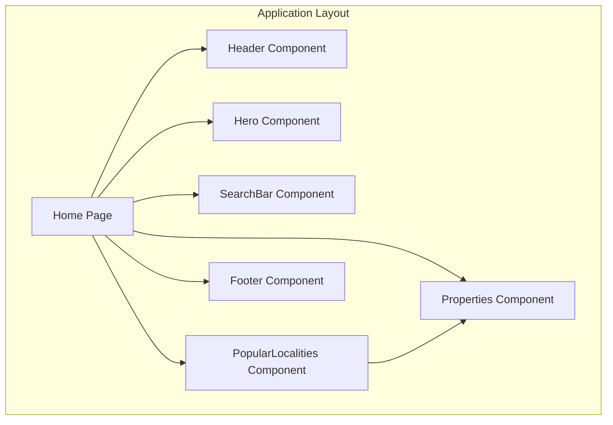
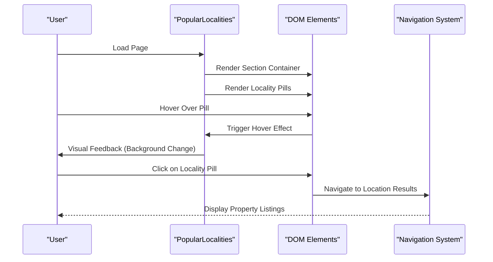
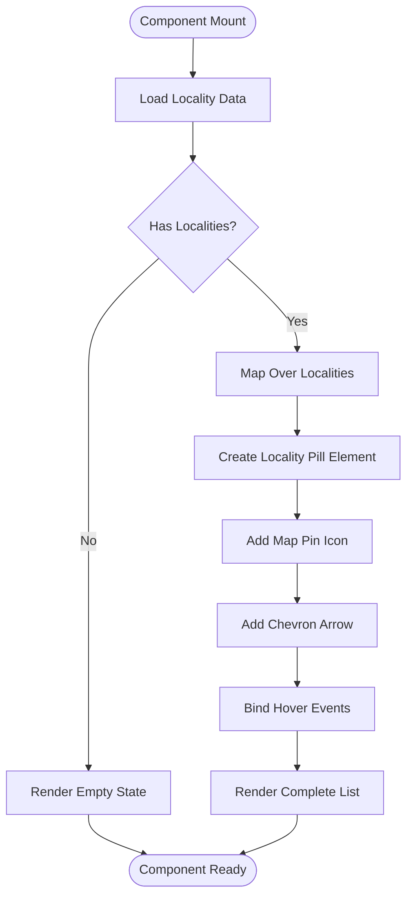
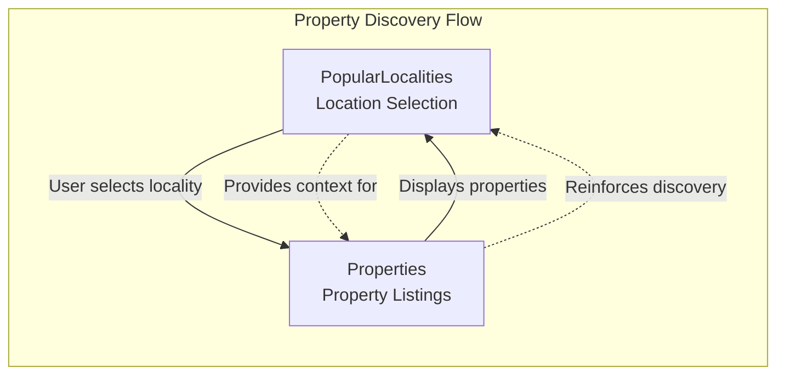
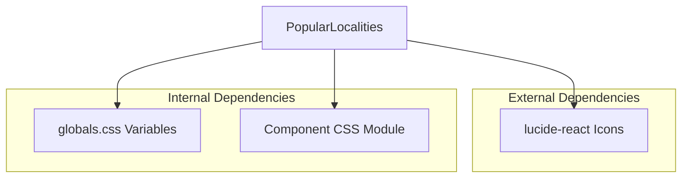

# PopularLocalities Component

<cite>
**Referenced Files in This Document**
- [PopularLocalities.jsx](file://src/components/PopularLocalities/PopularLocalities.jsx)
- [PopularLocalities.css](file://src/components/PopularLocalities/PopularLocalities.css)
- [Properties.jsx](file://src/components/Properties/Properties.jsx)
- [Properties.css](file://src/components/Properties/Properties.css)
- [page.jsx](file://src/app/page.jsx)
- [globals.css](file://src/styles/globals.css)
</cite>

## Table of Contents
1. [Introduction](#introduction)
2. [Project Structure](#project-structure)
3. [Core Components](#core-components)
4. [Architecture Overview](#architecture-overview)
5. [Detailed Component Analysis](#detailed-component-analysis)
6. [Dependency Analysis](#dependency-analysis)
7. [Performance Considerations](#performance-considerations)
8. [Troubleshooting Guide](#troubleshooting-guide)
9. [Conclusion](#conclusion)

## Introduction
The PopularLocalities component presents location-based property suggestions to users through interactive locality pills. It serves as a discovery mechanism for popular residential areas, integrating seamlessly with the overall property marketplace interface. The component showcases a clean, modern design with responsive behavior and hover interactions that enhance user engagement.

## Project Structure
The PopularLocalities component is part of the main application's homepage layout and works in conjunction with the Properties component to provide a complete property discovery experience.



**Diagram sources**
- [page.jsx](file://src/app/page.jsx#L11-L25)

**Section sources**
- [page.jsx](file://src/app/page.jsx#L1-L26)

## Core Components
The PopularLocalities component consists of two primary files: the React component implementation and its associated CSS styling module.

### Component Structure
The component exports a default function that renders a section containing:
- A labeled header with a map pin icon
- A responsive list of locality pills
- Each pill displays the locality name with a directional arrow indicator

### Styling Approach
The component uses CSS Modules with scoped class names to ensure styling isolation and prevent conflicts with other components. The styling follows a consistent design system with:
- Flexbox layout for responsive alignment
- CSS custom properties for theme consistency
- Hover effects for interactive feedback
- Mobile-first responsive design

**Section sources**
- [PopularLocalities.jsx](file://src/components/PopularLocalities/PopularLocalities.jsx#L12-L30)
- [PopularLocalities.css](file://src/components/PopularLocalities/PopularLocalities.css#L1-L58)

## Architecture Overview
The PopularLocalities component operates as a standalone presentation layer that focuses specifically on location-based property discovery. It integrates with the broader application through the main page layout while maintaining its own styling and behavioral boundaries.



**Diagram sources**
- [PopularLocalities.jsx](file://src/components/PopularLocalities/PopularLocalities.jsx#L12-L30)
- [PopularLocalities.css](file://src/components/PopularLocalities/PopularLocalities.css#L48-L50)

## Detailed Component Analysis

### Data Structure and Props Interface
The component currently uses a static array of locality names as its data source. While the current implementation doesn't accept external props, the data structure is designed to support future enhancements.

#### Current Data Structure
```javascript
const localities = [
  "Shela",
  "South Bopal", 
  "Gota",
  "Jagatpur",
  "Bopal"
];
```

#### Proposed Props Interface
For future extensibility, the component could accept the following props:

| Prop | Type | Required | Description |
|------|------|----------|-------------|
| `localities` | Array<string> | No | Array of locality names to display |
| `onLocalitySelect` | Function | No | Callback function for locality selection events |
| `title` | string | No | Custom title text for the component header |
| `className` | string | No | Additional CSS class names for customization |

### Display Logic
The component implements a straightforward rendering pattern that maps over the locality array and generates interactive pill elements.



**Diagram sources**
- [PopularLocalities.jsx](file://src/components/PopularLocalities/PopularLocalities.jsx#L20-L26)

### Styling Implementation
The component utilizes CSS Modules with scoped class names to ensure styling isolation. The styling approach emphasizes:

#### Responsive Grid Layout
The component employs a flexible flexbox layout that adapts to different screen sizes:
- Desktop: Horizontal layout with label and pill list
- Tablet/Mobile: Vertical stacked layout for optimal readability

#### Interactive Elements
Hover effects provide clear user feedback:
- Background color transitions for visual indication
- Consistent color scheme using CSS custom properties
- Smooth transitions for enhanced user experience

#### Color Scheme and Typography
The component maintains consistency with the application's design system:
- Primary orange accent color (#FF6A00) for highlights
- Dark gray text for readability
- Clean typography with appropriate spacing

### Integration with Properties Component
While PopularLocalities focuses on location discovery, it complements the Properties component by directing users to relevant property listings.



**Diagram sources**
- [PopularLocalities.jsx](file://src/components/PopularLocalities/PopularLocalities.jsx#L12-L30)
- [Properties.jsx](file://src/components/Properties/Properties.jsx#L28-L66)

**Section sources**
- [PopularLocalities.jsx](file://src/components/PopularLocalities/PopularLocalities.jsx#L1-L31)
- [PopularLocalities.css](file://src/components/PopularLocalities/PopularLocalities.css#L1-L58)
- [Properties.jsx](file://src/components/Properties/Properties.jsx#L1-L67)

## Dependency Analysis
The PopularLocalities component has minimal external dependencies, focusing on internal styling and iconography.



**Diagram sources**
- [PopularLocalities.jsx](file://src/components/PopularLocalities/PopularLocalities.jsx#L1-L2)
- [globals.css](file://src/styles/globals.css#L3-L10)

### Component Coupling
The component demonstrates low coupling with external systems:
- Uses only essential icons from lucide-react
- Leverages global CSS variables for consistent theming
- Maintains self-contained styling through CSS Modules

**Section sources**
- [PopularLocalities.jsx](file://src/components/PopularLocalities/PopularLocalities.jsx#L1-L3)
- [globals.css](file://src/styles/globals.css#L3-L10)

## Performance Considerations
Given the component's current implementation with a small, static dataset, performance considerations are straightforward but important for future scalability.

### Current Performance Profile
- **Rendering**: Single-pass array mapping over 5 locality items
- **Memory**: Minimal DOM overhead with simple anchor elements
- **Bundle Size**: Lightweight with only essential icon dependencies

### Optimization Strategies for Larger Datasets
For scenarios involving larger locality datasets or dynamic data loading:

1. **Virtualization**: Implement windowed rendering for large lists
2. **Memoization**: Use React.memo for stable locality items
3. **Lazy Loading**: Defer rendering until component is in viewport
4. **Debounced Interactions**: Throttle hover and click handlers

### User Experience Patterns
The component follows established UX patterns for property discovery:
- Clear visual hierarchy with prominent icons
- Intuitive hover states for interaction feedback
- Responsive design for cross-device compatibility
- Consistent color scheme reinforcing brand identity

## Troubleshooting Guide

### Common Issues and Solutions

#### Styling Conflicts
**Problem**: Component styles affecting other page elements
**Solution**: Verify CSS Modules are properly scoped and not importing global styles unintentionally

#### Icon Rendering Issues
**Problem**: Icons not displaying correctly
**Solution**: Ensure lucide-react is properly installed and icons are imported correctly

#### Responsive Behavior Problems
**Problem**: Layout breaks on different screen sizes
**Solution**: Check media query breakpoints and ensure container widths are properly configured

#### Accessibility Concerns
**Problem**: Screen reader compatibility issues
**Solution**: Add proper aria-labels and keyboard navigation support

### Debugging Steps
1. Verify component imports in the main page layout
2. Check CSS class names match between JSX and CSS files
3. Confirm icon library installation and version compatibility
4. Test responsive breakpoints across different device sizes

**Section sources**
- [PopularLocalities.jsx](file://src/components/PopularLocalities/PopularLocalities.jsx#L1-L31)
- [PopularLocalities.css](file://src/components/PopularLocalities/PopularLocalities.css#L1-L58)

## Conclusion
The PopularLocalities component successfully implements a focused, user-friendly solution for location-based property discovery. Its clean architecture, responsive design, and integration with the broader property marketplace system demonstrate effective frontend development practices. The component's modular structure and CSS Modules approach ensure maintainability and scalability for future enhancements.

The implementation provides a solid foundation for property discovery while maintaining excellent user experience through thoughtful interactions and responsive design. Future enhancements could include dynamic data loading, enhanced accessibility features, and expanded customization options while maintaining the component's core focus on intuitive location-based property exploration.