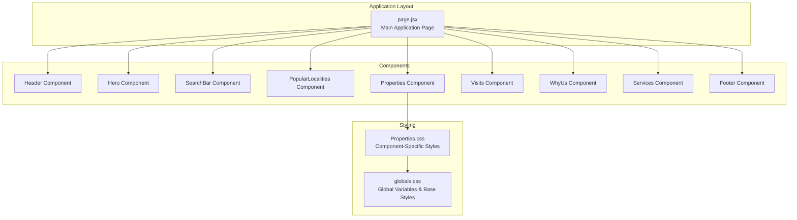
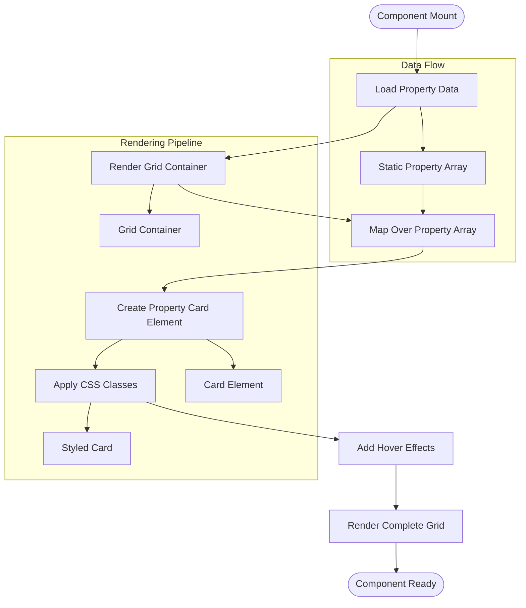
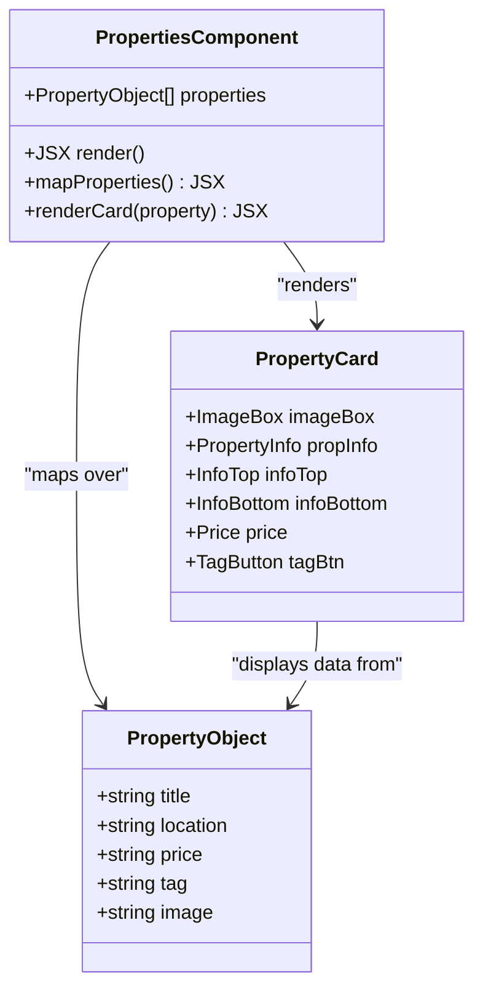
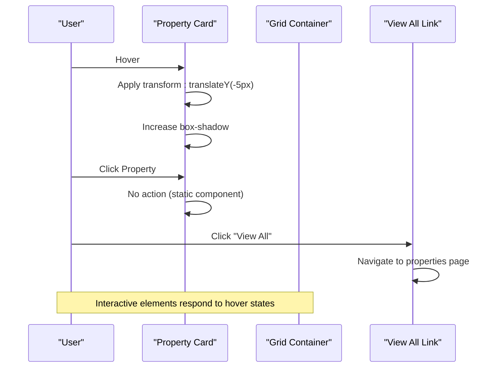
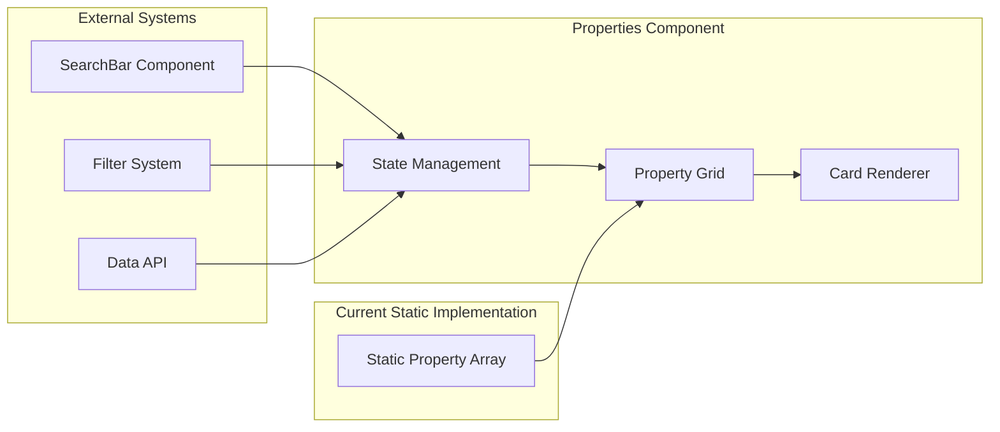
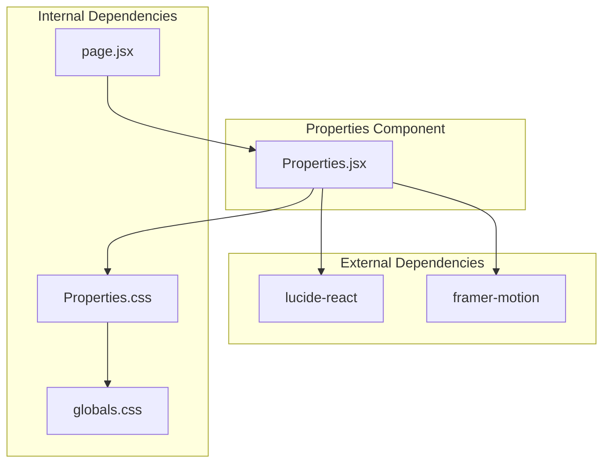
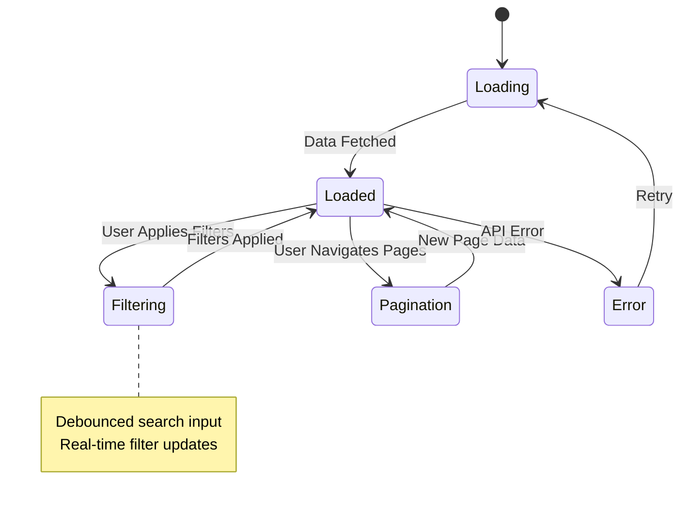

# Properties Component

<cite>
**Referenced Files in This Document**
- [Properties.jsx](file://src/components/Properties/Properties.jsx)
- [Properties.css](file://src/components/Properties/Properties.css)
- [globals.css](file://src/styles/globals.css)
- [page.jsx](file://src/app/page.jsx)
- [package.json](file://package.json)
</cite>

## Table of Contents
1. [Introduction](#introduction)
2. [Project Structure](#project-structure)
3. [Core Components](#core-components)
4. [Architecture Overview](#architecture-overview)
5. [Detailed Component Analysis](#detailed-component-analysis)
6. [Dependency Analysis](#dependency-analysis)
7. [Performance Considerations](#performance-considerations)
8. [Troubleshooting Guide](#troubleshooting-guide)
9. [Conclusion](#conclusion)

## Introduction
The Properties component renders a responsive grid of property cards showcasing popular real estate listings. It demonstrates a clean, modern design with hover animations, responsive grid layouts, and a cohesive styling system built with CSS modules. The component currently uses static property data but is structured to integrate with dynamic data sources and filtering/search functionality.

## Project Structure
The Properties component is organized as a standalone React functional component with dedicated CSS styling. It integrates into the main application layout through the homepage composition.

**Diagram sources**
- [page.jsx](file://src/app/page.jsx#L1-L26)
- [Properties.jsx](file://src/components/Properties/Properties.jsx#L1-L67)
- [globals.css](file://src/styles/globals.css#L1-L60)

**Section sources**
- [page.jsx](file://src/app/page.jsx#L1-L26)
- [Properties.jsx](file://src/components/Properties/Properties.jsx#L1-L67)

## Core Components
The Properties component consists of several key structural elements:

### Property Card Structure
Each property card follows a consistent layout pattern:
- **Image Container**: Displays property imagery with aspect ratio preservation
- **Information Panel**: Contains title, location, price, and action buttons
- **Tag System**: Visual indicators for property type (Buy/Rent/New)

### Grid Layout System
The component implements a responsive CSS Grid with:
- Desktop: 3-column layout
- Tablet: 2-column layout  
- Mobile: Single column layout

### Styling Architecture
- Uses CSS custom properties for theme consistency
- Implements hover transitions and elevation effects
- Leverages container queries for responsive adaptation

**Section sources**
- [Properties.jsx](file://src/components/Properties/Properties.jsx#L28-L66)
- [Properties.css](file://src/components/Properties/Properties.css#L22-L26)
- [Properties.css](file://src/components/Properties/Properties.css#L96-L106)

## Architecture Overview
The Properties component follows a component-driven architecture with clear separation of concerns between presentation and styling.

**Diagram sources**
- [Properties.jsx](file://src/components/Properties/Properties.jsx#L4-L26)
- [Properties.jsx](file://src/components/Properties/Properties.jsx#L42-L61)

## Detailed Component Analysis

### Property Data Structure
The component expects property objects with the following schema:

| Field | Type | Description | Example |
|-------|------|-------------|---------|
| title | string | Property name/title | "2BHK Apartment" |
| location | string | Property location | "Satellite" |
| price | string | Property pricing | "60 Lcs" |
| tag | string | Property type indicator | "Buy", "Rent", "New" |
| image | string | Image asset path | "/images/property.png" |

### Component Implementation Pattern
The Properties component uses a functional approach with the following characteristics:

**Diagram sources**
- [Properties.jsx](file://src/components/Properties/Properties.jsx#L4-L26)
- [Properties.jsx](file://src/components/Properties/Properties.jsx#L43-L61)

### Styling Approach with CSS Modules
The component employs scoped CSS styling with the following patterns:

#### Responsive Grid System
- Desktop: `repeat(3, 1fr)` creates equal-width columns
- Tablet: `repeat(2, 1fr)` adapts to smaller screens
- Mobile: `1fr` ensures full-width single column

#### Animation Implementation
- Hover effects use CSS transforms (`translateY(-5px)`)
- Smooth transitions with 0.3s duration
- Box shadow enhancements on interaction

#### Color System Integration
- Uses CSS custom properties from global stylesheet
- Tag-specific styling for Buy/Rent/New categories
- Consistent typography hierarchy

### Interaction Patterns
The component supports several interaction patterns:

**Diagram sources**
- [Properties.jsx](file://src/components/Properties/Properties.jsx#L37-L39)
- [Properties.css](file://src/components/Properties/Properties.css#L37-L40)

### Integration with Filtering and Search
While the current implementation uses static data, the component is structured to integrate with external filtering systems:

**Diagram sources**
- [Properties.jsx](file://src/components/Properties/Properties.jsx#L4-L26)
- [SearchBar.jsx](file://src/components/SearchBar/SearchBar.jsx#L1-L34)

**Section sources**
- [Properties.jsx](file://src/components/Properties/Properties.jsx#L1-L67)
- [Properties.css](file://src/components/Properties/Properties.css#L1-L107)

## Dependency Analysis
The Properties component has minimal external dependencies and clear internal relationships.

**Diagram sources**
- [package.json](file://package.json#L10-L16)
- [Properties.jsx](file://src/components/Properties/Properties.jsx#L1-L2)
- [page.jsx](file://src/app/page.jsx#L5-L5)

### External Dependencies
- **lucide-react**: Provides SVG icons (ChevronRight, Search)
- **framer-motion**: Animation library (installed but not currently used)

### Internal Dependencies
- **CSS Modules**: Scoped styling for component isolation
- **Global Variables**: CSS custom properties for theme consistency
- **Container Queries**: Responsive layout adaptation

**Section sources**
- [package.json](file://package.json#L10-L16)
- [Properties.jsx](file://src/components/Properties/Properties.jsx#L1-L2)
- [globals.css](file://src/styles/globals.css#L3-L10)

## Performance Considerations
The current implementation uses static data which provides optimal performance for small datasets. However, for production use with larger property lists, consider the following optimizations:

### Current Performance Characteristics
- **Memory Usage**: Minimal - static array loaded once
- **Rendering**: Efficient JSX mapping over small dataset
- **Bundle Size**: Lightweight with minimal dependencies

### Recommended Optimizations for Large Lists
1. **Virtualization**: Implement windowed rendering for thousands of properties
2. **Lazy Loading**: Load images only when they enter viewport
3. **Pagination**: Implement server-side pagination for large datasets
4. **Memoization**: Use React.memo for property cards to prevent unnecessary re-renders
5. **Code Splitting**: Dynamically import the Properties component for route-based loading

### State Management Integration
For dynamic property lists, integrate with state management solutions:

## Troubleshooting Guide

### Common Issues and Solutions

#### Missing Images
**Problem**: Property images not displaying
**Solution**: Verify image paths exist in public directory
**Reference**: [Image rendering](file://src/components/Properties/Properties.jsx#L46)

#### Responsive Layout Issues
**Problem**: Grid not adapting to screen sizes
**Solution**: Check media query breakpoints and container width
**Reference**: [Responsive breakpoints](file://src/components/Properties/Properties.css#L96-L106)

#### Hover Effect Not Working
**Problem**: Cards don't lift on hover
**Solution**: Verify CSS hover selectors are not overridden
**Reference**: [Hover effects](file://src/components/Properties/Properties.css#L37-L40)

#### Styling Conflicts
**Problem**: Component styles affecting other elements
**Solution**: Ensure CSS modules are properly scoped
**Reference**: [Component scoping](file://src/components/Properties/Properties.jsx#L1)

### Debugging Tips
1. **Inspect Element**: Use browser dev tools to verify CSS class application
2. **Console Logging**: Add temporary logs to verify data flow
3. **Network Tab**: Check for failed image or asset requests
4. **Performance Tab**: Monitor rendering performance with large datasets

**Section sources**
- [Properties.jsx](file://src/components/Properties/Properties.jsx#L46)
- [Properties.css](file://src/components/Properties/Properties.css#L96-L106)
- [Properties.css](file://src/components/Properties/Properties.css#L37-L40)

## Conclusion
The Properties component provides a solid foundation for property listing display with excellent responsive design and clean styling. Its modular architecture allows for easy enhancement with dynamic data sources, advanced filtering capabilities, and performance optimizations. The component's current implementation demonstrates best practices in React development while remaining flexible enough to accommodate future feature additions.

Key strengths include:
- Clean, maintainable code structure
- Responsive design with mobile-first approach
- Consistent styling system using CSS custom properties
- Scalable architecture ready for integration with external data sources

Future enhancements should focus on implementing dynamic data fetching, advanced filtering, and performance optimizations for large property catalogs.