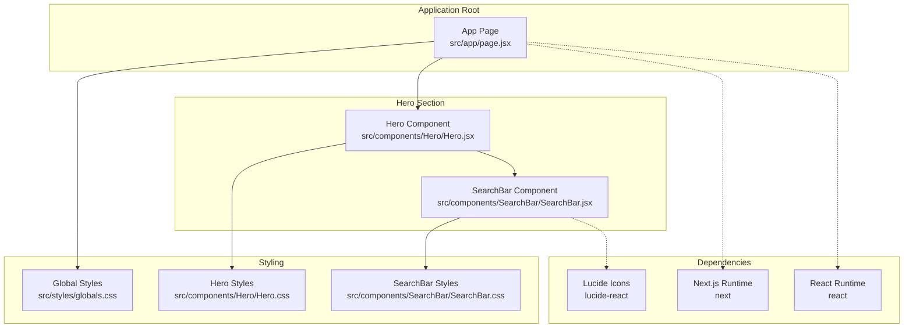
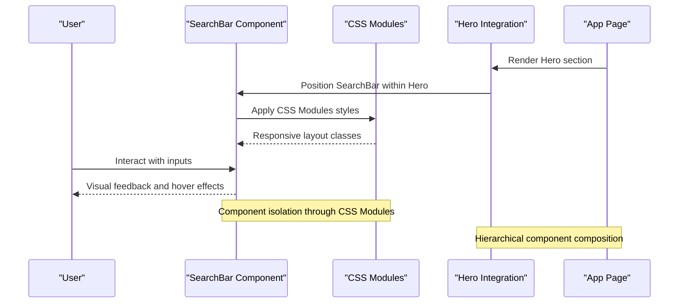
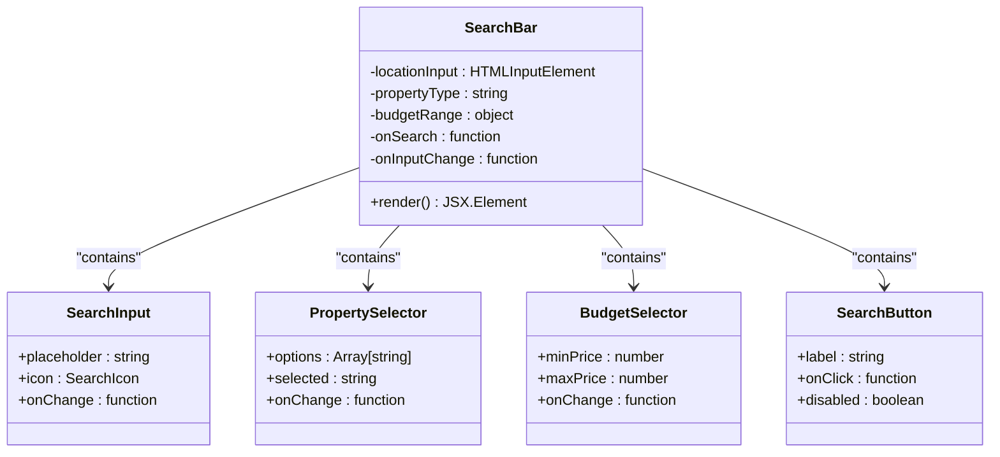
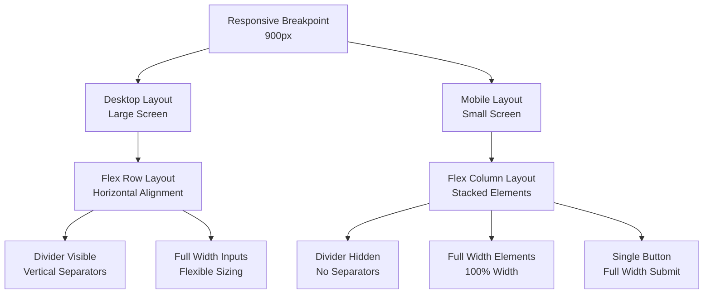
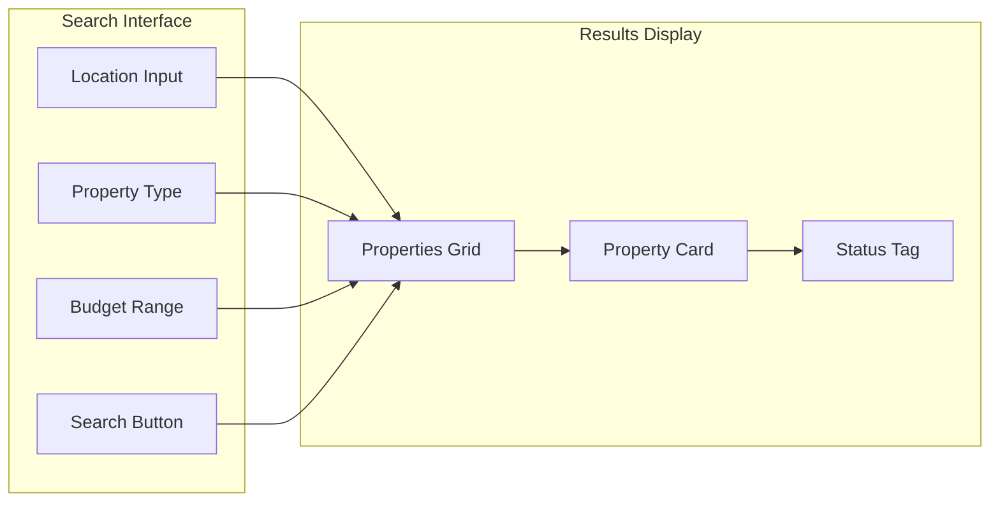
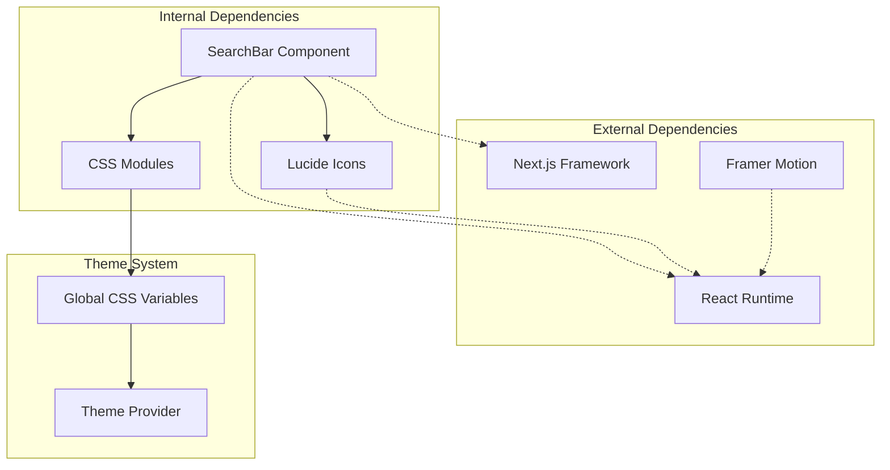

# SearchBar Component

<cite>
**Referenced Files in This Document**
- [SearchBar.jsx](file://src/components/SearchBar/SearchBar.jsx)
- [SearchBar.css](file://src/components/SearchBar/SearchBar.css)
- [page.jsx](file://src/app/page.jsx)
- [Hero.jsx](file://src/components/Hero/Hero.jsx)
- [Hero.css](file://src/components/Hero/Hero.css)
- [Properties.jsx](file://src/components/Properties/Properties.jsx)
- [globals.css](file://src/styles/globals.css)
- [package.json](file://package.json)
</cite>

## Table of Contents
1. [Introduction](#introduction)
2. [Project Structure](#project-structure)
3. [Core Components](#core-components)
4. [Architecture Overview](#architecture-overview)
5. [Detailed Component Analysis](#detailed-component-analysis)
6. [Dependency Analysis](#dependency-analysis)
7. [Performance Considerations](#performance-considerations)
8. [Troubleshooting Guide](#troubleshooting-guide)
9. [Conclusion](#conclusion)

## Introduction
The SearchBar component provides a multi-faceted search interface positioned prominently within the Hero section of the homepage. It enables users to search for properties by location (city/property), select property type (Buy/Rent/New), set budget parameters, and submit search requests. The component is designed with modern React patterns, CSS Modules for styling, responsive design principles, and integrates seamlessly with the broader application layout.

## Project Structure
The SearchBar resides within the components directory alongside other UI elements. It is integrated into the main application page and positioned within the Hero section to maximize visibility and user engagement.

**Diagram sources**
- [page.jsx](file://src/app/page.jsx#L1-L26)
- [Hero.jsx](file://src/components/Hero/Hero.jsx#L1-L45)
- [SearchBar.jsx](file://src/components/SearchBar/SearchBar.jsx#L1-L34)
- [globals.css](file://src/styles/globals.css#L1-L60)
- [Hero.css](file://src/components/Hero/Hero.css#L1-L126)
- [SearchBar.css](file://src/components/SearchBar/SearchBar.css#L1-L95)
- [package.json](file://package.json#L10-L16)

**Section sources**
- [page.jsx](file://src/app/page.jsx#L1-L26)
- [Hero.jsx](file://src/components/Hero/Hero.jsx#L1-L45)
- [SearchBar.jsx](file://src/components/SearchBar/SearchBar.jsx#L1-L34)
- [globals.css](file://src/styles/globals.css#L1-L60)

## Core Components
The SearchBar component consists of four primary interactive elements:

### Location Input Field
- **Purpose**: Allows users to enter city or property location
- **Implementation**: Text input with search icon and placeholder guidance
- **Styling**: Flexible input container with icon alignment and responsive width

### Property Type Selector
- **Current State**: Static display showing "Buy" as default selection
- **Structure**: Interactive dropdown-like element with chevron indicator
- **Available Types**: Buy, Rent, New (as shown in Properties component)

### Budget Range Selector
- **Current State**: Placeholder display indicating budget selection capability
- **Structure**: Dropdown element with budget label and indicator
- **Future Enhancement**: Would support price range filtering

### Search Button
- **Purpose**: Initiates property search with prominent visual styling
- **Behavior**: Hover effects with color transitions
- **Accessibility**: Clear visual feedback and hover states

**Section sources**
- [SearchBar.jsx](file://src/components/SearchBar/SearchBar.jsx#L4-L33)
- [SearchBar.css](file://src/components/SearchBar/SearchBar.css#L7-L76)
- [Properties.jsx](file://src/components/Properties/Properties.jsx#L4-L26)

## Architecture Overview
The SearchBar operates within a layered architecture that separates concerns between presentation, styling, and integration:

**Diagram sources**
- [page.jsx](file://src/app/page.jsx#L11-L24)
- [Hero.jsx](file://src/components/Hero/Hero.jsx#L3-L42)
- [SearchBar.jsx](file://src/components/SearchBar/SearchBar.jsx#L4-L33)
- [SearchBar.css](file://src/components/SearchBar/SearchBar.css#L1-L95)

## Detailed Component Analysis

### Component Structure and Props Interface
The current SearchBar implementation follows a functional component pattern without explicit props. However, the component structure suggests potential extension points:

**Diagram sources**
- [SearchBar.jsx](file://src/components/SearchBar/SearchBar.jsx#L4-L33)

### Styling Approach with CSS Modules
The component employs CSS Modules for scoped styling with global theme variables:

#### Color System Integration
- **Primary Brand**: `var(--primary)` (#ff6a00) for buttons and highlights
- **Background**: `var(--white)` (#ffffff) for component backgrounds
- **Text**: `var(--text-dark)` (#111) and `var(--text-gray)` (#555) for typography
- **Container Width**: `var(--container-width)` (1200px) for responsive layouts

#### Responsive Design Implementation
The component adapts to different screen sizes through media queries:

**Diagram sources**
- [SearchBar.css](file://src/components/SearchBar/SearchBar.css#L78-L94)
- [globals.css](file://src/styles/globals.css#L3-L10)

### Integration with Properties Component
The SearchBar complements the Properties component through shared data patterns:

**Diagram sources**
- [SearchBar.jsx](file://src/components/SearchBar/SearchBar.jsx#L8-L28)
- [Properties.jsx](file://src/components/Properties/Properties.jsx#L28-L66)

**Section sources**
- [SearchBar.jsx](file://src/components/SearchBar/SearchBar.jsx#L1-L34)
- [SearchBar.css](file://src/components/SearchBar/SearchBar.css#L1-L95)
- [Properties.jsx](file://src/components/Properties/Properties.jsx#L1-L67)

## Dependency Analysis
The SearchBar component has minimal external dependencies, focusing on core functionality and iconography:

**Diagram sources**
- [SearchBar.jsx](file://src/components/SearchBar/SearchBar.jsx#L1-L2)
- [package.json](file://package.json#L10-L16)
- [globals.css](file://src/styles/globals.css#L3-L10)

**Section sources**
- [SearchBar.jsx](file://src/components/SearchBar/SearchBar.jsx#L1-L3)
- [package.json](file://package.json#L10-L16)

## Performance Considerations
The SearchBar component is designed for optimal performance through several architectural choices:

### Lightweight Implementation
- **Minimal State**: Current implementation uses functional component without local state
- **Static Markup**: HTML elements without complex rendering logic
- **Efficient Styling**: CSS Modules with minimal specificity conflicts

### Optimized Rendering
- **Pure Component Pattern**: Stateless functional components render efficiently
- **No Unnecessary Re-renders**: Static content avoids re-render triggers
- **Memory Efficient**: Minimal DOM nodes and event handlers

### Bundle Size Impact
- **Icon Library**: lucide-react provides tree-shaking benefits
- **CSS Isolation**: Scoped styles prevent global style conflicts
- **Framework Efficiency**: Next.js automatic code splitting and optimization

## Troubleshooting Guide

### Common Issues and Solutions

#### Styling Conflicts
**Problem**: SearchBar styles not applying correctly
**Solution**: Verify CSS Modules import order and global variable definitions

#### Responsive Layout Issues
**Problem**: Elements not stacking properly on mobile devices
**Solution**: Check media query breakpoints and container width variables

#### Icon Display Problems
**Problem**: Search or chevron icons not rendering
**Solution**: Verify lucide-react installation and import statements

#### Accessibility Concerns
**Problem**: Screen reader compatibility issues
**Solution**: Add proper ARIA attributes and keyboard navigation support

### Debugging Checklist
1. **Component Mounting**: Verify SearchBar renders within Hero section
2. **Style Application**: Confirm CSS Modules are properly loaded
3. **Event Handling**: Test click events on interactive elements
4. **Responsive Behavior**: Validate mobile layout adaptation
5. **Accessibility**: Test keyboard navigation and screen reader support

**Section sources**
- [SearchBar.jsx](file://src/components/SearchBar/SearchBar.jsx#L1-L34)
- [SearchBar.css](file://src/components/SearchBar/SearchBar.css#L1-L95)

## Conclusion
The SearchBar component represents a well-architected, future-ready search interface that balances simplicity with extensibility. Its modular design, responsive capabilities, and integration with the broader application ecosystem positions it as a cornerstone feature for property discovery. The component's current implementation provides a solid foundation for future enhancements including dynamic state management, advanced filtering capabilities, and enhanced user experience optimizations.

Key strengths include:
- Clean separation of concerns through CSS Modules
- Responsive design that adapts to various screen sizes
- Integration with the established theme system
- Foundation for future feature expansion
- Minimal performance overhead

The component serves as an excellent example of modern React development practices while maintaining flexibility for future enhancements in functionality and user experience.