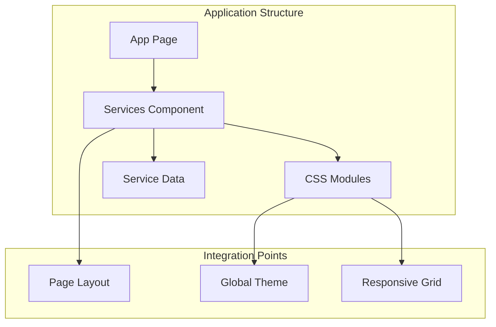
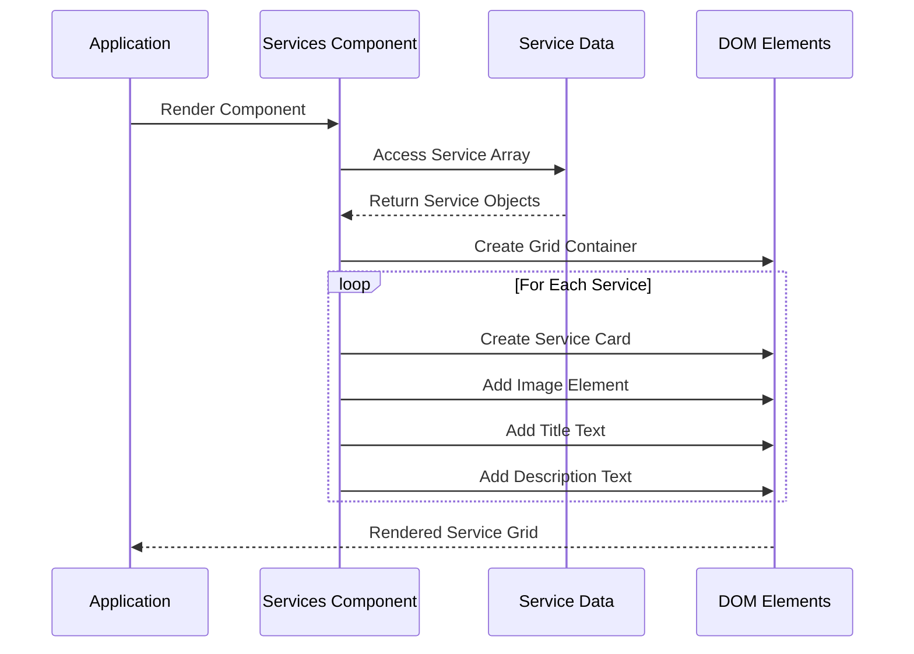
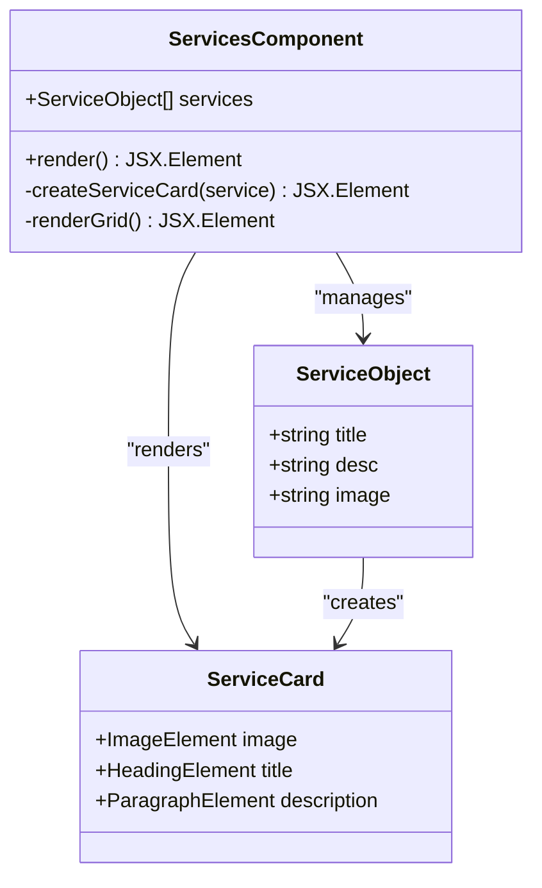
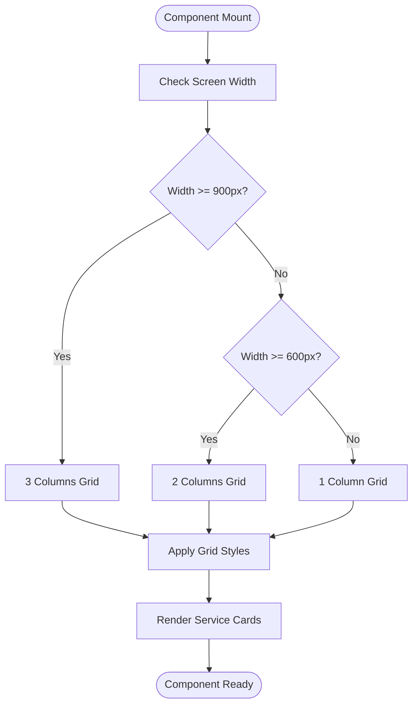
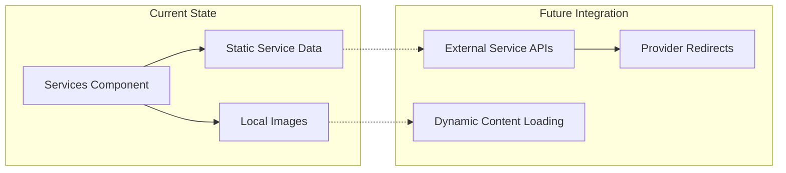
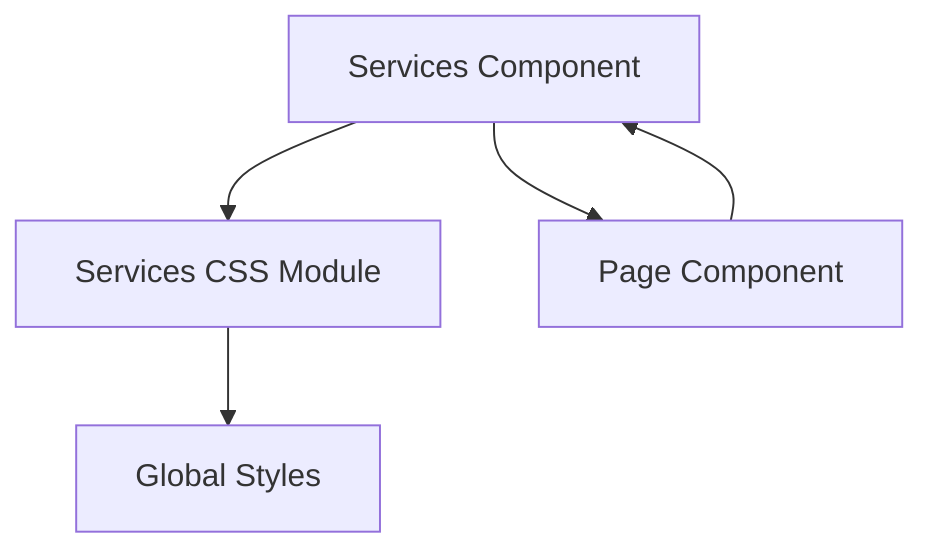

# Services Component

<cite>
**Referenced Files in This Document**
- [Services.jsx](file://src/components/Services/Services.jsx)
- [Services.css](file://src/components/Services/Services.css)
- [page.jsx](file://src/app/page.jsx)
- [globals.css](file://src/styles/globals.css)
</cite>

## Table of Contents
1. [Introduction](#introduction)
2. [Project Structure](#project-structure)
3. [Core Components](#core-components)
4. [Architecture Overview](#architecture-overview)
5. [Detailed Component Analysis](#detailed-component-analysis)
6. [Dependency Analysis](#dependency-analysis)
7. [Performance Considerations](#performance-considerations)
8. [Troubleshooting Guide](#troubleshooting-guide)
9. [Conclusion](#conclusion)

## Introduction
The Services component is a core feature of the Propellow real estate platform that showcases six essential services designed to enhance user engagement and expand the platform's service ecosystem. This component serves as a centralized hub for property-related services including financial planning, home financing, design solutions, market intelligence, pricing research, and legal support.

The component follows modern React development practices with CSS Modules for styling, responsive design principles, and a clean separation of concerns. It integrates seamlessly with the platform's design system while maintaining flexibility for future enhancements and service additions.

## Project Structure
The Services component is organized within the components directory alongside other platform features. The structure demonstrates a feature-based organization pattern where each major section of the application is encapsulated in its own module with dedicated styling.

**Diagram sources**
- [Services.jsx](file://src/components/Services/Services.jsx#L1-L62)
- [page.jsx](file://src/app/page.jsx#L1-L25)

**Section sources**
- [Services.jsx](file://src/components/Services/Services.jsx#L1-L62)
- [page.jsx](file://src/app/page.jsx#L1-L25)

## Core Components
The Services component consists of two primary elements: the service data structure and the presentation layer. The component defines six distinct services, each with title, description, and associated imagery.

### Service Data Structure
The component maintains a static array of service objects containing:
- **title**: Human-readable service name
- **desc**: Brief description explaining service benefits
- **image**: Path to service-specific imagery

### Presentation Layer
The component renders a responsive grid layout containing six service cards, each displaying:
- **Visual representation**: Service-specific imagery
- **Service information**: Title and descriptive text
- **Interactive elements**: Hover effects and transitions

**Section sources**
- [Services.jsx](file://src/components/Services/Services.jsx#L3-L34)

## Architecture Overview
The Services component follows a unidirectional data flow pattern where service data drives the component rendering. The architecture emphasizes simplicity, maintainability, and scalability for future service additions.

**Diagram sources**
- [Services.jsx](file://src/components/Services/Services.jsx#L36-L61)

## Detailed Component Analysis

### Component Structure and Props Interface
The Services component currently uses inline service data rather than accepting external props. However, the component structure supports easy prop-based customization for future enhancements.

**Diagram sources**
- [Services.jsx](file://src/components/Services/Services.jsx#L3-L34)

### Grid Layout Implementation
The component implements a responsive CSS Grid layout that adapts to different screen sizes:

**Diagram sources**
- [Services.css](file://src/components/Services/Services.css#L6-L10)
- [Services.css](file://src/components/Services/Services.css#L50-L60)

### Styling Approach with CSS Modules
The component utilizes CSS Modules for scoped styling, ensuring consistent design patterns across the platform:

#### Design System Integration
The component leverages the global design system variables:
- **Primary Color**: Orange (#ff6a00) for highlights and accents
- **Text Colors**: Dark gray (#111) and medium gray (#555) for typography
- **Background**: White (#ffffff) for clean, professional appearance
- **Container Width**: 1200px maximum width constraint

#### Responsive Design Patterns
The component implements a mobile-first responsive approach:
- **Desktop**: 3-column grid layout
- **Tablet**: 2-column grid layout  
- **Mobile**: Single column layout

**Section sources**
- [Services.jsx](file://src/components/Services/Services.jsx#L1-L62)
- [Services.css](file://src/components/Services/Services.css#L1-L61)
- [globals.css](file://src/styles/globals.css#L3-L10)

### Six Core Real Estate Services

#### EMI Calculator
Provides instant monthly payment estimation based on budget and loan tenure parameters. This service helps users understand affordability and plan their property purchases effectively.

#### Home Loans
Connects users with trusted banking partners and lending institutions, offering comprehensive loan options and competitive rates for property financing.

#### Interior Design
Delivers expert design solutions tailored to individual preferences and budget constraints, helping users visualize and achieve their ideal living spaces.

#### Market Trends
Keeps users informed about current property price movements, demand patterns, and market conditions to support informed investment decisions.

#### Price Research
Enables property price comparison across different localities and developments, providing transparency and benchmarking for buyers and sellers.

#### Legal Assistance
Offers guidance on property documentation, verification processes, and legal compliance to ensure secure and smooth real estate transactions.

### Integration with Service-Specific Functionality
While the current implementation focuses on presentation, the component structure supports seamless integration with backend services and external provider APIs:

**Diagram sources**
- [Services.jsx](file://src/components/Services/Services.jsx#L3-L34)

**Section sources**
- [Services.jsx](file://src/components/Services/Services.jsx#L3-L34)

## Dependency Analysis
The Services component has minimal external dependencies, focusing on internal styling and data management.

**Diagram sources**
- [Services.jsx](file://src/components/Services/Services.jsx#L1-L2)
- [page.jsx](file://src/app/page.jsx#L8-L8)

### Component Coupling and Cohesion
The component demonstrates high internal cohesion with clear separation of concerns:
- **Data Management**: Service data array
- **Presentation Logic**: Rendering and layout
- **Styling**: CSS Module with design system integration

**Section sources**
- [Services.jsx](file://src/components/Services/Services.jsx#L1-L62)
- [Services.css](file://src/components/Services/Services.css#L1-L61)

## Performance Considerations
The component is optimized for performance through several design choices:

### Rendering Efficiency
- **Static Data**: Uses inline service data to avoid unnecessary API calls
- **Simple Structure**: Minimal DOM elements reduce rendering overhead
- **Efficient Grid**: CSS Grid provides optimal layout performance

### Memory Management
- **Component Lifecycle**: Stateless functional component with automatic cleanup
- **Image Loading**: Lazy loading through CSS object-fit for efficient image rendering

### Scalability Factors
- **Modular Design**: Easy to extend with additional services
- **CSS Modules**: Scoped styling prevents conflicts and reduces bundle size
- **Responsive Architecture**: Mobile-first approach ensures optimal performance across devices

## Troubleshooting Guide

### Common Issues and Solutions

#### Missing Images
**Problem**: Service images not displaying
**Solution**: Verify image paths exist in the public/images directory and filenames match the service data configuration.

#### Layout Issues
**Problem**: Grid layout not responsive
**Solution**: Check media query breakpoints and ensure CSS Grid properties are correctly applied.

#### Styling Conflicts
**Problem**: Service cards not styled correctly
**Solution**: Verify CSS Module imports and ensure global design system variables are properly defined.

#### Accessibility Concerns
**Problem**: Screen reader compatibility issues
**Solution**: Ensure proper alt text attributes and semantic HTML structure in service cards.

**Section sources**
- [Services.jsx](file://src/components/Services/Services.jsx#L48-L50)
- [Services.css](file://src/components/Services/Services.css#L26-L31)

## Conclusion
The Services component represents a well-architected solution for showcasing real estate services within the Propellow platform. Its clean implementation, responsive design, and scalable structure position it as a cornerstone component for expanding the platform's service ecosystem.

The component successfully balances simplicity with extensibility, providing a solid foundation for future enhancements including dynamic service data, external API integrations, and advanced user interaction features. Its integration with the global design system ensures consistent user experience across all platform sections.

Through strategic implementation of CSS Modules, responsive grid layouts, and mobile-first design principles, the component delivers optimal performance and accessibility while maintaining flexibility for future growth and innovation in the real estate technology space.