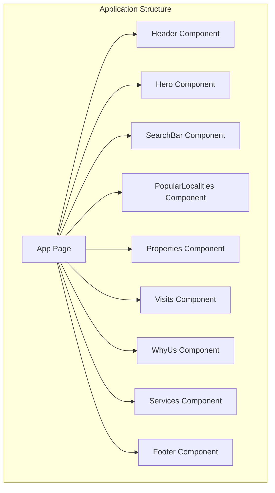
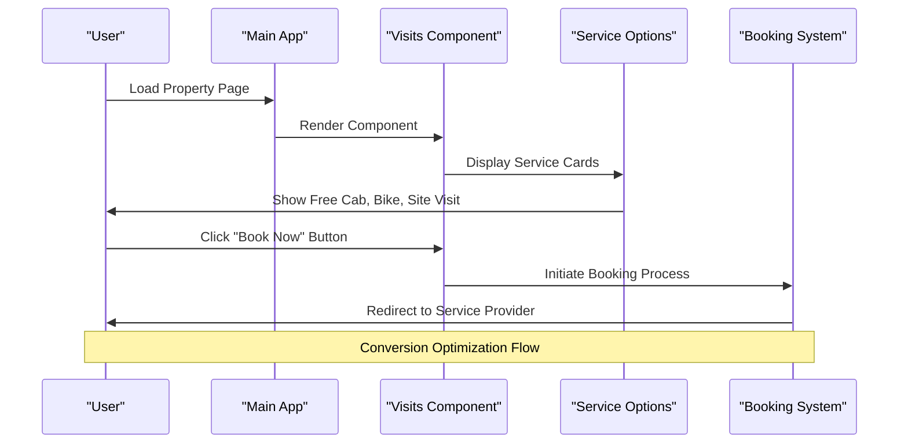
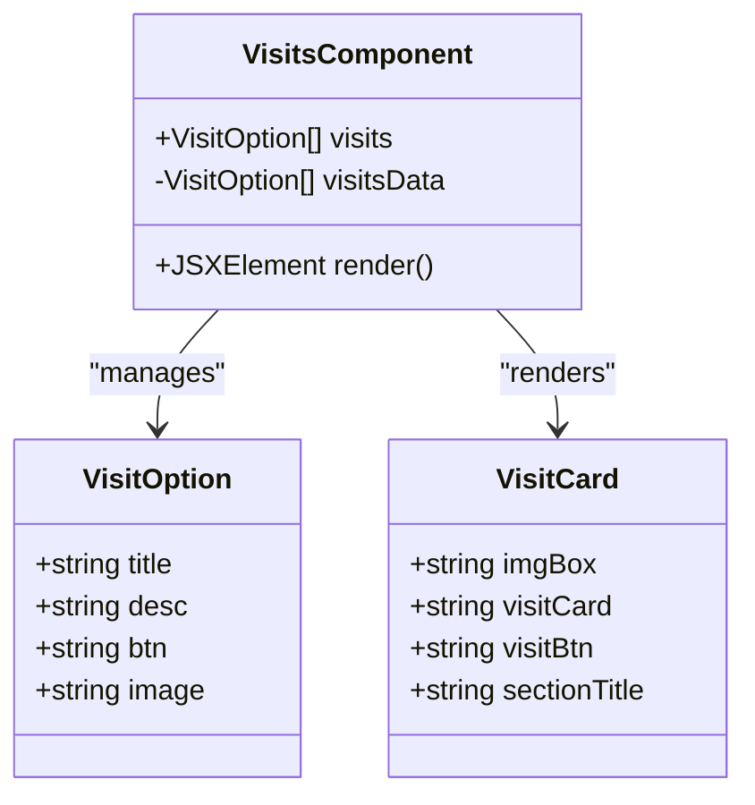
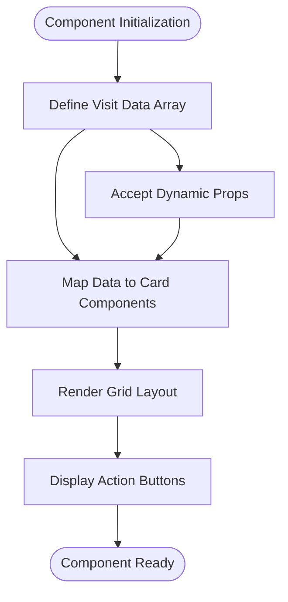
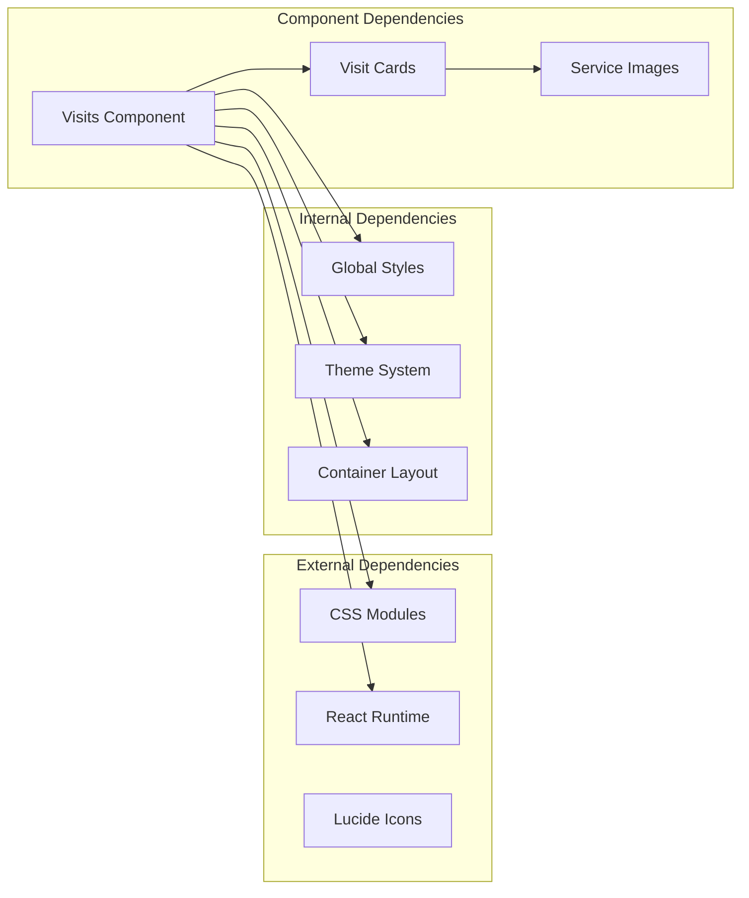

# Visits Component

<cite>
**Referenced Files in This Document**
- [Visits.jsx](file://src/components/Visits/Visits.jsx)
- [Visits.css](file://src/components/Visits/Visits.css)
- [page.jsx](file://src/app/page.jsx)
- [globals.css](file://src/styles/globals.css)
</cite>

## Table of Contents
1. [Introduction](#introduction)
2. [Project Structure](#project-structure)
3. [Core Components](#core-components)
4. [Architecture Overview](#architecture-overview)
5. [Detailed Component Analysis](#detailed-component-analysis)
6. [Dependency Analysis](#dependency-analysis)
7. [Performance Considerations](#performance-considerations)
8. [Troubleshooting Guide](#troubleshooting-guide)
9. [Conclusion](#conclusion)

## Introduction
The Visits component is a React-based UI element designed to present property visit booking options to users. It showcases three distinct free service offerings: free cab service, free bike ride, and free site visit. The component serves as a conversion optimization tool within the user journey, encouraging property visitors to book complimentary transportation and guided visits to verified properties.

The component follows modern React patterns with CSS Modules for styling, responsive design principles, and integrates seamlessly into the application's overall design system. It leverages a centralized theming approach through CSS custom properties defined in the global stylesheet.

## Project Structure
The Visits component is organized as a self-contained module within the components directory, following Next.js conventions for file-based routing and component organization.

**Diagram sources**
- [page.jsx](file://src/app/page.jsx#L1-L25)

**Section sources**
- [page.jsx](file://src/app/page.jsx#L1-L25)

## Core Components
The Visits component consists of two primary files: the main component implementation and its associated CSS styling module.

### Component Structure
The component utilizes a functional React approach with a static data array defining the three visit service options. Each service option includes:
- Title for the service offering
- Descriptive text explaining the service benefits
- Button label for user action
- Image path for visual representation

### Styling Approach
The component employs CSS Modules for scoped styling, ensuring consistent visual presentation across the application while maintaining separation of concerns. The styling system leverages CSS custom properties for theme consistency and responsive design patterns.

**Section sources**
- [Visits.jsx](file://src/components/Visits/Visits.jsx#L1-L48)
- [Visits.css](file://src/components/Visits/Visits.css#L1-L79)

## Architecture Overview
The Visits component operates as part of the application's main page composition, positioned strategically within the user journey to maximize conversion opportunities.

**Diagram sources**
- [page.jsx](file://src/app/page.jsx#L11-L24)
- [Visits.jsx](file://src/components/Visits/Visits.jsx#L24-L48)

## Detailed Component Analysis

### Component Implementation
The Visits component follows a clean, functional React pattern with embedded styling through CSS Modules. The component structure includes:

**Diagram sources**
- [Visits.jsx](file://src/components/Visits/Visits.jsx#L3-L22)
- [Visits.jsx](file://src/components/Visits/Visits.jsx#L24-L48)

### Data Structure and Props Interface
The component defines a static data structure for visit services, which could be expanded to accept dynamic props for customization:

**Diagram sources**
- [Visits.jsx](file://src/components/Visits/Visits.jsx#L3-L22)

### Visual Presentation and User Interaction
The component implements a card-based layout with hover effects and responsive design:

#### Service Options Presentation
The three service options are presented in a grid layout with consistent visual treatment:
- **Free Cab Service**: Comfortable pickup and drop service
- **Free Bike Ride**: Quick and convenient for nearby properties  
- **Free Site Visit**: Guided visits to verified properties

#### Interactive Elements
Each service card includes:
- Visual icon representation
- Clear service description
- Prominent "Book Now" call-to-action button
- Hover animations for enhanced user engagement

**Section sources**
- [Visits.jsx](file://src/components/Visits/Visits.jsx#L3-L22)
- [Visits.jsx](file://src/components/Visits/Visits.jsx#L24-L48)

### Styling System and Design Patterns
The component leverages a comprehensive CSS Modules approach with the following design patterns:

#### Theme Integration
The styling system integrates with the global theme through CSS custom properties:
- Primary brand color for buttons and accents
- Consistent typography scales
- Responsive breakpoint management
- Shadow and border radius consistency

#### Responsive Design
The component adapts to different screen sizes:
- Desktop: Three-column grid layout
- Mobile: Single column stacked layout
- Flexible container sizing

#### Visual Hierarchy
The design establishes clear visual hierarchy:
- Section title with accent bar
- Card-based service presentations
- Consistent spacing and typography
- Interactive hover states

**Section sources**
- [Visits.css](file://src/components/Visits/Visits.css#L1-L79)
- [globals.css](file://src/styles/globals.css#L3-L10)

## Dependency Analysis
The Visits component maintains minimal dependencies while integrating with the broader application ecosystem.

**Diagram sources**
- [Visits.jsx](file://src/components/Visits/Visits.jsx#L1)
- [globals.css](file://src/styles/globals.css#L1-L60)

### Integration Points
The component integrates with several key application systems:

#### Theming System
- Utilizes CSS custom properties for consistent branding
- Inherits global typography and spacing systems
- Maintains color scheme consistency

#### Layout System
- Integrates with the container-based layout system
- Follows established responsive breakpoints
- Adheres to the application's grid system patterns

#### Content Management
- Static data structure allows for easy content updates
- Image asset system for service visualizations
- Text content managed through component data

**Section sources**
- [Visits.jsx](file://src/components/Visits/Visits.jsx#L1)
- [globals.css](file://src/styles/globals.css#L25-L29)

## Performance Considerations
The Visits component is designed with performance optimization in mind:

### Rendering Efficiency
- Static data structure prevents unnecessary re-renders
- Minimal DOM manipulation through CSS transitions
- Efficient grid layout using CSS Grid

### Asset Management
- Image assets loaded from public directory
- Optimized for caching and CDN delivery
- Responsive image sizing considerations

### Bundle Size Impact
- Lightweight implementation with minimal dependencies
- CSS Modules scoped to component only
- No external library dependencies

## Troubleshooting Guide

### Common Issues and Solutions

#### Image Loading Problems
**Issue**: Service images not displaying
**Solution**: Verify image paths in the visit data array match actual file locations

#### Styling Conflicts
**Issue**: Component styling conflicts with other elements
**Solution**: Ensure CSS Modules are properly imported and scoped

#### Responsive Layout Issues
**Issue**: Grid layout not adapting to screen size
**Solution**: Check media query breakpoints and container width settings

#### Button Functionality
**Issue**: "Book Now" buttons not interactive
**Solution**: Current implementation uses static buttons - requires event handlers for functionality

### Debugging Steps
1. Verify component import in main page
2. Check CSS Modules loading
3. Confirm image asset availability
4. Test responsive breakpoints
5. Validate theme system integration

**Section sources**
- [Visits.jsx](file://src/components/Visits/Visits.jsx#L1-L48)
- [Visits.css](file://src/components/Visits/Visits.css#L72-L78)

## Conclusion
The Visits component represents a well-architected solution for property visit booking presentation within the application. Its clean implementation, responsive design, and integration with the global theming system demonstrate best practices in modern React development.

The component successfully balances visual appeal with functional simplicity, providing clear pathways for user conversion while maintaining consistency with the application's overall design language. Its modular structure and CSS Modules approach ensure maintainability and scalability for future enhancements.

Key strengths include:
- Clean, functional React implementation
- Comprehensive responsive design
- Integrated theming system
- Minimal performance overhead
- Scalable architecture for future modifications

The component serves as an effective conversion optimization tool, strategically positioned within the user journey to encourage property visit bookings through clear presentation of free service offerings.