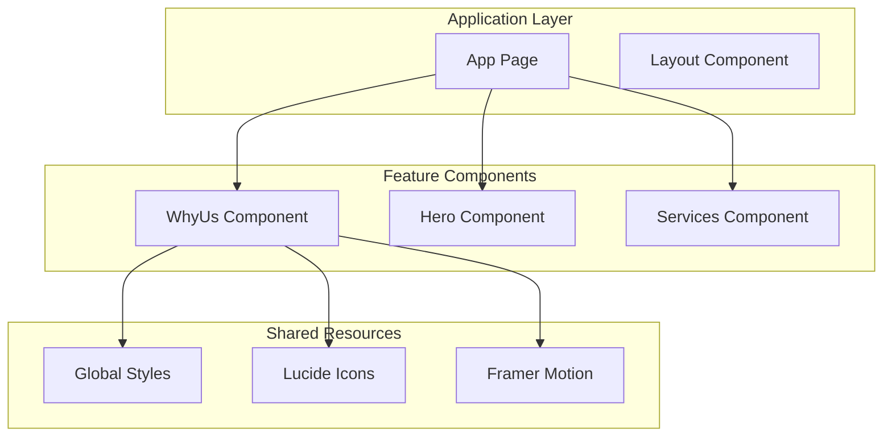
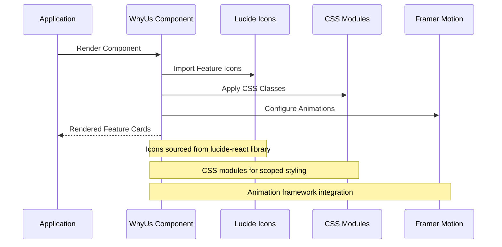
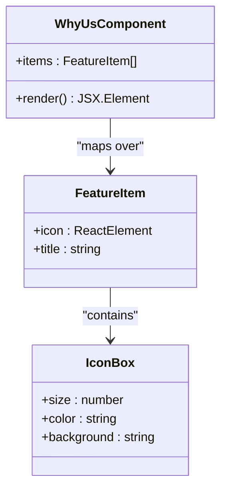
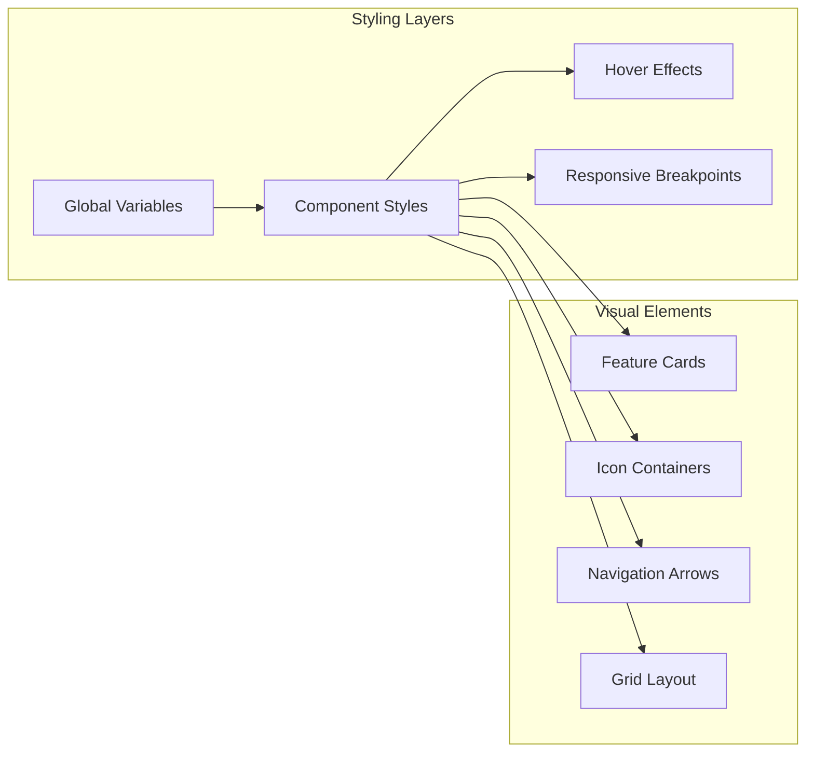
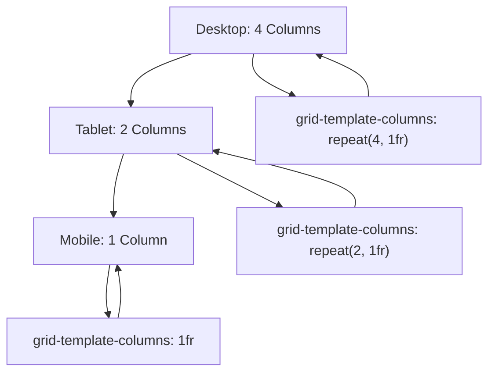
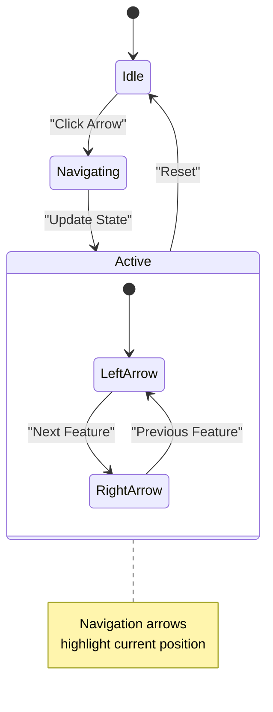
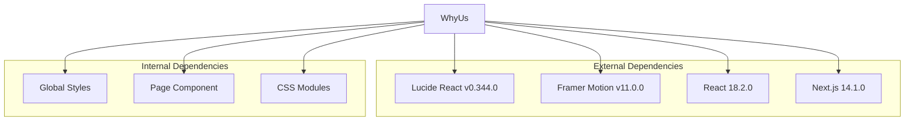

# WhyUs Component

<cite>
**Referenced Files in This Document**
- [WhyUs.jsx](file://src/components/WhyUs/WhyUs.jsx)
- [WhyUs.css](file://src/components/WhyUs/WhyUs.css)
- [page.jsx](file://src/app/page.jsx)
- [globals.css](file://src/styles/globals.css)
- [package.json](file://package.json)
</cite>

## Table of Contents
1. [Introduction](#introduction)
2. [Project Structure](#project-structure)
3. [Core Components](#core-components)
4. [Architecture Overview](#architecture-overview)
5. [Detailed Component Analysis](#detailed-component-analysis)
6. [Dependency Analysis](#dependency-analysis)
7. [Performance Considerations](#performance-considerations)
8. [Troubleshooting Guide](#troubleshooting-guide)
9. [Conclusion](#conclusion)

## Introduction
The WhyUs component presents the platform's key value propositions through an icon-based feature showcase. It demonstrates the platform's capabilities in property buying, renting, listing, and verification while building trust through transparent communication. The component serves as a cornerstone in establishing the platform's credibility and differentiating its value proposition in the competitive real estate market.

## Project Structure
The WhyUs component follows a modular architecture pattern within the Next.js application structure:

**Diagram sources**
- [page.jsx](file://src/app/page.jsx#L1-L26)
- [WhyUs.jsx](file://src/components/WhyUs/WhyUs.jsx#L1-L61)

**Section sources**
- [page.jsx](file://src/app/page.jsx#L1-L26)
- [globals.css](file://src/styles/globals.css#L1-L60)

## Core Components
The WhyUs component consists of three primary structural elements:

### Feature Showcase Grid
The component displays four distinct features arranged in a responsive grid layout:
- Property transactions (buying and renting)
- Property listing and management
- Verified owners and builders
- Smart filtering capabilities

### Navigation Controls
Interactive arrow buttons provide visual navigation indicators:
- Left arrow for backward navigation
- Right arrow for forward navigation
- Active state highlighting for current position

### Icon-Based Presentation
Each feature is represented by a Lucide React icon paired with descriptive text, creating an intuitive visual language that communicates value propositions at a glance.

**Section sources**
- [WhyUs.jsx](file://src/components/WhyUs/WhyUs.jsx#L11-L28)
- [WhyUs.jsx](file://src/components/WhyUs/WhyUs.jsx#L30-L60)

## Architecture Overview
The WhyUs component integrates with the broader application architecture through several key mechanisms:

**Diagram sources**
- [WhyUs.jsx](file://src/components/WhyUs/WhyUs.jsx#L1-L9)
- [WhyUs.css](file://src/components/WhyUs/WhyUs.css#L1-L85)
- [package.json](file://package.json#L10-L16)

The component participates in the application's feature presentation strategy by:
- Establishing trust through transparent value communication
- Differentiating platform capabilities through visual iconography
- Supporting responsive design across device categories
- Integrating with the overall brand identity system

## Detailed Component Analysis

### Feature Data Structure
The component utilizes a structured data approach for feature representation:

**Diagram sources**
- [WhyUs.jsx](file://src/components/WhyUs/WhyUs.jsx#L11-L28)

Each feature item consists of:
- **Icon Element**: Lucide React component instance
- **Title Text**: Descriptive feature name
- **Size Configuration**: Consistent icon sizing (32px)

### Styling Architecture
The component employs CSS modules with a comprehensive styling approach:

**Diagram sources**
- [WhyUs.css](file://src/components/WhyUs/WhyUs.css#L1-L85)
- [globals.css](file://src/styles/globals.css#L3-L10)

Key styling characteristics include:
- **Color System**: Uses CSS custom properties (--primary, --white, --text-dark)
- **Typography**: Poppins font family with consistent sizing
- **Spacing**: Consistent 30px gaps between grid items
- **Shadows**: Subtle 0.04 opacity for depth perception
- **Transitions**: Smooth 0.3s transitions for interactive states

### Responsive Design Implementation
The component adapts its layout across multiple screen sizes:

**Diagram sources**
- [WhyUs.css](file://src/components/WhyUs/WhyUs.css#L74-L84)

Responsive breakpoints:
- **900px**: 2-column layout for tablets
- **500px**: Single column for mobile devices

### Navigation Control System
The component includes basic navigation controls for feature cycling:

**Diagram sources**
- [WhyUs.jsx](file://src/components/WhyUs/WhyUs.jsx#L39-L46)

Navigation features:
- **Arrow Buttons**: ChevronLeft and ChevronRight icons
- **Active State**: Visual indication of current position
- **Interactive Feedback**: Hover and click states

**Section sources**
- [WhyUs.jsx](file://src/components/WhyUs/WhyUs.jsx#L1-L61)
- [WhyUs.css](file://src/components/WhyUs/WhyUs.css#L1-L85)

## Dependency Analysis
The WhyUs component relies on several external libraries and internal resources:

**Diagram sources**
- [package.json](file://package.json#L10-L16)
- [WhyUs.jsx](file://src/components/WhyUs/WhyUs.jsx#L1-L9)

Dependency characteristics:
- **Lucide React**: Provides consistent iconography
- **Framer Motion**: Enables animation capabilities
- **CSS Modules**: Ensures scoped styling
- **Global Variables**: Maintains design system consistency

**Section sources**
- [package.json](file://package.json#L10-L16)
- [WhyUs.jsx](file://src/components/WhyUs/WhyUs.jsx#L1-L9)

## Performance Considerations
The WhyUs component is designed for optimal performance through several mechanisms:

### Rendering Optimization
- **Static Data Structure**: Features are defined as static arrays
- **Minimal Re-renders**: No state management required for basic display
- **Efficient Grid Layout**: CSS Grid provides hardware-accelerated rendering

### Bundle Size Impact
- **Icon Loading**: Lucide React icons are tree-shaken to include only used components
- **CSS Organization**: Modular CSS reduces bundle size through selective imports
- **Animation Framework**: Lightweight implementation suitable for feature cards

### Accessibility Considerations
- **Semantic HTML**: Proper section and div usage
- **Keyboard Navigation**: Button elements support keyboard interaction
- **Screen Reader Support**: Descriptive text alternatives for icons

## Troubleshooting Guide

### Common Issues and Solutions

#### Icon Display Problems
**Issue**: Icons not rendering correctly
**Solution**: Verify Lucide React installation and ensure proper import statements

#### Styling Conflicts
**Issue**: Component styles overriding global styles
**Solution**: Confirm CSS module scoping and check for conflicting global selectors

#### Responsive Layout Issues
**Issue**: Grid layout not adapting to screen size
**Solution**: Verify media query breakpoints and container width settings

#### Animation Not Working
**Issue**: Missing animation effects despite Framer Motion dependency
**Solution**: Check that animation components are properly integrated and dependencies are installed

**Section sources**
- [WhyUs.jsx](file://src/components/WhyUs/WhyUs.jsx#L1-L61)
- [WhyUs.css](file://src/components/WhyUs/WhyUs.css#L1-L85)

## Conclusion
The WhyUs component effectively communicates the platform's value proposition through a clean, icon-driven interface that builds trust and differentiates the service offering. Its modular architecture, responsive design, and integration with the broader application ecosystem make it a valuable asset in the user experience strategy. The component successfully balances visual appeal with functional clarity, presenting complex real estate services through intuitive iconography and straightforward feature descriptions.

The implementation demonstrates best practices in modern React development, including proper dependency management, CSS module usage, and responsive design patterns. Future enhancements could include interactive animations, dynamic feature cycling, and expanded customization options while maintaining the component's core effectiveness in establishing platform credibility.