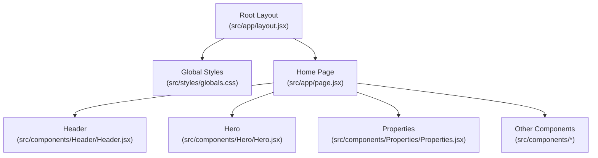
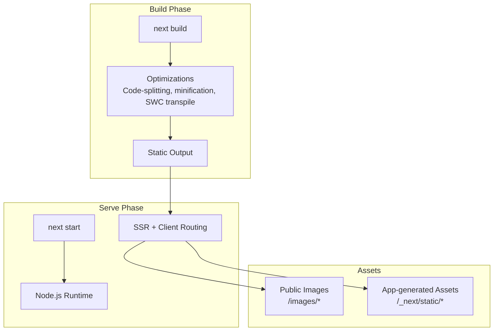
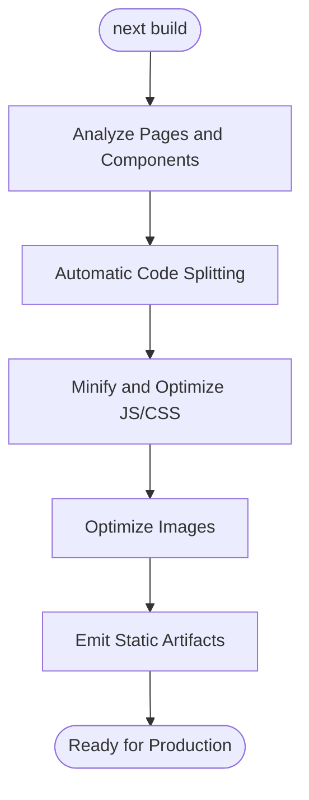
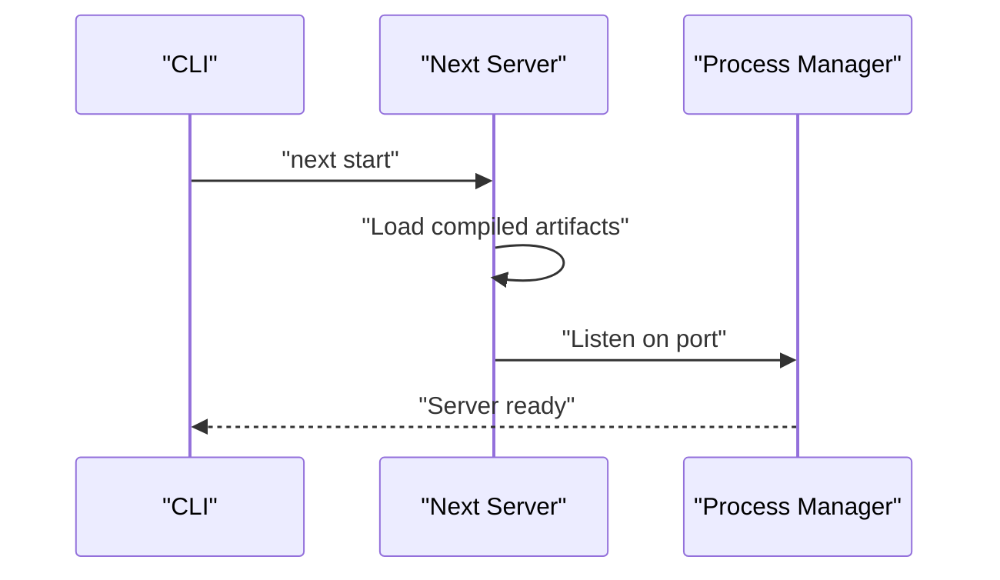
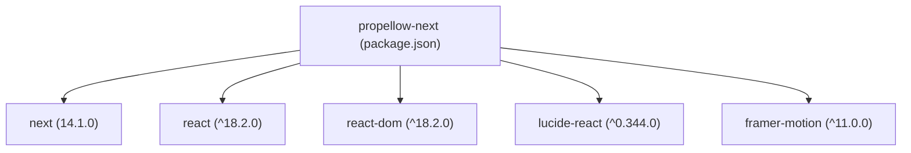

# Deployment & Production

<cite>
**Referenced Files in This Document**
- [package.json](file://package.json)
- [jsconfig.json](file://jsconfig.json)
- [src/app/layout.jsx](file://src/app/layout.jsx)
- [src/app/page.jsx](file://src/app/page.jsx)
- [src/styles/globals.css](file://src/styles/globals.css)
- [src/components/Header/Header.jsx](file://src/components/Header/Header.jsx)
- [src/components/Hero/Hero.jsx](file://src/components/Hero/Hero.jsx)
- [src/components/Properties/Properties.jsx](file://src/components/Properties/Properties.jsx)
</cite>

## Table of Contents
1. [Introduction](#introduction)
2. [Project Structure](#project-structure)
3. [Core Components](#core-components)
4. [Architecture Overview](#architecture-overview)
5. [Detailed Component Analysis](#detailed-component-analysis)
6. [Dependency Analysis](#dependency-analysis)
7. [Performance Considerations](#performance-considerations)
8. [Troubleshooting Guide](#troubleshooting-guide)
9. [Conclusion](#conclusion)
10. [Appendices](#appendices)

## Introduction
This document provides comprehensive deployment and production guidance for the Propellow Next.js application. It covers the build process, production startup, deployment options, performance monitoring, bundle analysis, security, caching, CDN integration, troubleshooting, and scaling considerations tailored for a real estate platform.

## Project Structure
Propellow follows a Next.js App Router project layout with a single route at the root path rendering a marketing/home page composed of reusable components. The application uses a local alias path mapping for imports and global styles applied at the root layout level.

**Diagram sources**
- [src/app/layout.jsx](file://src/app/layout.jsx#L1-L15)
- [src/app/page.jsx](file://src/app/page.jsx#L1-L26)
- [src/styles/globals.css](file://src/styles/globals.css#L1-L60)
- [src/components/Header/Header.jsx](file://src/components/Header/Header.jsx#L1-L26)
- [src/components/Hero/Hero.jsx](file://src/components/Hero/Hero.jsx#L1-L45)
- [src/components/Properties/Properties.jsx](file://src/components/Properties/Properties.jsx#L1-L66)

**Section sources**
- [package.json](file://package.json#L1-L18)
- [jsconfig.json](file://jsconfig.json#L1-L9)
- [src/app/layout.jsx](file://src/app/layout.jsx#L1-L15)
- [src/app/page.jsx](file://src/app/page.jsx#L1-L26)

## Core Components
- Build scripts: The project defines standard Next.js scripts for development, building, and production serving.
- Path alias: The jsconfig.json configures an alias to simplify imports from the src directory.
- Root layout: Applies global styles and sets page metadata.
- Home page: Composes multiple feature-focused components to render the landing experience.

Key production-relevant observations:
- Global CSS is imported at the root layout, ensuring baseline styles are present during SSR and client-side hydration.
- Components use static assets referenced via public paths, which are served by Next.js in production.

**Section sources**
- [package.json](file://package.json#L5-L9)
- [jsconfig.json](file://jsconfig.json#L1-L9)
- [src/app/layout.jsx](file://src/app/layout.jsx#L1-L15)
- [src/app/page.jsx](file://src/app/page.jsx#L1-L26)
- [src/styles/globals.css](file://src/styles/globals.css#L1-L60)

## Architecture Overview
The runtime architecture for production consists of:
- Build phase: next build compiles pages, optimizes assets, and generates static output.
- Serve phase: next start runs a Node.js server that serves prebuilt pages and assets.
- Asset delivery: Static assets (including images under public paths) are served efficiently by Next.js.

**Diagram sources**
- [package.json](file://package.json#L5-L9)
- [src/app/layout.jsx](file://src/app/layout.jsx#L1-L15)
- [src/components/Hero/Hero.jsx](file://src/components/Hero/Hero.jsx#L35-L39)

## Detailed Component Analysis

### Build and Optimization Strategies
- Code splitting: Next.js automatically splits routes and dynamic imports. Keep components modular to leverage automatic code splitting.
- Image optimization: Prefer next/image for optimized images; current Hero component uses a static path. For dynamic images, consider next/image to reduce payload sizes.
- CSS-in-JS and global CSS: Global styles are included at the root layout. Minimize unused CSS and avoid heavy animations on initial viewport to improve Largest Contentful Paint.
- Transpilation: Next.js uses SWC for fast builds; keep dependencies updated to benefit from latest optimizations.

**Diagram sources**
- [package.json](file://package.json#L7-L7)
- [src/components/Hero/Hero.jsx](file://src/components/Hero/Hero.jsx#L35-L39)

**Section sources**
- [package.json](file://package.json#L7-L7)
- [src/app/layout.jsx](file://src/app/layout.jsx#L1-L15)
- [src/styles/globals.css](file://src/styles/globals.css#L1-L60)

### Production Startup and Server Configuration
- next start: Runs the production server. Ensure NODE_ENV is set appropriately and the output of next build is present.
- Environment variables: Define environment variables for runtime configuration (e.g., base URLs, feature flags). Set them at deploy-time.
- Process manager: Use PM2 or similar to manage the next start process, enable restart on failure, and monitor resource usage.
- Health checks: Implement a simple GET endpoint to verify service readiness.

**Diagram sources**
- [package.json](file://package.json#L8-L8)

**Section sources**
- [package.json](file://package.json#L8-L8)

### Deployment Options
- Static hosting platforms: Since the application is a marketing/home page, it can be exported as static HTML using next export and deployed to platforms supporting static sites. Ensure all links are relative and external resources are adapted for static delivery.
- Server deployment: Use next start behind a reverse proxy (e.g., Nginx) or containerized with Docker. Configure health checks, SSL termination, and load balancing.
- Edge/CDN distribution: Use a CDN or edge platform to cache static assets and pre-rendered pages for low latency.

Note: The current repository does not include explicit export configuration. For static export, add the appropriate configuration to package.json or a Next.js configuration file.

**Section sources**
- [package.json](file://package.json#L5-L9)

### Performance Monitoring and Bundle Analysis
- Bundle analysis: After next build, inspect the generated static output and use a bundler analyzer to review asset sizes and dependencies.
- Metrics: Track Time to First Byte (TTFB), First Contentful Paint (FCP), Largest Contentful Paint (LCP), and Cumulative Layout Shift (CLS).
- Observability: Integrate application performance monitoring (APM) to capture server-side rendering metrics and client-side performance.

[No sources needed since this section provides general guidance]

### Security Considerations
- CSP: Define a strict Content-Security-Policy header to mitigate XSS risks.
- Sanitization: Sanitize any user-generated content if introduced later.
- HTTPS: Enforce HTTPS at the CDN or reverse proxy layer.
- Dependencies: Regularly audit dependencies for vulnerabilities and keep them updated.

[No sources needed since this section provides general guidance]

### Caching and CDN Integration
- Cache policies: Configure long-term caching for immutable assets and shorter caching for dynamic content.
- CDN: Place a CDN in front of the origin to cache static assets and pre-rendered pages.
- Image optimization: Use next/image with CDN to deliver responsive, optimized images.

[No sources needed since this section provides general guidance]

### Scaling Considerations
- Horizontal scaling: Run multiple instances behind a load balancer; ensure sticky sessions are not required for this static/home-page workload.
- Infrastructure: Provision CPU-optimized instances for build workloads and memory-optimized instances for serving.
- Traffic patterns: Expect higher traffic during peak hours; plan for burst capacity and autoscaling.

[No sources needed since this section provides general guidance]

## Dependency Analysis
The project relies on Next.js and React. The dependency tree includes swc binaries for platform-specific builds and peer dependencies for React.

**Diagram sources**
- [package.json](file://package.json#L10-L16)

**Section sources**
- [package.json](file://package.json#L10-L16)

## Performance Considerations
- Reduce CLS: Reserve space for images and ads to prevent layout shifts.
- Optimize fonts: Preload critical font subsets and defer non-critical weights.
- Minimize main thread work: Defer non-critical JavaScript and split bundles.
- Image delivery: Use modern formats (AVIF/WebP) and responsive sizing.

[No sources needed since this section provides general guidance]

## Troubleshooting Guide
- Build failures:
  - Verify Node.js version compatibility and clean node_modules if necessary.
  - Re-run next build after fixing lint or type errors.
- Runtime errors:
  - Check logs from the process manager for uncaught exceptions.
  - Confirm environment variables are set correctly for the deployment target.
- Asset issues:
  - Ensure static assets referenced by components exist in the public directory.
  - For next/image usage, confirm image paths and domains are configured.
- Performance regressions:
  - Compare bundle sizes before and after changes.
  - Monitor Core Web Vitals post-deployment and investigate failing pages.

[No sources needed since this section provides general guidance]

## Conclusion
Deploying Propellow involves a straightforward build and serve pipeline with strong potential for static export or server deployment. Focus on optimizing images, minimizing bundle sizes, implementing robust caching and CDN strategies, and establishing performance monitoring to support real estate platform traffic patterns effectively.

## Appendices
- Build commands summary:
  - Development: next dev
  - Build: next build
  - Production: next start

**Section sources**
- [package.json](file://package.json#L5-L9)