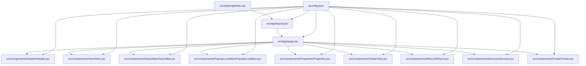
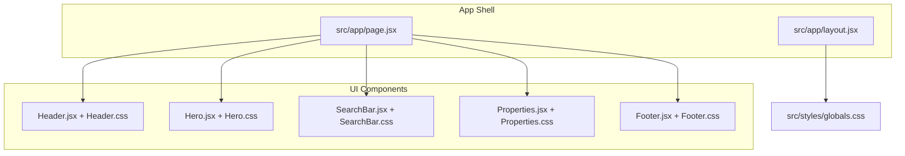
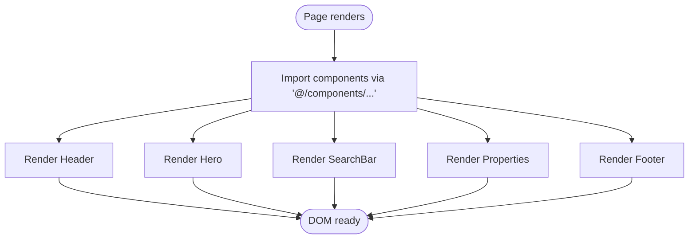
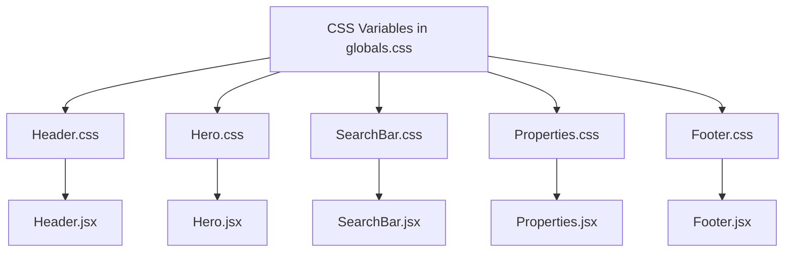
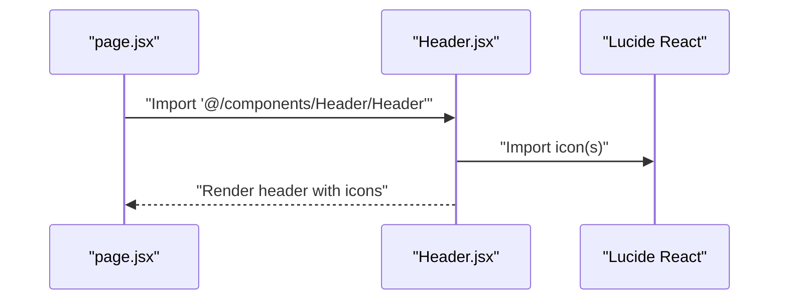
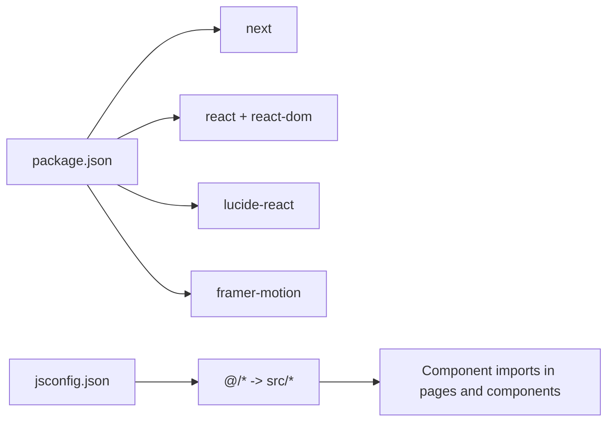

# Development Guidelines

<cite>
**Referenced Files in This Document**
- [package.json](file://package.json)
- [jsconfig.json](file://jsconfig.json)
- [src/app/layout.jsx](file://src/app/layout.jsx)
- [src/app/page.jsx](file://src/app/page.jsx)
- [src/styles/globals.css](file://src/styles/globals.css)
- [src/components/Header/Header.jsx](file://src/components/Header/Header.jsx)
- [src/components/Header/Header.css](file://src/components/Header/Header.css)
- [src/components/Hero/Hero.jsx](file://src/components/Hero/Hero.jsx)
- [src/components/Hero/Hero.css](file://src/components/Hero/Hero.css)
- [src/components/Footer/Footer.jsx](file://src/components/Footer/Footer.jsx)
- [src/components/Footer/Footer.css](file://src/components/Footer/Footer.css)
- [src/components/SearchBar/SearchBar.jsx](file://src/components/SearchBar/SearchBar.jsx)
- [src/components/SearchBar/SearchBar.css](file://src/components/SearchBar/SearchBar.css)
- [src/components/Properties/Properties.jsx](file://src/components/Properties/Properties.jsx)
- [src/components/Properties/Properties.css](file://src/components/Properties/Properties.css)
</cite>

## Table of Contents
1. [Introduction](#introduction)
2. [Project Structure](#project-structure)
3. [Core Components](#core-components)
4. [Architecture Overview](#architecture-overview)
5. [Detailed Component Analysis](#detailed-component-analysis)
6. [Dependency Analysis](#dependency-analysis)
7. [Performance Considerations](#performance-considerations)
8. [Troubleshooting Guide](#troubleshooting-guide)
9. [Code Review Standards](#code-review-standards)
10. [Testing Strategies](#testing-strategies)
11. [Conclusion](#conclusion)

## Introduction
This document provides comprehensive development guidelines for maintaining and extending the Propellow frontend project. It covers code style conventions, component development standards, file organization patterns, naming conventions, integration of external libraries (Lucide React and Framer Motion), path alias configuration (@/), and best practices for component composition. It also includes troubleshooting guidance, performance optimization practices, and testing strategies tailored to the current codebase.

## Project Structure
The project follows a Next.js App Router-based structure with a clear separation of concerns:
- Application shell and routing live under src/app.
- Reusable UI components are organized under src/components with dedicated folders per component.
- Global styles are centralized under src/styles.
- Path aliases are configured via jsconfig.json to simplify imports using @/.

**Diagram sources**
- [src/app/layout.jsx](file://src/app/layout.jsx#L1-L15)
- [src/app/page.jsx](file://src/app/page.jsx#L1-L26)
- [jsconfig.json](file://jsconfig.json#L1-L9)

**Section sources**
- [src/app/layout.jsx](file://src/app/layout.jsx#L1-L15)
- [src/app/page.jsx](file://src/app/page.jsx#L1-L26)
- [jsconfig.json](file://jsconfig.json#L1-L9)

## Core Components
The application composes a homepage made up of multiple self-contained components. Each component follows a consistent pattern:
- A JSX file defines the component markup and imports its local CSS.
- A matching CSS file provides scoped styles for the component.
- Components are imported into the page via the path alias @/, ensuring clean and maintainable imports.

Key conventions observed:
- Component folder naming: PascalCase (e.g., Header, Hero).
- File naming: ComponentName.jsx and ComponentName.css within the same folder.
- Import strategy: Local CSS import inside the component file; component imports in the page using @/.

Examples of established components:
- Header: Logo, navigation links, and action buttons.
- Hero: Promotional content with a feature list and call-to-action.
- SearchBar: A composite search interface with iconography.
- Properties: Grid of property cards with dynamic tags.
- Footer: Multi-column link layout with social icons.

**Section sources**
- [src/app/page.jsx](file://src/app/page.jsx#L1-L26)
- [src/components/Header/Header.jsx](file://src/components/Header/Header.jsx#L1-L26)
- [src/components/Hero/Hero.jsx](file://src/components/Hero/Hero.jsx#L1-L45)
- [src/components/SearchBar/SearchBar.jsx](file://src/components/SearchBar/SearchBar.jsx#L1-L34)
- [src/components/Properties/Properties.jsx](file://src/components/Properties/Properties.jsx#L1-L67)
- [src/components/Footer/Footer.jsx](file://src/components/Footer/Footer.jsx#L1-L51)

## Architecture Overview
The runtime architecture is a client-side React application rendered by Next.js. The page component composes multiple UI components, each encapsulated with its own styles. Global typography and theme tokens are defined centrally.

**Diagram sources**
- [src/app/layout.jsx](file://src/app/layout.jsx#L1-L15)
- [src/app/page.jsx](file://src/app/page.jsx#L1-L26)
- [src/styles/globals.css](file://src/styles/globals.css#L1-L60)

## Detailed Component Analysis

### Component Composition Pattern
Components are designed as small, reusable units that render static or minimal dynamic content. They import their local CSS and are orchestrated by the page component. This promotes:
- Encapsulation: Styles remain close to the component.
- Composability: Components are assembled in the page.
- Maintainability: Updates to a single component are localized.

**Diagram sources**
- [src/app/page.jsx](file://src/app/page.jsx#L1-L26)
- [jsconfig.json](file://jsconfig.json#L1-L9)

**Section sources**
- [src/app/page.jsx](file://src/app/page.jsx#L1-L26)

### Styling and Theming
Global styles define a shared design system:
- Theme tokens via CSS variables (e.g., primary colors, container width).
- Base typography and resets.
- Utility classes for consistent spacing and section titles.

Component-specific styles leverage these tokens and follow a BEM-like naming scheme for readability and maintainability.

**Diagram sources**
- [src/styles/globals.css](file://src/styles/globals.css#L1-L60)
- [src/components/Header/Header.css](file://src/components/Header/Header.css#L1-L73)
- [src/components/Hero/Hero.css](file://src/components/Hero/Hero.css#L1-L126)
- [src/components/SearchBar/SearchBar.css](file://src/components/SearchBar/SearchBar.css#L1-L95)
- [src/components/Properties/Properties.css](file://src/components/Properties/Properties.css#L1-L107)
- [src/components/Footer/Footer.css](file://src/components/Footer/Footer.css#L1-L98)

**Section sources**
- [src/styles/globals.css](file://src/styles/globals.css#L1-L60)

### Iconography with Lucide React
Icons are integrated using Lucide React. Components import specific icons and pass props such as size and className to match the design system.

**Diagram sources**
- [src/app/page.jsx](file://src/app/page.jsx#L1-L9)
- [src/components/Header/Header.jsx](file://src/components/Header/Header.jsx#L1-L26)
- [package.json](file://package.json#L10-L16)

**Section sources**
- [src/components/Header/Header.jsx](file://src/components/Header/Header.jsx#L1-L26)
- [src/components/Footer/Footer.jsx](file://src/components/Footer/Footer.jsx#L1-L51)
- [src/components/SearchBar/SearchBar.jsx](file://src/components/SearchBar/SearchBar.jsx#L1-L34)
- [package.json](file://package.json#L10-L16)

### Animation Integration with Framer Motion
Framer Motion is available as a dependency. Recommended usage patterns:
- Animate subtle transitions (hover states, route changes) for improved UX.
- Prefer declarative motion primitives for interactive elements.
- Keep animations performant by limiting heavy transforms and using transform properties.

Note: Current components primarily rely on CSS for hover effects. Introduce Framer Motion for page transitions or micro-interactions as needed.

**Section sources**
- [package.json](file://package.json#L10-L16)

## Dependency Analysis
External dependencies and their roles:
- next: Framework runtime and routing.
- react/react-dom: UI library and renderer.
- lucide-react: Vector icon library for consistent iconography.
- framer-motion: Animation library for motion primitives.

Path alias configuration enables concise imports across the codebase.

**Diagram sources**
- [package.json](file://package.json#L1-L18)
- [jsconfig.json](file://jsconfig.json#L1-L9)

**Section sources**
- [package.json](file://package.json#L1-L18)
- [jsconfig.json](file://jsconfig.json#L1-L9)

## Performance Considerations
- Image optimization: Serve appropriately sized images and leverage modern formats. Place images under public or optimize via Next/Image when applicable.
- CSS specificity: Keep selectors shallow and avoid deeply nested rules to reduce rendering cost.
- Bundle size: Prefer tree-shaking by importing only used Lucide React icons per component.
- Animations: Use hardware-accelerated properties (transform, opacity) and limit frequent reflows.
- Rendering: Avoid unnecessary re-renders by keeping components pure and passing stable props.

## Troubleshooting Guide
Common development issues and resolutions:
- Build errors after adding a new component:
  - Ensure the component file exists and exports a default function.
  - Verify the import path matches the folder and file naming convention.
- Broken icons:
  - Confirm the icon name exists in lucide-react and is imported correctly.
  - Check that size and className props are applied consistently.
- Styles not applying:
  - Confirm the component imports its local CSS file.
  - Verify CSS variable usage and media queries are correct.
- Path alias not resolving:
  - Check jsconfig.json for the baseUrl and paths configuration.
  - Ensure imports use the @/ prefix consistently.

**Section sources**
- [jsconfig.json](file://jsconfig.json#L1-L9)
- [src/app/page.jsx](file://src/app/page.jsx#L1-L26)
- [src/components/Header/Header.jsx](file://src/components/Header/Header.jsx#L1-L26)
- [src/components/Footer/Footer.jsx](file://src/components/Footer/Footer.jsx#L1-L51)
- [src/components/SearchBar/SearchBar.jsx](file://src/components/SearchBar/SearchBar.jsx#L1-L34)

## Code Review Standards
Review checklist for component contributions:
- Naming: Component folders and files use PascalCase; filenames match component names.
- Imports: Use @/ alias for internal imports; import only required icons from lucide-react.
- Styling: Component CSS is scoped locally; styles use global tokens and follow BEM-like naming.
- Accessibility: Ensure semantic HTML and meaningful alt attributes for images.
- Responsiveness: Verify media queries and responsive breakpoints.
- Performance: Avoid heavy computations in render; keep components pure.
- Testing: Add unit tests for interactive logic; snapshot tests for static renders.

## Testing Strategies
Recommended testing approach:
- Unit tests: Use a testing framework to render components and assert DOM structure and behavior.
- Interaction tests: Simulate user actions (hover, click) and verify visual feedback.
- Snapshot tests: Capture component renders to prevent unintended style regressions.
- Accessibility tests: Validate ARIA attributes and keyboard navigation where applicable.

## Conclusion
These guidelines establish a consistent foundation for developing, maintaining, and extending the Propellow frontend. By adhering to the component composition pattern, leveraging the path alias configuration, integrating Lucide React and Framer Motion thoughtfully, and following performance and testing practices, contributors can ensure a scalable and maintainable codebase.