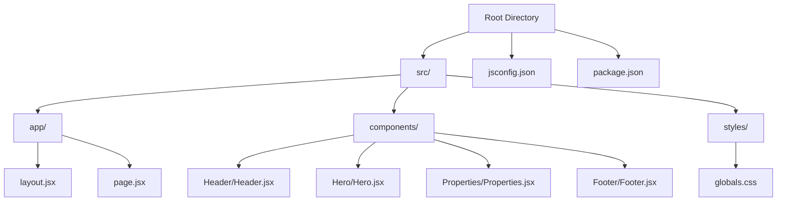
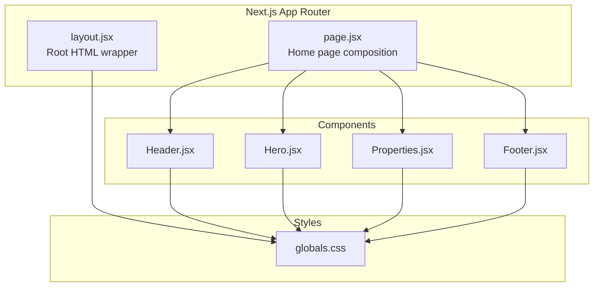
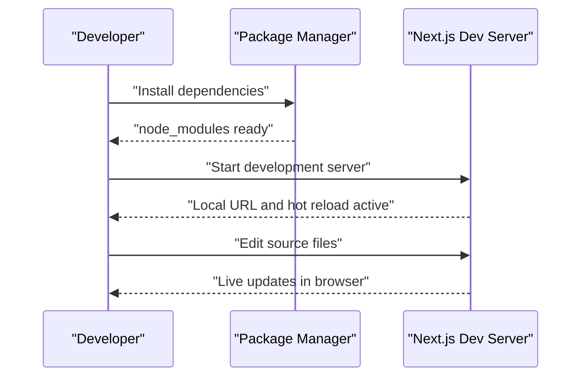
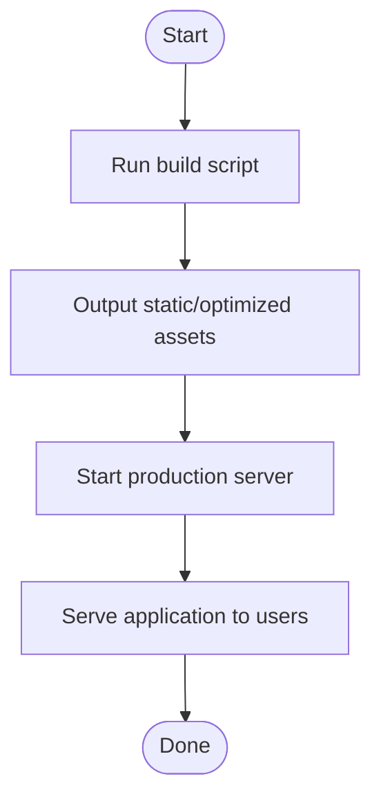
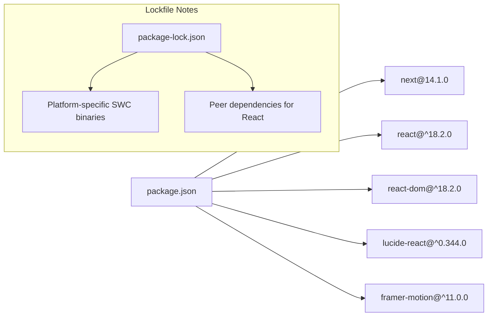

# Getting Started

<cite>
**Referenced Files in This Document**
- [package.json](file://package.json)
- [jsconfig.json](file://jsconfig.json)
- [package-lock.json](file://package-lock.json)
- [src/app/layout.jsx](file://src/app/layout.jsx)
- [src/app/page.jsx](file://src/app/page.jsx)
- [src/components/Header/Header.jsx](file://src/components/Header/Header.jsx)
- [src/styles/globals.css](file://src/styles/globals.css)
</cite>

## Table of Contents
1. [Introduction](#introduction)
2. [Project Structure](#project-structure)
3. [Core Components](#core-components)
4. [Architecture Overview](#architecture-overview)
5. [Detailed Component Analysis](#detailed-component-analysis)
6. [Dependency Analysis](#dependency-analysis)
7. [Performance Considerations](#performance-considerations)
8. [Troubleshooting Guide](#troubleshooting-guide)
9. [Conclusion](#conclusion)
10. [Appendices](#appendices)

## Introduction
This guide helps you set up and run the Propellow Next.js frontend locally. It covers prerequisites, installation, development workflow, building for production, and verifying your environment. The project uses Next.js App Router conventions and React components organized under src/.

## Project Structure
The project follows a modern Next.js App Router layout:
- Application shell and routing live under src/app
- Page components render UI composed of reusable components under src/components
- Global styles are centralized in src/styles
- Path aliases enable concise imports via @/*

**Diagram sources**
- [src/app/layout.jsx](file://src/app/layout.jsx#L1-L15)
- [src/app/page.jsx](file://src/app/page.jsx#L1-L26)
- [src/components/Header/Header.jsx](file://src/components/Header/Header.jsx#L1-L26)
- [src/styles/globals.css](file://src/styles/globals.css#L1-L60)
- [jsconfig.json](file://jsconfig.json#L1-L9)
- [package.json](file://package.json#L1-L18)

**Section sources**
- [src/app/layout.jsx](file://src/app/layout.jsx#L1-L15)
- [src/app/page.jsx](file://src/app/page.jsx#L1-L26)
- [jsconfig.json](file://jsconfig.json#L1-L9)
- [package.json](file://package.json#L1-L18)

## Core Components
- App Shell: Defines global metadata and root HTML structure.
- Home Page: Composes reusable components to render the landing page.
- Path Alias: Enables imports prefixed with @/, resolving to src/.
- Dependencies: React, Next.js, and UI libraries are declared in package.json.

Key implementation references:
- App layout and metadata: [src/app/layout.jsx](file://src/app/layout.jsx#L1-L15)
- Home page composition: [src/app/page.jsx](file://src/app/page.jsx#L1-L26)
- Path alias configuration: [jsconfig.json](file://jsconfig.json#L1-L9)
- Scripts and dependencies: [package.json](file://package.json#L1-L18)

**Section sources**
- [src/app/layout.jsx](file://src/app/layout.jsx#L1-L15)
- [src/app/page.jsx](file://src/app/page.jsx#L1-L26)
- [jsconfig.json](file://jsconfig.json#L1-L9)
- [package.json](file://package.json#L1-L18)

## Architecture Overview
The runtime architecture centers on Next.js App Router rendering React components. The home page composes multiple feature components, which are styled globally and locally.

**Diagram sources**
- [src/app/layout.jsx](file://src/app/layout.jsx#L1-L15)
- [src/app/page.jsx](file://src/app/page.jsx#L1-L26)
- [src/components/Header/Header.jsx](file://src/components/Header/Header.jsx#L1-L26)
- [src/styles/globals.css](file://src/styles/globals.css#L1-L60)

## Detailed Component Analysis

### Development Workflow
- Install dependencies using your preferred package manager.
- Start the development server with hot reload enabled.
- Open the local URL shown in the terminal to view changes instantly.

Practical steps:
- Install dependencies: Run your package manager install command in the project root.
- Start dev server: Execute the development script defined in package.json.
- Verify hot reload: Edit a component or style file and confirm the browser refreshes automatically.

Verification references:
- Scripts definition: [package.json](file://package.json#L5-L9)
- Layout metadata: [src/app/layout.jsx](file://src/app/layout.jsx#L3-L6)
- Example component: [src/components/Header/Header.jsx](file://src/components/Header/Header.jsx#L4-L25)

**Section sources**
- [package.json](file://package.json#L5-L9)
- [src/app/layout.jsx](file://src/app/layout.jsx#L3-L6)
- [src/components/Header/Header.jsx](file://src/components/Header/Header.jsx#L4-L25)

### Build and Production Startup
- Build the application for production.
- Start the production server to serve the optimized bundle.

References:
- Build script: [package.json](file://package.json#L7-L7)
- Production start script: [package.json](file://package.json#L8-L8)

**Section sources**
- [package.json](file://package.json#L7-L8)

### Project Structure Navigation
- src/app: App shell and pages
- src/components: Reusable UI components
- src/styles: Global styles and base CSS
- jsconfig.json: Path alias configuration for @/*
- package.json: Scripts, dependencies, and project metadata

Navigation pointers:
- App shell and metadata: [src/app/layout.jsx](file://src/app/layout.jsx#L1-L15)
- Home page composition: [src/app/page.jsx](file://src/app/page.jsx#L1-L26)
- Path alias: [jsconfig.json](file://jsconfig.json#L1-L9)
- Dependencies overview: [package.json](file://package.json#L10-L16)

**Section sources**
- [src/app/layout.jsx](file://src/app/layout.jsx#L1-L15)
- [src/app/page.jsx](file://src/app/page.jsx#L1-L26)
- [jsconfig.json](file://jsconfig.json#L1-L9)
- [package.json](file://package.json#L10-L16)

## Dependency Analysis
The project relies on Next.js and React ecosystem packages. The lockfile confirms platform-specific optional binaries and peer dependency requirements.

**Diagram sources**
- [package.json](file://package.json#L10-L16)
- [package-lock.json](file://package-lock.json#L10-L16)
- [package-lock.json](file://package-lock.json#L307-L353)

**Section sources**
- [package.json](file://package.json#L10-L16)
- [package-lock.json](file://package-lock.json#L10-L16)
- [package-lock.json](file://package-lock.json#L307-L353)

## Performance Considerations
- Keep dependencies current within compatible ranges to benefit from performance improvements.
- Leverage Next.js automatic optimizations such as static generation and code splitting.
- Minimize unnecessary re-renders by structuring components efficiently.

## Troubleshooting Guide
Common setup issues and resolutions:
- Node.js version mismatch
  - Symptom: Build failures or runtime errors on certain platforms
  - Cause: Outdated or incompatible Node.js version
  - Resolution: Ensure your Node.js version satisfies the minimum engine requirements indicated by the project dependencies
  - Reference: [package-lock.json](file://package-lock.json#L18-L167)

- Missing dependencies after clone
  - Symptom: Errors when running scripts
  - Cause: node_modules not installed
  - Resolution: Run your package manager install command at the project root
  - Reference: [package.json](file://package.json#L5-L9)

- Hot reload not working
  - Symptom: Changes not reflected in the browser
  - Cause: File watcher limits or editor save behavior
  - Resolution: Verify the dev server is running and your editor saves files; restart the dev server if needed
  - Reference: [package.json](file://package.json#L6-L6)

- Path alias resolution errors
  - Symptom: Import errors for @/*
  - Cause: jsconfig.json misconfiguration
  - Resolution: Confirm baseUrl and paths are set correctly
  - Reference: [jsconfig.json](file://jsconfig.json#L1-L9)

- Styles not applied
  - Symptom: Components appear unstyled
  - Cause: Missing global styles import
  - Resolution: Ensure global styles are imported in the root layout
  - Reference: [src/app/layout.jsx](file://src/app/layout.jsx#L1-L1)

**Section sources**
- [package-lock.json](file://package-lock.json#L18-L167)
- [package.json](file://package.json#L5-L9)
- [jsconfig.json](file://jsconfig.json#L1-L9)
- [src/app/layout.jsx](file://src/app/layout.jsx#L1-L1)

## Conclusion
You now have the essentials to install dependencies, run the development server with hot reload, build for production, and navigate the project structure. Use the verification steps to confirm your environment is ready and consult the troubleshooting section for common issues.

## Appendices
- Verification checklist
  - Run the development script and confirm the local URL appears
  - Edit a component file and verify immediate browser update
  - Execute the build script and confirm successful compilation
  - Start the production server and validate the application loads

- Environment prerequisites
  - Node.js: Satisfies the minimum engine requirements indicated by the project dependencies
  - Package manager: npm or yarn installed and configured on your system

**Section sources**
- [package.json](file://package.json#L5-L9)
- [package-lock.json](file://package-lock.json#L18-L167)