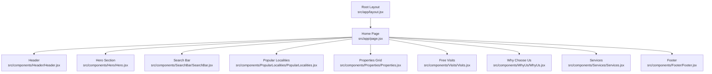
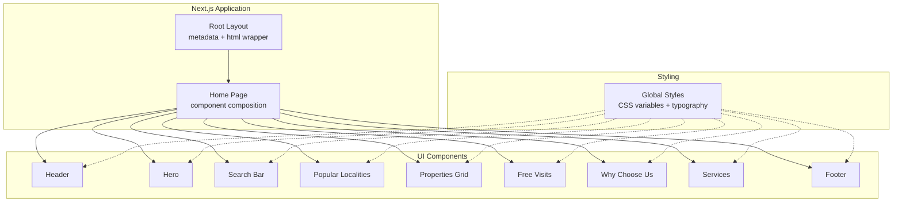
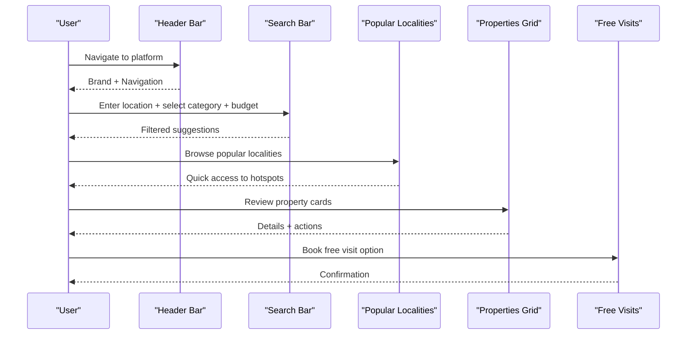
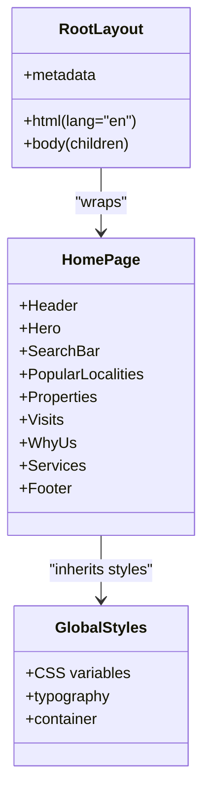
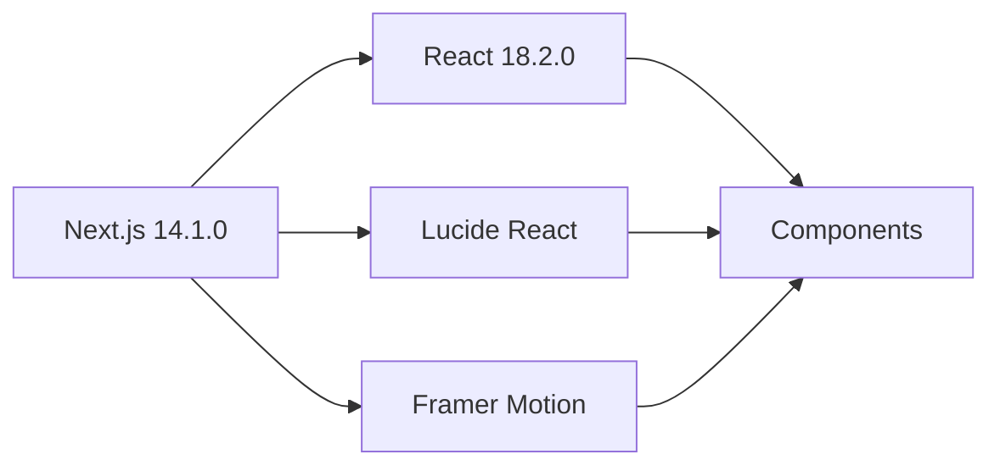

# Project Overview

<cite>
**Referenced Files in This Document**
- [package.json](file://package.json)
- [jsconfig.json](file://jsconfig.json)
- [src/app/layout.jsx](file://src/app/layout.jsx)
- [src/app/page.jsx](file://src/app/page.jsx)
- [src/styles/globals.css](file://src/styles/globals.css)
- [src/components/Header/Header.jsx](file://src/components/Header/Header.jsx)
- [src/components/Footer/Footer.jsx](file://src/components/Footer/Footer.jsx)
- [src/components/Hero/Hero.jsx](file://src/components/Hero/Hero.jsx)
- [src/components/SearchBar/SearchBar.jsx](file://src/components/SearchBar/SearchBar.jsx)
- [src/components/PopularLocalities/PopularLocalities.jsx](file://src/components/PopularLocalities/PopularLocalities.jsx)
- [src/components/Properties/Properties.jsx](file://src/components/Properties/Properties.jsx)
- [src/components/Visits/Visits.jsx](file://src/components/Visits/Visits.jsx)
- [src/components/WhyUs/WhyUs.jsx](file://src/components/WhyUs/WhyUs.jsx)
- [src/components/Services/Services.jsx](file://src/components/Services/Services.jsx)
</cite>

## Table of Contents
1. [Introduction](#introduction)
2. [Project Structure](#project-structure)
3. [Core Components](#core-components)
4. [Architecture Overview](#architecture-overview)
5. [Detailed Component Analysis](#detailed-component-analysis)
6. [Dependency Analysis](#dependency-analysis)
7. [Performance Considerations](#performance-considerations)
8. [Troubleshooting Guide](#troubleshooting-guide)
9. [Conclusion](#conclusion)

## Introduction
Propellow is a modern real estate discovery and listing platform designed to connect property seekers with verified, trustworthy listings. The platform emphasizes transparency, user-friendly property search, and integrated services to support informed real estate decisions. It targets homebuyers, renters, investors, and property professionals seeking reliable property information and streamlined transaction support.

Key objectives:
- Enable efficient property discovery through intuitive search and curated categories
- Provide verified listings to reduce risk and increase trust
- Offer integrated services such as EMI calculators, home loans, market insights, and legal assistance
- Deliver a responsive, accessible experience across devices

Target audience:
- First-time homebuyers and renters
- Property investors and agents
- Builders and owners seeking visibility
- Individuals researching market trends and pricing

## Project Structure
The project follows a Next.js 14 application structure with a modular component-based architecture. The frontend is organized around reusable UI components and a clean routing model centered on the root page.

**Diagram sources**
- [src/app/layout.jsx](file://src/app/layout.jsx#L1-L15)
- [src/app/page.jsx](file://src/app/page.jsx#L1-L26)
- [src/components/Header/Header.jsx](file://src/components/Header/Header.jsx#L1-L26)
- [src/components/Footer/Footer.jsx](file://src/components/Footer/Footer.jsx#L1-L51)
- [src/components/Hero/Hero.jsx](file://src/components/Hero/Hero.jsx#L1-L45)
- [src/components/SearchBar/SearchBar.jsx](file://src/components/SearchBar/SearchBar.jsx#L1-L34)
- [src/components/PopularLocalities/PopularLocalities.jsx](file://src/components/PopularLocalities/PopularLocalities.jsx#L1-L31)
- [src/components/Properties/Properties.jsx](file://src/components/Properties/Properties.jsx#L1-L67)
- [src/components/Visits/Visits.jsx](file://src/components/Visits/Visits.jsx#L1-L49)
- [src/components/WhyUs/WhyUs.jsx](file://src/components/WhyUs/WhyUs.jsx#L1-L61)
- [src/components/Services/Services.jsx](file://src/components/Services/Services.jsx#L1-L62)

**Section sources**
- [src/app/layout.jsx](file://src/app/layout.jsx#L1-L15)
- [src/app/page.jsx](file://src/app/page.jsx#L1-L26)
- [jsconfig.json](file://jsconfig.json#L1-L9)

## Core Components
This section outlines the primary building blocks of the platform and their roles in delivering the property discovery experience.

- Header: Provides navigation for property categories (Buy, Rent, Commercial, Plots), account actions (Upgrade, Login), and brand identity.
- Hero: Communicates core value propositions (verified listings, real owners, no fake ads) and invites users to get started.
- Search Bar: Enables targeted property discovery by allowing users to enter locations, select transaction type, and set budget filters.
- Popular Localities: Highlights frequently searched areas to accelerate discovery.
- Properties Grid: Displays curated property cards with essential details (title, location, price, tag) and call-to-action links.
- Free Visits: Offers convenient booking options for property visits (cab, bike, site visit).
- Why Choose Us: Emphasizes platform benefits such as verified owners, smart filters, and comprehensive listing management.
- Services: Delivers integrated tools including EMI calculator, home loans, interior design, market trends, price research, and legal assistance.
- Footer: Reinforces brand presence, provides social links, and organizes navigational resources.

These components collectively form a cohesive user journey from awareness to action, supported by consistent styling and responsive layouts.

**Section sources**
- [src/components/Header/Header.jsx](file://src/components/Header/Header.jsx#L1-L26)
- [src/components/Hero/Hero.jsx](file://src/components/Hero/Hero.jsx#L1-L45)
- [src/components/SearchBar/SearchBar.jsx](file://src/components/SearchBar/SearchBar.jsx#L1-L34)
- [src/components/PopularLocalities/PopularLocalities.jsx](file://src/components/PopularLocalities/PopularLocalities.jsx#L1-L31)
- [src/components/Properties/Properties.jsx](file://src/components/Properties/Properties.jsx#L1-L67)
- [src/components/Visits/Visits.jsx](file://src/components/Visits/Visits.jsx#L1-L49)
- [src/components/WhyUs/WhyUs.jsx](file://src/components/WhyUs/WhyUs.jsx#L1-L61)
- [src/components/Services/Services.jsx](file://src/components/Services/Services.jsx#L1-L62)
- [src/components/Footer/Footer.jsx](file://src/components/Footer/Footer.jsx#L1-L51)

## Architecture Overview
The platform adopts a client-side rendering architecture powered by Next.js 14.1.0. The root layout defines global metadata and HTML structure, while the home page composes multiple specialized components. Styling is centralized via global CSS variables and shared typography, ensuring consistent theming across the interface.

**Diagram sources**
- [src/app/layout.jsx](file://src/app/layout.jsx#L1-L15)
- [src/app/page.jsx](file://src/app/page.jsx#L1-L26)
- [src/styles/globals.css](file://src/styles/globals.css#L1-L60)

**Section sources**
- [src/app/layout.jsx](file://src/app/layout.jsx#L1-L15)
- [src/styles/globals.css](file://src/styles/globals.css#L1-L60)

## Detailed Component Analysis

### Technology Stack and Philosophy
- Next.js 14.1.0: Provides server-side rendering, static generation, and optimized client-side navigation for fast, SEO-friendly pages.
- React 18.2.0: Enables declarative UI construction and component-based architecture.
- Lucide React: Supplies a consistent, scalable iconography library for visual cues and affordances.
- Framer Motion: Adds subtle animations and micro-interactions to enhance user engagement without compromising performance.

Philosophy:
- Minimal, pragmatic design that prioritizes clarity and accessibility
- Component-driven development for maintainability and reusability
- Performance-first approach with efficient asset loading and responsive layouts

**Section sources**
- [package.json](file://package.json#L10-L16)
- [src/components/Header/Header.jsx](file://src/components/Header/Header.jsx#L1-L26)
- [src/components/Footer/Footer.jsx](file://src/components/Footer/Footer.jsx#L1-L51)

### Key Features and Workflows

#### Property Discovery Workflow

Practical outcomes:
- Users can quickly refine property searches by location, category, and budget
- Curated locality highlights accelerate decision-making
- Integrated visit booking reduces friction in the buyer/renter journey

**Diagram sources**
- [src/components/Header/Header.jsx](file://src/components/Header/Header.jsx#L1-L26)
- [src/components/SearchBar/SearchBar.jsx](file://src/components/SearchBar/SearchBar.jsx#L1-L34)
- [src/components/PopularLocalities/PopularLocalities.jsx](file://src/components/PopularLocalities/PopularLocalities.jsx#L1-L31)
- [src/components/Properties/Properties.jsx](file://src/components/Properties/Properties.jsx#L1-L67)
- [src/components/Visits/Visits.jsx](file://src/components/Visits/Visits.jsx#L1-L49)

#### Verification and Trust Signals
- Verified Listings: Prominent messaging in Hero and property cards
- Real Owners: Clear labeling and emphasis in Why Choose Us
- No Fake Ads: Transparent policy communicated via Hero and Footer

These signals help establish trust and reduce buyer risk.

**Section sources**
- [src/components/Hero/Hero.jsx](file://src/components/Hero/Hero.jsx#L1-L45)
- [src/components/WhyUs/WhyUs.jsx](file://src/components/WhyUs/WhyUs.jsx#L1-L61)
- [src/components/Footer/Footer.jsx](file://src/components/Footer/Footer.jsx#L1-L51)

#### Integrated Services
- EMI Calculator: Instant financial planning tool
- Home Loans: Access to lender options and guidance
- Market Trends: Price and demand insights
- Price Research: Comparative analytics across localities
- Legal Assistance: Verified documentation support
- Interior Design: Inspiration and expert tips

These services streamline the end-to-end property journey from research to purchase.

**Section sources**
- [src/components/Services/Services.jsx](file://src/components/Services/Services.jsx#L1-L62)

### Component-Level Architecture

**Diagram sources**
- [src/app/layout.jsx](file://src/app/layout.jsx#L1-L15)
- [src/app/page.jsx](file://src/app/page.jsx#L1-L26)
- [src/styles/globals.css](file://src/styles/globals.css#L1-L60)

**Section sources**
- [src/app/layout.jsx](file://src/app/layout.jsx#L1-L15)
- [src/app/page.jsx](file://src/app/page.jsx#L1-L26)
- [src/styles/globals.css](file://src/styles/globals.css#L1-L60)

## Dependency Analysis
The project maintains a lean dependency graph focused on core UI and animation libraries. Next.js manages routing and SSR, while React provides the component framework. Lucide React and Framer Motion contribute to visual polish and interactivity.

**Diagram sources**
- [package.json](file://package.json#L10-L16)

**Section sources**
- [package.json](file://package.json#L1-L18)

## Performance Considerations
- Client-side rendering with Next.js enables fast initial loads and smooth navigation
- Component-based architecture promotes code reuse and reduces bundle size
- CSS-in-JS via global styles ensures consistent theming without runtime overhead
- Iconography and motion libraries are scoped to components to minimize unused assets

Best practices:
- Lazy-load images and offscreen components
- Optimize icon usage with Lucide React to avoid unnecessary DOM nodes
- Use Framer Motion sparingly for critical micro-interactions
- Leverage Next.js image optimization for property and service imagery

## Troubleshooting Guide
Common issues and resolutions:
- Missing icons: Verify Lucide React imports and ensure correct icon names are used
- Styling inconsistencies: Confirm global CSS variables are applied and container widths align
- Navigation problems: Check Next.js routes and ensure component paths resolve correctly
- Animation glitches: Limit motion complexity and test across devices

**Section sources**
- [src/components/Header/Header.jsx](file://src/components/Header/Header.jsx#L1-L26)
- [src/components/Footer/Footer.jsx](file://src/components/Footer/Footer.jsx#L1-L51)
- [src/styles/globals.css](file://src/styles/globals.css#L1-L60)

## Conclusion
Propellow delivers a focused, user-centric real estate platform that combines intuitive property discovery with verified listings and integrated services. Its architecture balances developer productivity with user experience, leveraging modern web technologies to create a reliable, scalable foundation for property seekers and professionals alike.