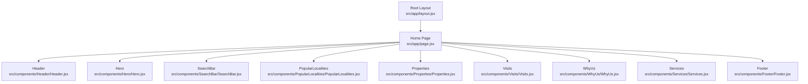
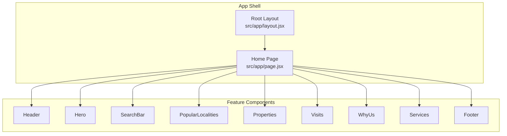
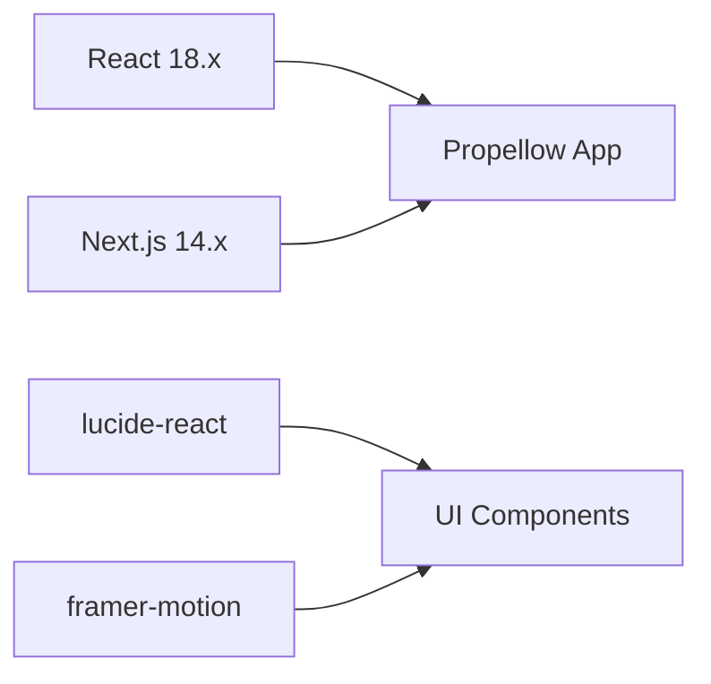

# State Management

<cite>
**Referenced Files in This Document**
- [src/app/page.jsx](file://src/app/page.jsx)
- [src/app/layout.jsx](file://src/app/layout.jsx)
- [src/components/SearchBar/SearchBar.jsx](file://src/components/SearchBar/SearchBar.jsx)
- [src/components/Properties/Properties.jsx](file://src/components/Properties/Properties.jsx)
- [src/components/PopularLocalities/PopularLocalities.jsx](file://src/components/PopularLocalities/PopularLocalities.jsx)
- [src/components/Visits/Visits.jsx](file://src/components/Visits/Visits.jsx)
- [src/components/WhyUs/WhyUs.jsx](file://src/components/WhyUs/WhyUs.jsx)
- [src/components/Header/Header.jsx](file://src/components/Header/Header.jsx)
- [src/components/Hero/Hero.jsx](file://src/components/Hero/Hero.jsx)
- [src/components/Services/Services.jsx](file://src/components/Services/Services.jsx)
- [src/components/Footer/Footer.jsx](file://src/components/Footer/Footer.jsx)
- [package.json](file://package.json)
</cite>

## Table of Contents
1. [Introduction](#introduction)
2. [Project Structure](#project-structure)
3. [Core Components](#core-components)
4. [Architecture Overview](#architecture-overview)
5. [Detailed Component Analysis](#detailed-component-analysis)
6. [Dependency Analysis](#dependency-analysis)
7. [Performance Considerations](#performance-considerations)
8. [Troubleshooting Guide](#troubleshooting-guide)
9. [Conclusion](#conclusion)
10. [Appendices](#appendices)

## Introduction
This document explains Propellow’s current state handling approach and outlines practical migration strategies for introducing centralized state management. As implemented, the application relies on:
- Static data patterns: components define local arrays and render lists.
- Props drilling: the root page composes child components without passing state via props.
- Component-local interactivity: interactive elements are present but state is not yet centralized.

These patterns are appropriate for a static landing page but will require structured state management as interactivity grows (e.g., search filters, forms, user sessions, or cross-component coordination).

## Project Structure
The application is a Next.js app bootstrapped with React 18. The UI is composed of multiple feature-focused components under src/components. The root page renders these components in order.

**Diagram sources**
- [src/app/layout.jsx](file://src/app/layout.jsx#L1-L15)
- [src/app/page.jsx](file://src/app/page.jsx#L1-L26)
- [src/components/Header/Header.jsx](file://src/components/Header/Header.jsx#L1-L26)
- [src/components/Hero/Hero.jsx](file://src/components/Hero/Hero.jsx#L1-L45)
- [src/components/SearchBar/SearchBar.jsx](file://src/components/SearchBar/SearchBar.jsx#L1-L34)
- [src/components/PopularLocalities/PopularLocalities.jsx](file://src/components/PopularLocalities/PopularLocalities.jsx#L1-L31)
- [src/components/Properties/Properties.jsx](file://src/components/Properties/Properties.jsx#L1-L67)
- [src/components/Visits/Visits.jsx](file://src/components/Visits/Visits.jsx#L1-L49)
- [src/components/WhyUs/WhyUs.jsx](file://src/components/WhyUs/WhyUs.jsx#L1-L61)
- [src/components/Services/Services.jsx](file://src/components/Services/Services.jsx#L1-L62)
- [src/components/Footer/Footer.jsx](file://src/components/Footer/Footer.jsx#L1-L51)

**Section sources**
- [src/app/layout.jsx](file://src/app/layout.jsx#L1-L15)
- [src/app/page.jsx](file://src/app/page.jsx#L1-L26)

## Core Components
- Static data rendering: Several components render lists from local arrays (e.g., properties, visits, popular localities, services, why-us items). These arrays are defined inside the component files and passed to child elements during rendering.
- Minimal interactivity: Interactive elements exist (buttons, links), but there is no centralized state management hook usage observed in the examined files.

Key observations:
- Data is static and component-scoped.
- There is no props drilling in the current composition because the root page does not pass state down to children.
- Event handlers are not defined in the examined files; interactivity is not yet implemented.

**Section sources**
- [src/components/Properties/Properties.jsx](file://src/components/Properties/Properties.jsx#L4-L26)
- [src/components/Visits/Visits.jsx](file://src/components/Visits/Visits.jsx#L3-L22)
- [src/components/PopularLocalities/PopularLocalities.jsx](file://src/components/PopularLocalities/PopularLocalities.jsx#L4-L10)
- [src/components/Services/Services.jsx](file://src/components/Services/Services.jsx#L3-L34)
- [src/components/WhyUs/WhyUs.jsx](file://src/components/WhyUs/WhyUs.jsx#L11-L28)
- [src/components/SearchBar/SearchBar.jsx](file://src/components/SearchBar/SearchBar.jsx#L1-L34)

## Architecture Overview
The current architecture is a top-down composition with no shared state. The root page composes feature components, each responsible for its own static data and UI.

**Diagram sources**
- [src/app/layout.jsx](file://src/app/layout.jsx#L1-L15)
- [src/app/page.jsx](file://src/app/page.jsx#L1-L26)
- [src/components/Header/Header.jsx](file://src/components/Header/Header.jsx#L1-L26)
- [src/components/Hero/Hero.jsx](file://src/components/Hero/Hero.jsx#L1-L45)
- [src/components/SearchBar/SearchBar.jsx](file://src/components/SearchBar/SearchBar.jsx#L1-L34)
- [src/components/PopularLocalities/PopularLocalities.jsx](file://src/components/PopularLocalities/PopularLocalities.jsx#L1-L31)
- [src/components/Properties/Properties.jsx](file://src/components/Properties/Properties.jsx#L1-L67)
- [src/components/Visits/Visits.jsx](file://src/components/Visits/Visits.jsx#L1-L49)
- [src/components/WhyUs/WhyUs.jsx](file://src/components/WhyUs/WhyUs.jsx#L1-L61)
- [src/components/Services/Services.jsx](file://src/components/Services/Services.jsx#L1-L62)
- [src/components/Footer/Footer.jsx](file://src/components/Footer/Footer.jsx#L1-L51)

## Detailed Component Analysis
This section examines how each component handles data and interactivity, highlighting current patterns and potential state needs.

### Static Data Components
- Properties: Renders a static array of property entries and displays them in a grid.
- Visits: Renders a static array of visit offerings and displays them in a grid.
- PopularLocalities: Renders a static list of locality names.
- Services: Renders a static array of service cards.
- WhyUs: Renders a static list of feature cards.

Implications:
- These components are currently stateless and rely on local arrays.
- If interactivity is introduced (e.g., filtering, pagination, selection), state will be needed.

**Section sources**
- [src/components/Properties/Properties.jsx](file://src/components/Properties/Properties.jsx#L4-L26)
- [src/components/Visits/Visits.jsx](file://src/components/Visits/Visits.jsx#L3-L22)
- [src/components/PopularLocalities/PopularLocalities.jsx](file://src/components/PopularLocalities/PopularLocalities.jsx#L4-L10)
- [src/components/Services/Services.jsx](file://src/components/Services/Services.jsx#L3-L34)
- [src/components/WhyUs/WhyUs.jsx](file://src/components/WhyUs/WhyUs.jsx#L11-L28)

### Interactive Elements and Props Drilling
- SearchBar: Contains interactive elements (inputs, selects, button). Currently static; no state is managed here.
- Header: Contains navigation links and action buttons. No state observed.
- Hero: Presentational section with a CTA button. No state observed.
- Footer: Presentational section with links and social icons. No state observed.

Current state handling:
- No props drilling is used in the current composition.
- No event handlers or state hooks are present in the examined files.

**Section sources**
- [src/components/SearchBar/SearchBar.jsx](file://src/components/SearchBar/SearchBar.jsx#L1-L34)
- [src/components/Header/Header.jsx](file://src/components/Header/Header.jsx#L1-L26)
- [src/components/Hero/Hero.jsx](file://src/components/Hero/Hero.jsx#L1-L45)
- [src/components/Footer/Footer.jsx](file://src/components/Footer/Footer.jsx#L1-L51)

### Component Communication Patterns
- Top-down composition: Parent page composes children; no props are passed down for state.
- No explicit event propagation or callback passing is observed in the examined files.

Potential future patterns:
- Pass callbacks via props to enable controlled updates from parents.
- Introduce a central store or context to coordinate state across multiple components.

**Section sources**
- [src/app/page.jsx](file://src/app/page.jsx#L1-L26)

## Dependency Analysis
React and Next.js versions indicate a modern React 18 environment suitable for adopting centralized state patterns.

**Diagram sources**
- [package.json](file://package.json#L10-L16)

**Section sources**
- [package.json](file://package.json#L10-L16)

## Performance Considerations
- Static data rendering is efficient; rendering lists from local arrays avoids unnecessary re-renders.
- As state becomes centralized, ensure stable references for props and keys to prevent excessive re-renders.
- Prefer memoization for expensive computations and avoid unnecessary re-creations of handler functions.

[No sources needed since this section provides general guidance]

## Troubleshooting Guide
Common pitfalls when introducing state:
- Uncontrolled components: Inputs without state bindings can lead to unexpected behavior. Use controlled inputs when capturing user input.
- Excessive re-renders: Passing new object/array instances on every render can cause downstream re-renders. Stabilize references.
- Lost focus or cursor position: When re-rendering inputs, preserve focus by managing value/state carefully.

[No sources needed since this section provides general guidance]

## Conclusion
Propellow currently uses a static data pattern with minimal interactivity. The composition is straightforward and functional for a landing page. As interactivity increases (search, filters, forms, user actions), adopting a structured state management approach will improve maintainability and scalability. The recommended path is to introduce context or a lightweight state solution incrementally, starting with small, focused changes.

[No sources needed since this section summarizes without analyzing specific files]

## Appendices

### Migration Strategy Guidelines
- Start small: Introduce a context or a simple custom hook for a single piece of state (e.g., search filters).
- Controlled components: When adding forms, manage input values via state to keep UI predictable.
- Gradual adoption: Replace ad-hoc props drilling with a central store or context over time.
- Testing: Add unit tests for stateful components to catch regressions early.

[No sources needed since this section provides general guidance]

### Example Patterns Observed
- Rendering static lists: Components iterate over local arrays to render grids or lists.
- Presentational composition: Components render UI without internal state.
- Event-less buttons: Buttons are present but no event handlers are defined in the examined files.

**Section sources**
- [src/components/Properties/Properties.jsx](file://src/components/Properties/Properties.jsx#L42-L61)
- [src/components/Visits/Visits.jsx](file://src/components/Visits/Visits.jsx#L33-L43)
- [src/components/PopularLocalities/PopularLocalities.jsx](file://src/components/PopularLocalities/PopularLocalities.jsx#L20-L25)
- [src/components/Services/Services.jsx](file://src/components/Services/Services.jsx#L45-L56)
- [src/components/WhyUs/WhyUs.jsx](file://src/components/WhyUs/WhyUs.jsx#L49-L55)
- [src/components/SearchBar/SearchBar.jsx](file://src/components/SearchBar/SearchBar.jsx#L5-L31)