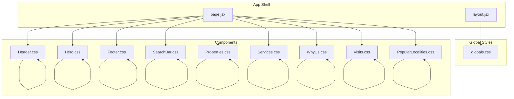
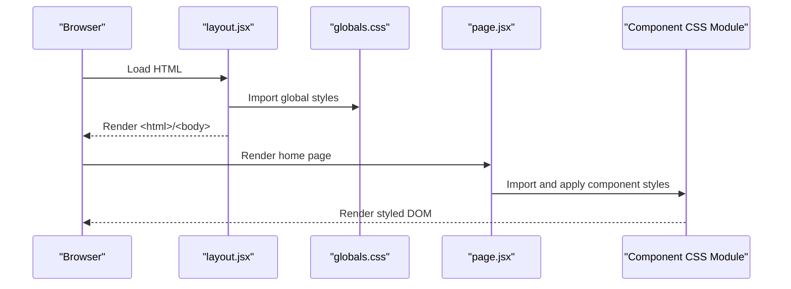
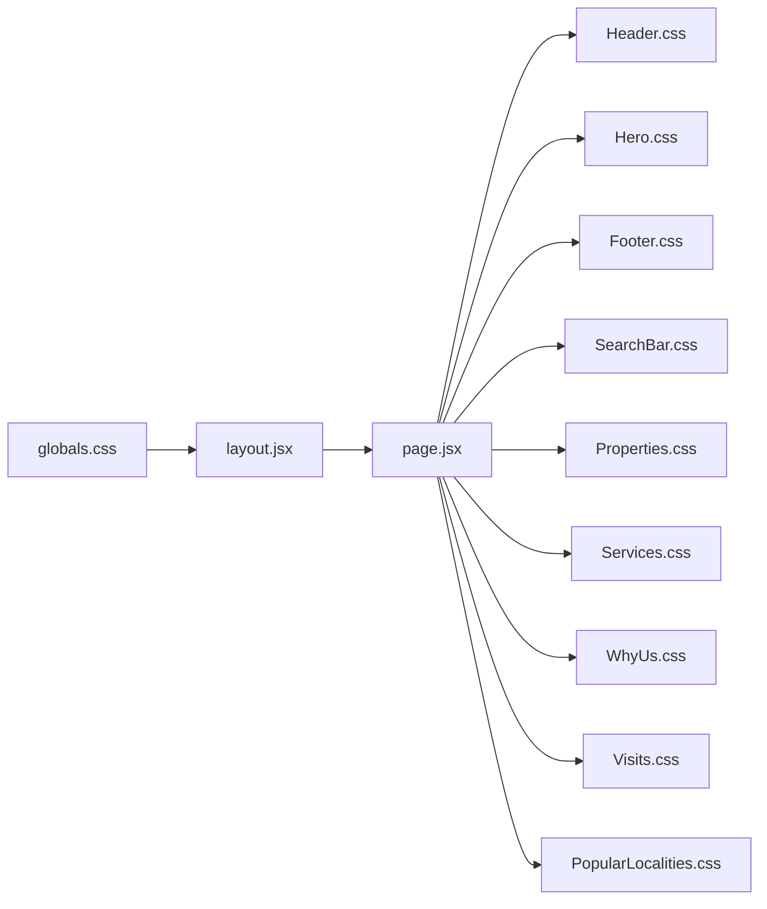

# Styling System

<cite>
**Referenced Files in This Document**
- [globals.css](file://src/styles/globals.css)
- [layout.jsx](file://src/app/layout.jsx)
- [page.jsx](file://src/app/page.jsx)
- [Header.css](file://src/components/Header/Header.css)
- [Hero.css](file://src/components/Hero/Hero.css)
- [Footer.css](file://src/components/Footer/Footer.css)
- [SearchBar.css](file://src/components/SearchBar/SearchBar.css)
- [Properties.css](file://src/components/Properties/Properties.css)
- [Services.css](file://src/components/Services/Services.css)
- [WhyUs.css](file://src/components/WhyUs/WhyUs.css)
- [Visits.css](file://src/components/Visits/Visits.css)
- [PopularLocalities.css](file://src/components/PopularLocalities/PopularLocalities.css)
- [Header.jsx](file://src/components/Header/Header.jsx)
- [Hero.jsx](file://src/components/Hero/Hero.jsx)
- [package.json](file://package.json)
</cite>

## Table of Contents
1. [Introduction](#introduction)
2. [Project Structure](#project-structure)
3. [Core Components](#core-components)
4. [Architecture Overview](#architecture-overview)
5. [Detailed Component Analysis](#detailed-component-analysis)
6. [Dependency Analysis](#dependency-analysis)
7. [Performance Considerations](#performance-considerations)
8. [Troubleshooting Guide](#troubleshooting-guide)
9. [Conclusion](#conclusion)

## Introduction
This document describes Propellow’s CSS architecture and styling system. It covers the custom properties foundation, global baseline styles, component-scoped CSS modules, responsive design strategy, and consistent styling patterns across components. It also provides practical guidance for maintaining design consistency, extending the theme system, and adding new styles while considering cross-browser compatibility and performance.

## Project Structure
The styling system is organized around a small set of global styles and per-component CSS modules. Global styles define the base theme and reset/baseline rules. Each component owns its presentation via a dedicated CSS module, ensuring encapsulation and maintainability.

**Diagram sources**
- [layout.jsx](file://src/app/layout.jsx#L1-L15)
- [page.jsx](file://src/app/page.jsx#L1-L26)
- [globals.css](file://src/styles/globals.css#L1-L60)
- [Header.css](file://src/components/Header/Header.css#L1-L73)
- [Hero.css](file://src/components/Hero/Hero.css#L1-L126)
- [Footer.css](file://src/components/Footer/Footer.css#L1-L98)
- [SearchBar.css](file://src/components/SearchBar/SearchBar.css#L1-L95)
- [Properties.css](file://src/components/Properties/Properties.css#L1-L107)
- [Services.css](file://src/components/Services/Services.css#L1-L61)
- [WhyUs.css](file://src/components/WhyUs/WhyUs.css#L1-L85)
- [Visits.css](file://src/components/Visits/Visits.css#L1-L79)
- [PopularLocalities.css](file://src/components/PopularLocalities/PopularLocalities.css#L1-L58)

**Section sources**
- [layout.jsx](file://src/app/layout.jsx#L1-L15)
- [page.jsx](file://src/app/page.jsx#L1-L26)
- [globals.css](file://src/styles/globals.css#L1-L60)

## Core Components
- Global theme variables: The :root defines primary brand colors, text colors, and container width. These variables are consumed throughout components for consistent theming.
- Baseline resets and typography: A global reset ensures consistent margins/padding and establishes a default font stack and body color.
- Container utility: A reusable container class constrains content width and centers it with horizontal padding.
- Shared helpers: A section title pattern demonstrates a common visual treatment for headings with accent bars.

Key patterns:
- Theme-driven colors: Components consistently reference theme variables for backgrounds, borders, and accents.
- Spacing scale: Components use relative units and consistent gaps (e.g., 8px, 16px, 20px, 24px, 30px, 40px) to maintain rhythm.
- Border radii: Rounded corners are standardized (e.g., 8px, 12px, 16px, 20px, 24px, 100px for large curves).
- Shadows: Subtle, layered shadows are applied to cards and interactive elements to imply depth.
- Responsive breakpoints: Media queries target 900px and smaller widths to adapt layouts for mobile.

**Section sources**
- [globals.css](file://src/styles/globals.css#L3-L10)
- [globals.css](file://src/styles/globals.css#L12-L29)
- [globals.css](file://src/styles/globals.css#L45-L59)

## Architecture Overview
The styling architecture follows a predictable flow:
- Global CSS is imported at the root layout level.
- Each component imports its own CSS module and applies semantic class names.
- Components rely on global theme variables and utilities for consistent visuals.
- Breakpoints are defined locally within component styles to keep concerns modular.

**Diagram sources**
- [layout.jsx](file://src/app/layout.jsx#L1-L15)
- [globals.css](file://src/styles/globals.css#L1-L60)
- [page.jsx](file://src/app/page.jsx#L1-L26)

## Detailed Component Analysis

### Global Theme Variables and Utilities
- Theme variables: Primary brand color, light variant, text colors, and container width are defined centrally.
- Baseline: Reset margins/padding and set box sizing globally.
- Body defaults: Font family, color, line height, and background are established.
- Container: Max width, centered layout, and horizontal padding.
- Links and buttons: Consistent transitions and inherited fonts.
- Section title: Heading pattern with accent bar.

Best practices:
- Prefer theme variables for all colors and spacings.
- Keep utilities (e.g., container) DRY and reuse across components.

**Section sources**
- [globals.css](file://src/styles/globals.css#L3-L10)
- [globals.css](file://src/styles/globals.css#L12-L29)
- [globals.css](file://src/styles/globals.css#L45-L59)

### Header Component
- Sticky header with logo, navigation links, and action buttons.
- Uses theme variables for background, text, and accent colors.
- Hover states for navigation and buttons follow the brand palette.
- Mobile adaptation hides navigation at narrower widths.

Responsive pattern:
- A single breakpoint at 900px hides navigation and adjusts padding.

**Section sources**
- [Header.css](file://src/components/Header/Header.css#L1-L73)

### Hero Component
- Full-width hero with a branded background shape and content grid.
- Typography hierarchy emphasizes large headline and supporting text.
- Feature list and call-to-action button use brand accents and hover feedback.
- Card-like image container with rounded corners and shadow.
- Responsive adjustments reflow content and reduce font sizes at narrow widths.

Responsive pattern:
- A single breakpoint at 900px switches content to a stacked, centered layout.

**Section sources**
- [Hero.css](file://src/components/Hero/Hero.css#L1-L126)

### Footer Component
- Dark-themed footer with logo, description, social links, and link grid.
- Social icons and link items use hover transitions aligned with the brand.
- Grid layout adapts to fewer columns on smaller screens.

Responsive pattern:
- A single breakpoint at 900px stacks columns and reduces grid columns.

**Section sources**
- [Footer.css](file://src/components/Footer/Footer.css#L1-L98)

### Search Bar Component
- Centered search box with input area, selection area, divider, and submit button.
- Shadow and border provide depth; button uses brand color.
- Mobile-first layout stacks elements and removes the divider.

Responsive pattern:
- A single breakpoint at 900px switches to a vertical layout and full-width controls.

**Section sources**
- [SearchBar.css](file://src/components/SearchBar/SearchBar.css#L1-L95)

### Properties Component
- Grid of property cards with hover elevation and subtle shadows.
- Card content includes pricing, tags, and CTA buttons.
- Responsive grid reduces columns at narrower widths.

Responsive pattern:
- Two breakpoints: 900px and 600px adjust grid columns.

**Section sources**
- [Properties.css](file://src/components/Properties/Properties.css#L1-L107)

### Services Component
- Similar card grid to Properties with comparable hover and shadow treatments.
- Responsive grid reduces columns at 900px and 600px.

**Section sources**
- [Services.css](file://src/components/Services/Services.css#L1-L61)

### Why Us Component
- Four-column grid on wide screens, reduced to two and then one column at narrower widths.
- Centralized icon boxes with brand color and light background.
- Hover animations elevate cards with increased shadows.

Responsive pattern:
- Two breakpoints: 900px and 500px.

**Section sources**
- [WhyUs.css](file://src/components/WhyUs/WhyUs.css#L1-L85)

### Visits Component
- Three-column grid on wide screens, reduced to one column at narrower widths.
- Card styling mirrors other feature sections with shadows and hover elevation.
- Buttons use brand color with inverted text on hover.

Responsive pattern:
- One breakpoint at 900px.

**Section sources**
- [Visits.css](file://src/components/Visits/Visits.css#L1-L79)

### Popular Localities Component
- Horizontal scrolling list of location pills with brand accent color.
- Responsive adjustment stacks elements vertically on narrow screens.

Responsive pattern:
- One breakpoint at 900px.

**Section sources**
- [PopularLocalities.css](file://src/components/PopularLocalities/PopularLocalities.css#L1-L58)

### Cross-Component Consistency Patterns
- Color system: Primary brand color and light variant are used for accents, backgrounds, and hover states.
- Typography: Poppins is applied globally; headings and body text sizes are consistent across components.
- Spacing: Relative gaps and paddings are reused to maintain rhythm.
- Borders and radii: Standardized border radius values appear across components.
- Shadows: Cards and interactive elements use consistent shadow values for depth cues.

**Section sources**
- [globals.css](file://src/styles/globals.css#L1-L60)
- [Header.css](file://src/components/Header/Header.css#L1-L73)
- [Hero.css](file://src/components/Hero/Hero.css#L1-L126)
- [Footer.css](file://src/components/Footer/Footer.css#L1-L98)
- [SearchBar.css](file://src/components/SearchBar/SearchBar.css#L1-L95)
- [Properties.css](file://src/components/Properties/Properties.css#L1-L107)
- [Services.css](file://src/components/Services/Services.css#L1-L61)
- [WhyUs.css](file://src/components/WhyUs/WhyUs.css#L1-L85)
- [Visits.css](file://src/components/Visits/Visits.css#L1-L79)
- [PopularLocalities.css](file://src/components/PopularLocalities/PopularLocalities.css#L1-L58)

## Dependency Analysis
- Global styles dependency: All pages import the global stylesheet, ensuring theme variables and utilities are available everywhere.
- Component imports: Each component imports its own CSS module, keeping styles scoped to the component.
- Responsive coupling: Components independently manage their breakpoints, reducing global coupling and enabling local control.

**Diagram sources**
- [globals.css](file://src/styles/globals.css#L1-L60)
- [layout.jsx](file://src/app/layout.jsx#L1-L15)
- [page.jsx](file://src/app/page.jsx#L1-L26)
- [Header.css](file://src/components/Header/Header.css#L1-L73)
- [Hero.css](file://src/components/Hero/Hero.css#L1-L126)
- [Footer.css](file://src/components/Footer/Footer.css#L1-L98)
- [SearchBar.css](file://src/components/SearchBar/SearchBar.css#L1-L95)
- [Properties.css](file://src/components/Properties/Properties.css#L1-L107)
- [Services.css](file://src/components/Services/Services.css#L1-L61)
- [WhyUs.css](file://src/components/WhyUs/WhyUs.css#L1-L85)
- [Visits.css](file://src/components/Visits/Visits.css#L1-L79)
- [PopularLocalities.css](file://src/components/PopularLocalities/PopularLocalities.css#L1-L58)

**Section sources**
- [layout.jsx](file://src/app/layout.jsx#L1-L15)
- [page.jsx](file://src/app/page.jsx#L1-L26)
- [globals.css](file://src/styles/globals.css#L1-L60)

## Performance Considerations
- CSS-in-JS alternatives: The project uses plain CSS modules and global CSS. This keeps rendering lightweight and avoids runtime CSS generation overhead.
- Minimal selectors: Component CSS uses simple, flat selectors, which are efficient and easy to override locally.
- Responsive media queries: Queries are scoped to component files, minimizing cascade and reducing specificity wars.
- Fonts: Google Fonts is loaded via an external stylesheet; ensure caching and consider preloading strategies if needed.
- Bundle size: With Next.js, CSS is automatically extracted and optimized during builds.

Recommendations:
- Keep component CSS modular and avoid global resets beyond the shared baseline.
- Reuse theme variables to minimize repeated color and spacing declarations.
- Prefer container queries or simpler breakpoints to reduce repaints on resize.

**Section sources**
- [globals.css](file://src/styles/globals.css#L1-L60)
- [Header.css](file://src/components/Header/Header.css#L1-L73)
- [Hero.css](file://src/components/Hero/Hero.css#L1-L126)
- [Footer.css](file://src/components/Footer/Footer.css#L1-L98)
- [SearchBar.css](file://src/components/SearchBar/SearchBar.css#L1-L95)
- [Properties.css](file://src/components/Properties/Properties.css#L1-L107)
- [Services.css](file://src/components/Services/Services.css#L1-L61)
- [WhyUs.css](file://src/components/WhyUs/WhyUs.css#L1-L85)
- [Visits.css](file://src/components/Visits/Visits.css#L1-L79)
- [PopularLocalities.css](file://src/components/PopularLocalities/PopularLocalities.css#L1-L58)

## Troubleshooting Guide
Common issues and resolutions:
- Colors not updating: Ensure theme variables are defined in the global stylesheet and referenced consistently across components.
- Layout breaks on mobile: Verify media queries are present and placed after base styles in each component CSS file.
- Hover states missing: Confirm hover selectors are defined alongside base states and use theme variables for consistency.
- Fonts not loading: Check the external font import in the global stylesheet and confirm network availability.

Guidelines:
- Add new theme variables in the global root scope before using them in components.
- Keep component styles under 900px breakpoints aligned with existing patterns for predictability.
- Use the container utility for consistent content width when building new sections.

**Section sources**
- [globals.css](file://src/styles/globals.css#L3-L10)
- [globals.css](file://src/styles/globals.css#L25-L29)
- [Header.css](file://src/components/Header/Header.css#L65-L72)
- [Hero.css](file://src/components/Hero/Hero.css#L110-L125)
- [Footer.css](file://src/components/Footer/Footer.css#L90-L97)
- [SearchBar.css](file://src/components/SearchBar/SearchBar.css#L78-L94)
- [Properties.css](file://src/components/Properties/Properties.css#L96-L106)
- [Services.css](file://src/components/Services/Services.css#L50-L60)
- [WhyUs.css](file://src/components/WhyUs/WhyUs.css#L74-L84)
- [Visits.css](file://src/components/Visits/Visits.css#L72-L78)
- [PopularLocalities.css](file://src/components/PopularLocalities/PopularLocalities.css#L52-L57)

## Conclusion
Propellow’s styling system is intentionally simple and scalable. A small set of global theme variables and utilities powers a consistent design language across components. Each component owns its presentation via scoped CSS modules, enabling maintainability and predictable overrides. The responsive strategy favors a mobile-first approach with targeted breakpoints, and the design system emphasizes consistent spacing, typography, and color usage. Following the documented patterns and guidelines will help preserve design coherence as the project evolves.